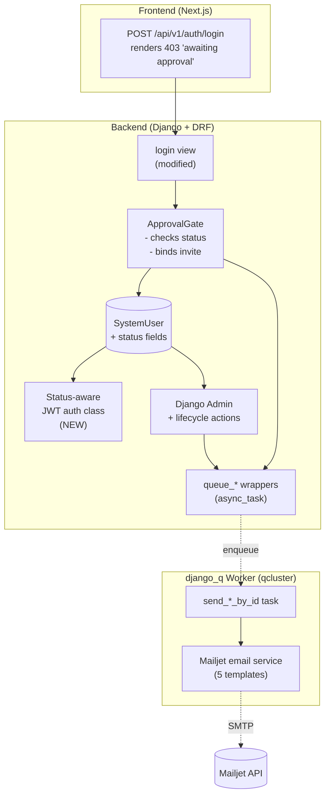
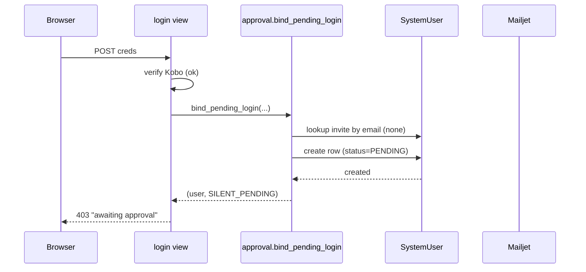
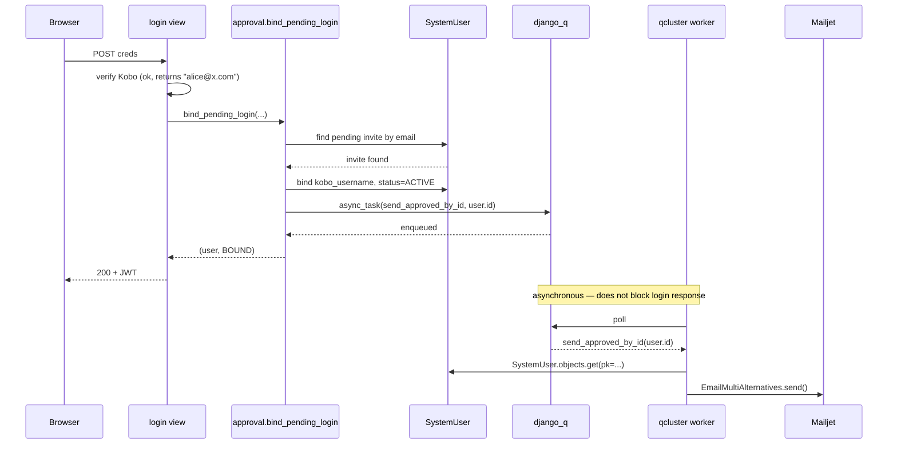
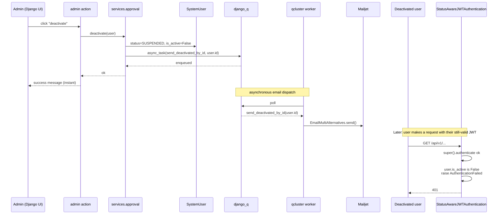

# Users Management — Design

**Source**: [users-management-requirements.md](users-management-requirements.md)
**User AC**: [users-management-user-ac.md](users-management-user-ac.md)

## Verified Findings

- `EMAIL_BACKEND = "django_mailjet.backends.MailjetBackend"` ([settings.py:194](../../backend/african_bamboo_dashboard/settings.py#L194)) — Mailjet is wired as Django's email backend, so plain `django.core.mail.send_mail` / `EmailMultiAlternatives` will route through Mailjet automatically. **No custom Mailjet client is needed.**
- Default DRF auth is `rest_framework_simplejwt.authentication.JWTAuthentication` — single substitution point for the lightweight status check.
- `SoftDeletes` mixin already on `SystemUser` ([models.py:10](../../backend/api/v1/v1_users/models.py#L10)).
- `SystemUserAdmin.save_model` calls `obj.generate_reset_password_code()` ([admin.py:46](../../backend/api/v1/v1_users/admin.py#L46)) — that method does **not** exist on `SystemUser`. Latent bug; fixed by rebuilding the admin file.
- `django_q` is configured as the task queue ([settings.py:207-213](../../backend/african_bamboo_dashboard/settings.py#L207)) with 2 workers, 60s timeout, 120s retry. **Email notifications are dispatched asynchronously via `django_q.tasks.async_task`** so admin lifecycle actions return instantly.
- The existing `v1_jobs` app is intentionally **not** used for email notifications. `Jobs` rows model user-initiated, downloadable, pollable work (export_shapefile / geojson / xlsx — see [v1_jobs/constants.py:1-10](../../backend/api/v1/v1_jobs/constants.py#L1)). Email notifications are system-initiated, produce no artifact, and are not polled. Wrapping them in `Jobs` rows would add bookkeeping for visibility no one needs. django_q's own admin (`/admin/django_q/`) is the right home for failure visibility.
- `UserStatus` constants live in [backend/api/v1/v1_users/constants.py](../../backend/api/v1/v1_users/constants.py) as a plain class with integer constants, mirroring the `JobStatus` / `JobTypes` convention in `v1_jobs/constants.py`.

## 1. Component View



## 2. Data Model

### 2.1 `SystemUser` field additions

| Field | Type | Default | Notes |
|---|---|---|---|
| `status` | `IntegerField(choices=UserStatus.fieldStr.items())` | `UserStatus.PENDING` for new rows; **data migration** sets all existing rows to `UserStatus.ACTIVE` | Enum lives in `constants.py` (see §2.2) |
| `status_changed_at` | `DateTimeField(null=True, blank=True)` | `null` | Set by lifecycle actions |
| `status_changed_by` | `ForeignKey("self", null=True, blank=True, on_delete=SET_NULL, related_name="+")` | `null` | The admin who flipped the state |
| `is_active` | `BooleanField(default=True)` | `True` | Explicit model field. `AbstractBaseUser` only exposes `is_active` as a **class attribute**, not a field, so without declaring it here it cannot be persisted or queried by admin `list_filter` / auth checks. |
| `invited_at` | `DateTimeField(null=True, blank=True)` | `null` | Set when row created via Invite (vs. self-arrival) |
| `kobo_username` | (already exists) | — | Becomes **nullable** for invite-before-login rows |
| `kobo_url` | (already exists) | — | Stays nullable; required only at invite time if admin pre-binds |

### 2.2 `UserStatus` constants (in `v1_users/constants.py`)

```python
class UserStatus:
    PENDING = 0      # Awaiting admin decision
    ACTIVE = 1       # Allowed to log in (subject to is_active)
    SUSPENDED = 2    # Access blocked (rejected from PENDING,
                     #                 or deactivated from ACTIVE)

    fieldStr = {
        PENDING: "pending",
        ACTIVE: "active",
        SUSPENDED: "suspended",
    }
```

Three states only. Both **reject** (from PENDING) and **deactivate** (from ACTIVE) land at `SUSPENDED`; the four admin actions stay distinct via source-state preconditions and email templates.

`is_active` is the cross-cutting boolean: `False` when `status == SUSPENDED`, `True` when `ACTIVE`. `PENDING` users have `is_active = False` so SimpleJWT cannot mint tokens for them either. Keeping both fields is intentional — `status` is the workflow value (3 states); `is_active` is the SimpleJWT-compatible boolean.

### 2.3 Constraint changes

- **Drop**: `unique_together = [("kobo_username", "kobo_url")]` — incompatible with invite rows that have null `kobo_username`.
- **Replace with**: a `UniqueConstraint` that enforces uniqueness only when `kobo_username` is not null:
  ```python
  models.UniqueConstraint(
      fields=["kobo_username", "kobo_url"],
      condition=Q(kobo_username__isnull=False),
      name="unique_kobo_identity_when_set",
  )
  ```
- Email is already `unique=True` on the model — invite lookup uses email as the join key.

### 2.4 Migration plan (`v1_users/migrations/0002_user_access_management.py`)

1. AddField: `status` (IntegerField), `status_changed_at`, `status_changed_by`, `invited_at`.
2. AlterField: `kobo_username` → `null=True, blank=True`.
3. RemoveConstraint: existing `unique_together`.
4. AddConstraint: conditional `UniqueConstraint`.
5. **Data migration** (RunPython): set `status=1` (i.e. `UserStatus.ACTIVE`) and `is_active=True` on every existing row. Idempotent. Migration files use literal integers because constants may be renamed without breaking existing migrations.

## 3. Backend Module Layout

Per the 200–400-line rule:

```
backend/
├── african_bamboo_dashboard/
│   └── templates/email/
│       └── main.html          # SHARED template (render {{ body }} + CTA)
├── utils/
│   └── email_helper.py        # MODIFY: fix broken import, extend EmailTypes,
│                              # add send_email_by_user_id + queue_email
└── api/v1/v1_users/
    ├── constants.py           # ALREADY CREATED: UserStatus integer constants
    ├── models.py              # +new fields, imports UserStatus from constants
    ├── admin.py               # rebuilt with lifecycle actions (~250 lines)
    ├── views.py               # login() updated
    ├── serializers.py         # +PendingLoginResponseSerializer for 403 body
    ├── auth.py                # NEW: StatusAwareJWTAuthentication (~50 lines)
    ├── services/
    │   ├── __init__.py        # empty
    │   └── approval.py        # NEW: invite binding + transitions (~200 lines)
    └── tests/
    ├── tests_login_pending_endpoint.py        # NEW
    ├── tests_login_suspended_endpoint.py    # NEW
    ├── tests_invite_binding.py                # NEW (service-level)
    ├── tests_admin_lifecycle_actions.py       # NEW
    ├── tests_status_aware_jwt_auth.py         # NEW
    ├── tests_email_notifications.py           # NEW
    └── tests_users_model.py                   # +cases for new fields
```

## 4. Interface Specifications

### 4.1 `auth.StatusAwareJWTAuthentication`

```python
class StatusAwareJWTAuthentication(JWTAuthentication):
    """Reject tokens belonging to users whose access has been revoked.

    Behavior:
      - Calls super().authenticate(request) first.
      - If the resolved user has status != UserStatus.ACTIVE or
        is_active is False, raises AuthenticationFailed
        with code "user_inactive".
      - Otherwise returns (user, validated_token).
    """
    def authenticate(self, request): ...
```

`settings.py` change:

```python
"DEFAULT_AUTHENTICATION_CLASSES": [
    "api.v1.v1_users.auth.StatusAwareJWTAuthentication",
],
```

### 4.2 `services.approval` — pure functions, no HTTP awareness

```python
def create_invite(*, email: str, name: str | None,
                  kobo_url: str | None,
                  invited_by: SystemUser) -> SystemUser:
    """Create a pending row with invited_at set.
       Sends invitation email.
       Raises ValueError if email already exists."""

def bind_pending_login(*, email_from_kobo: str,
                       kobo_username: str, kobo_url: str,
                       kobo_user_detail: dict
                       ) -> tuple[SystemUser, BindOutcome]:
    """Looks up pending invite by normalized email.
       If found:
         - Bind kobo_username + kobo_url, flip status -> ACTIVE,
           send 'approved' email, return (user, BOUND).
       Else: create silent-pending row, return (user, SILENT_PENDING).
       If email_from_kobo is the synthesized fallback,
       skip auto-bind and log warning.

       Two Kobo identities may share an email address
       (e.g. ab_admin and ab_enumerator both use
       sidharth@african-bamboo.com). Since SystemUser.email
       is UNIQUE (for Django-admin natural-key reasons), the
       fallthrough create() is wrapped in try/except
       IntegrityError; on collision the row stores a
       synthesized email derived from (kobo_username,
       kobo_url_host) and a warning is logged. The Kobo
       identity (kobo_url, kobo_username) remains the
       authoritative lookup."""

def approve(user, by):     # PENDING -> ACTIVE,    queue_approved
def reject(user, by):      # PENDING -> SUSPENDED, queue_rejected
def deactivate(user, by):  # ACTIVE  -> SUSPENDED, queue_deactivated
def reactivate(user, by):  # SUSPENDED -> ACTIVE,  queue_reactivated
    # Each: update status, status_changed_at, status_changed_by,
    # set is_active accordingly, then call emails.queue_*(user) to
    # enqueue the email on the django_q worker (returns instantly).
    # Source-state precondition is enforced at the admin layer
    # (see §5).
```

`BindOutcome` = `Enum`: `BOUND`, `SILENT_PENDING`, `ALREADY_ACTIVE`.

### 4.3 Email dispatch — reuse the global helper

Rather than a per-module `services/emails.py` with 5 template pairs, we use the existing global [`backend/utils/email_helper.py`](../../backend/utils/email_helper.py) + the shared [`templates/email/main.html`](../../backend/african_bamboo_dashboard/templates/email/main.html). Every transactional email across the project flows through this one helper.

The helper needs three small edits:

1. **Bug fix** — replace `from eswatini.settings import …` (leftover from template repo, module doesn't exist) with `from django.conf import settings`.
2. **Extend `EmailTypes`** — add `account_invited`, `account_rejected`, `account_deactivated`, `account_reactivated` (it currently has only `account_approved`). Add matching branches in `email_context()` that set `subject`, `body`, `cta_text`, `cta_url`. Each state-change branch weaves a `_account_label()` suffix — `" for the KoboToolbox account `<kobo_username>`"` — into the body so recipients with multiple Kobo accounts know which one was acted on. Empty for invite-only rows where `kobo_username` is null.
3. **Append two public callables** — async plumbing the approval service will use:

```python
def send_email_by_user_id(user_id, type, extra_context=None):
    """Task entry-point for django_q. Pickle-safe args."""
    User = get_user_model()
    user = User.objects.filter(pk=user_id).first()
    if user is None:
        logger.warning(
            "Email task: user %s no longer exists; skipping.",
            user_id,
        )
        return
    context = {
        "send_to": [user.email],
        "name": user.name or user.email,
        "kobo_username": user.kobo_username,
        "kobo_url": user.kobo_url,
    }
    if extra_context:
        context.update(extra_context)
    send_email(context=context, type=type)


def queue_email(user, type, extra_context=None):
    """Caller-facing async wrapper. Returns instantly."""
    async_task(
        "utils.email_helper.send_email_by_user_id",
        user.id, type, extra_context or {},
    )
```

Callers (see §4.2 approval service) just do:

```python
from utils.email_helper import EmailTypes, queue_email

queue_email(user, EmailTypes.account_approved)
queue_email(user, EmailTypes.account_invited,
            extra_context={"inviter_name": "Alice"})
```

The shared `email/main.html` renders `{{ body }}` and a conditional `{{ cta_url }}` button (`{{ cta_text }}` as label). Because project-root `templates/` is not an app, `TEMPLATES[0]["DIRS"]` must include it — a one-line `settings.py` change.

`send_email` already wraps Mailjet in `try/except Exception as ex: logger.warning(...)` (after the `print` → logger fix), so Mailjet failures never bubble into the worker's stack. django_q's retry policy (`Q_CLUSTER["retry"] = 120`s) handles transient failures.

### 4.4 Login view (`v1_users/views.py`) — modified

Sequence (new branches in **bold**):

1. Validate Kobo creds (unchanged).
2. **Call `services.approval.bind_pending_login(...)` instead of `update_or_create`**.
3. If returned user `status != UserStatus.ACTIVE` or `is_active = False` → return **403** with body `{message, status, email}` and **do not** issue JWT. The `status` field is the **string label** from `UserStatus.fieldStr` (`"pending"` or `"suspended"`), never the raw integer.
4. Else: existing JWT issuance path (unchanged).

### 4.5 Pending login response shape

```python
class PendingLoginResponseSerializer(serializers.Serializer):
    message = serializers.CharField()
    # The string label from UserStatus.fieldStr — "pending" or
    # "suspended". Frontend switches on this.
    status = serializers.CharField()
    email = serializers.EmailField()
```

HTTP status 403 (per requirements). 401 remains for invalid Kobo creds.

## 5. Django Admin Design

### 5.1 Admin access URL

Admins access the Django admin at `https://<WEBDOMAIN>/admin/` — same origin as the Next.js app, not a separate backend host. Routing:

| Env | Component | Adds |
|---|---|---|
| Dev | [frontend/next.config.mjs](../../frontend/next.config.mjs) | `/admin/*` and `/static/*` rewrites → `http://127.0.0.1:8000` |
| Prod | [nginx/conf.d/default.conf](../../nginx/conf.d/default.conf) | `location /admin` and `location /static` → `http://backend:8000` |

`/static/*` is required because Django admin loads its CSS/JS from `/static/admin/*`. The nginx `/admin` block mirrors the existing `/api` block (same `Host` / `X-Forwarded-Host` / `X-Forwarded-Proto` headers) so CSRF host validation on admin form POSTs keeps working.

### 5.2 `SystemUserAdmin` rebuilt

- **list_display**: `email`, `name`, `kobo_username`, `kobo_url`, `status_label` (renders `UserStatus.fieldStr[obj.status]`), `is_active`, `status_changed_at`, `last_login`
- **list_filter**: `status` (uses `UserStatus.fieldStr.items()` for the dropdown labels), `is_active`, `is_superuser`
- **search_fields**: `email`, `name`, `kobo_username`
- **ordering**: `-status_changed_at`
- **readonly_fields**: `status_changed_at`, `status_changed_by`, `last_login`, `invited_at`
- **fieldsets**:
  - Identity: `email`, `name`
  - Kobo: `kobo_url`, `kobo_username`
  - Access: `status`, `is_active`, `status_changed_at`, `status_changed_by`, `invited_at`
  - Permissions: `is_superuser`
- **add_form**: a custom `InviteForm` overriding the add view → calls `services.approval.create_invite`. The default Django add-user-with-password form is replaced because we don't store local passwords for Kobo users.
- **actions** (admin bulk actions, also exposed as object-detail buttons):
  - "Approve selected" → `services.approval.approve` per row, only valid from `PENDING`.
  - "Reject selected" → `services.approval.reject`, only valid from `PENDING`.
  - "Deactivate selected" → `services.approval.deactivate`, only valid from `ACTIVE`.
  - "Reactivate selected" → `services.approval.reactivate`, only valid from `SUSPENDED`.

Action methods validate `user.status` per-row and use `messages.warning` for rows in invalid states (no exception, no partial commit).

## 6. Sequence Diagrams

### 6.1 First-time Kobo login (no invite)



### 6.2 Invited user logs in for the first time



### 6.3 Admin deactivates an active user



## 7. API Contract Summary

Only one existing endpoint changes:

| Endpoint | Method | Change |
|---|---|---|
| `/api/v1/auth/login` | POST | New 403 response branch; success response unchanged |

Two supporting wiring changes outside the API surface:

1. **`backend/african_bamboo_dashboard/urls.py`** — mounts `path("admin/", admin.site.urls)` at the project root. Previously missing; `/admin/` 404'd even via the proxy.
2. **`CSRF_TRUSTED_ORIGINS = [WEBDOMAIN]`** in `settings.py` — Django 4 rejects admin form POSTs with `"Origin checking failed"` unless the posting host is explicitly trusted. `WEBDOMAIN` covers dev (`http://localhost:3000`) and prod without per-env overrides.

**No new public REST endpoints** in v1 (all admin operations are inside Django admin per requirement FR-6 + decision 12).

403 response body:

```json
{
  "message": "Your access is awaiting administrator approval.",
  "status": "pending",
  "email": "alice@example.com"
}
```

`status` is the **string label** from `UserStatus.fieldStr`, not the raw integer. Two distinct messages: `pending` → "awaiting approval"; `suspended` → "Access denied."

## 8. Email Types

All emails render via the single shared template `backend/african_bamboo_dashboard/templates/email/main.html`. The `EmailTypes` constants drive subject + body + CTA selection through `email_context()` branches in `utils/email_helper.py`.

| `EmailTypes` value | Subject | When | Extra context |
|---|---|---|---|
| `account_invited` | "You've been invited to African Bamboo Dashboard" | Admin creates invite (`services.approval.create_invite`) | `inviter_name` |
| `account_approved` | "Your account has been approved" | PENDING → ACTIVE (approve action or invite-by-email bind) | — |
| `account_rejected` | "Access request denied" | PENDING → SUSPENDED (reject action) | — |
| `account_deactivated` | "Your access has been revoked" | ACTIVE → SUSPENDED (deactivate action) | — |
| `account_reactivated` | "Your access has been restored" | SUSPENDED → ACTIVE (reactivate action) | — |

`cta_url` resolves to `settings.WEBDOMAIN + "/login"` for the three email types that carry a login CTA (`account_invited`, `account_approved`, `account_reactivated`); `account_rejected` / `account_deactivated` have no CTA.

Sent via `EmailMultiAlternatives` from inside a `django_q` worker task. The `{{ body }}` string contains plain prose today; if/when translatability becomes a need, the per-type `email_context()` branch is the place to introduce `gettext`.

## 8.1 Async dispatch (django_q)

- All five email types are enqueued via `django_q.tasks.async_task` from `utils.email_helper.queue_email` — one generic wrapper, not five per-type ones.
- The worker (`python manage.py qcluster`) picks up the task, resolves the user by ID, builds the context dict, and calls `send_email` which renders `email/main.html` and sends via Mailjet.
- Settings change in `settings.py`:
  ```python
  Q_CLUSTER = {
      "name": "african_bamboo",
      "workers": 2,
      "timeout": 60,
      "retry": 120,
      "orm": "default",
      "sync": bool(TEST_ENV),  # NEW: run inline in tests
  }
  ```
  With `sync=True` in tests, `async_task(...)` runs immediately on the calling thread, so existing `mail.outbox` assertions continue to work without refactoring.
- **Operational requirement**: none new. The existing `worker` container in [docker-compose.yml:40](../../docker-compose.yml#L40) already runs `python manage.py qcluster` via [run_worker.sh](../../backend/run_worker.sh). Dev, staging, and prod already have a qcluster process for the export jobs — emails reuse it.
- **Pickling rule**: `async_task` arguments are pickled to the broker. Always pass `user.id` (int), never the `SystemUser` instance.
- **Failure visibility**: failed tasks are logged by django_q and visible at `/admin/django_q/failure/`. The sync `send_*` renderers also log a warning on exception so the worker's stdout shows what happened.

## 9. Test Design

| Test file | What it asserts |
|---|---|
| `tests_login_pending_endpoint.py` | Pending user → 403 with correct status field; no JWT issued |
| `tests_login_suspended_endpoint.py` | SUSPENDED user (whether reached via reject or deactivate) → 403; no JWT |
| `tests_invite_binding.py` | Email match → status flips to ACTIVE, kobo_username set, "approved" email queued |
| `tests_invite_binding.py` | Synthesized email path → no auto-bind, silent pending, warning logged |
| `tests_admin_lifecycle_actions.py` | Each action only fires from its allowed source state; emails dispatched |
| `tests_status_aware_jwt_auth.py` | JWT for deactivated user → 401 on subsequent request |
| `tests_email_notifications.py` | All 5 templates render and land in `mail.outbox` |
| `tests_users_model.py` (extend) | Default status=`UserStatus.PENDING` (0); data migration sets `UserStatus.ACTIVE` (1) for legacy rows |

Mailjet is bypassed in tests via Django's `locmem` email backend (auto when `TEST_ENV` or `DEBUG`).

## 10. Backwards Compatibility & Rollout

- **Migration order**: schema migration runs first → data migration backfills `ACTIVE` (integer `1`) → no downtime risk because no row temporarily lands in `PENDING`.
- **Existing JWTs**: continue to work because all existing users become `ACTIVE` + `is_active=True`.
- **Frontend**: needs a one-line update to handle the new 403 status on the login page (display the `message` field instead of generic error). Out of scope for backend PR; flag in handoff.

## 11. Risks & Open Design Notes

1. **Latent admin bug** — [admin.py:46](../../backend/api/v1/v1_users/admin.py#L46) calls `obj.generate_reset_password_code()` which doesn't exist. Replacing the admin file as part of this design eliminates the call.
2. **Email delivery vs. transaction** — Resolved: emails are dispatched via `django_q.async_task` so the lifecycle action returns instantly even if Mailjet is slow or down. No operational change needed — the existing `worker` container ([docker-compose.yml:40](../../docker-compose.yml#L40) → [run_worker.sh](../../backend/run_worker.sh)) already runs `qcluster` for the export jobs.
3. **Email change** — `SystemUser.email` is mutable via the existing profile update endpoint ([views.py:113](../../backend/api/v1/v1_users/views.py#L113)). If a user changes their email after being approved, future invite-binding for that email would be ambiguous. Recommend **lock email field for non-superusers** in v1.
4. **Two pending rows merge** — if Option A's email match misses (e.g., admin invites `alice@x.com`, Kobo returns `Alice@X.com`), normalization handles it (case-insensitive). But if Kobo returns a totally different email, two pending rows result; admin must reject the duplicate manually.
5. **Shared-email Kobo identities** — Resolved: `bind_pending_login` catches `IntegrityError` on the second arriver and stores a synthesized email `{kobo_username}@{kobo_url_host}`. The real email is kept on the first arriver's row; the disambiguated second row keeps its Kobo identity as the authoritative key. Admin sees both rows side-by-side and can approve/reject independently. Regression test: `test_bind_two_kobo_users_sharing_email`.
5. **No audit trail** (per requirement) — only the latest transition is recorded. If audit ever becomes required, a small `UserStatusHistory` table can be added without schema rework.
