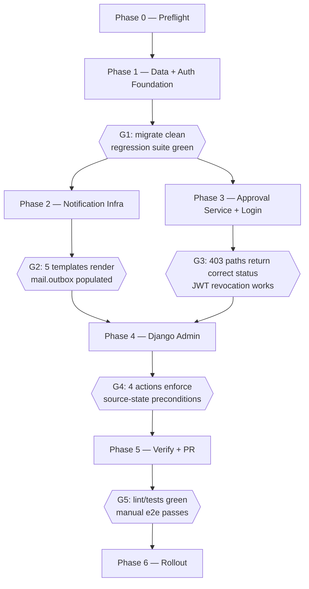
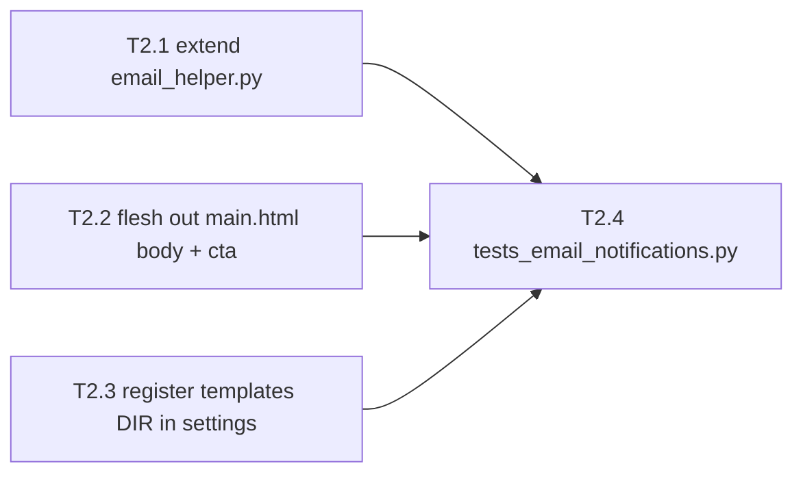
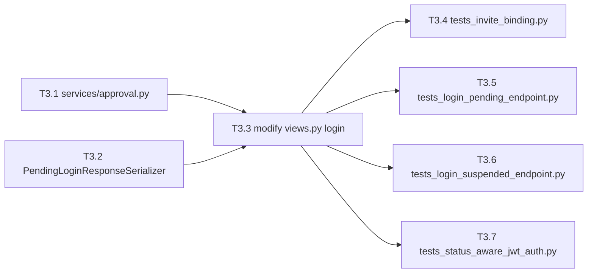
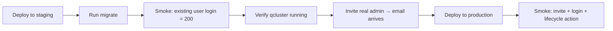

# Users Management — Implementation Workflow

**Source plan**: [../v23_users-management-plan.md](../v23_users-management-plan.md) (concrete code per file)
**Specs**: [requirements](users-management-requirements.md) · [design](users-management-design.md) · [acceptance criteria](users-management-user-ac.md)

This document is the *execution* view: phase order, dependencies, parallel opportunities, quality gates, PR strategy, and rollout. It deliberately does **not** restate the code — see the v23 plan for that.

---

## TL;DR

- 6 phases, 1 single PR recommended (foundation+gate are tightly coupled)
- Total backend effort: ~2.5 dev-days; frontend handoff: ~0.5 dev-day
- **Key gate**: data migration sets every existing row to `ACTIVE` first, so the login-behaviour change is a no-op for current users
- **No new operational change**: the existing `worker` container ([docker-compose.yml:40](../../docker-compose.yml#L40) → [backend/run_worker.sh](../../backend/run_worker.sh)) already runs `python manage.py qcluster`. Dev, staging, and prod already have a qcluster process — nothing to add.

---

## Phase Map

Phase 2 and Phase 3 can run in parallel after G1 (different files, no overlap), but Phase 4 needs both before it can start.

---

## Phase 0 — Preflight (5 min)

| Task | Why |
|---|---|
| T0.1 — Verify [`constants.py`](../../backend/api/v1/v1_users/constants.py) defines `UserStatus` with `PENDING=0 / ACTIVE=1 / SUSPENDED=2` and `fieldStr` | Already created by the user; the rest of the workflow imports from it |
| T0.2 — Confirm `MAILJET_APIKEY`, `MAILJET_SECRET`, `EMAIL_FROM`, `WEBDOMAIN` resolve in target envs | Email send-out depends on these |
| T0.3 — Confirm the `worker` container is running in the target env (`docker compose ps worker`) | [docker-compose.yml:40](../../docker-compose.yml#L40) already runs `python manage.py qcluster`; nothing new to add |

**Exit criteria**: all three confirmed.

---

## Phase 1 — Data + Auth Foundation (~0.5 day)

Independent file edits, but logically a single unit because the migration ties them together.

| ID | Task | File(s) | Depends on |
|---|---|---|---|
| T1.1 | Add `status`, `status_changed_at`, `status_changed_by`, `invited_at` fields; import `UserStatus` from `constants.py`; replace `unique_together` with conditional `UniqueConstraint` | `models.py` | T0.1 |
| T1.2 | Write migration `0002_user_access_management.py` — schema deltas + RunPython backfill to `ACTIVE` (literal `1`) | `migrations/0002_*.py` | T1.1 |
| T1.3 | Add `StatusAwareJWTAuthentication` | `auth.py` (new) | T1.1 |
| T1.4 | Wire `DEFAULT_AUTHENTICATION_CLASSES`; add `Q_CLUSTER["sync"] = bool(TEST_ENV)`; add `locmem` EMAIL_BACKEND when `TEST_ENV` | `settings.py` | T1.3 |
| T1.5 | Extend `tests_users_model.py` for default `PENDING` and migration backfill to `ACTIVE` | `tests/tests_users_model.py` | T1.2 |

T1.1 → T1.2 is sequential (model must exist before makemigrations). T1.3 / T1.4 can run in parallel with T1.2.

### Quality Gate G1

- [ ] `python manage.py makemigrations --check` → no missing migrations
- [ ] `python manage.py migrate` runs cleanly on a fresh DB **and** on a snapshot of prod data
- [ ] `python manage.py test api.v1.v1_users` — existing tests still green (regression check; backfill should make every existing test user `ACTIVE`)
- [ ] `tests_users_model.py` extensions pass

If G1 fails, **do not proceed**. Most likely cause: an existing test creates a user expecting `is_active=True` by default — adjust the test, not the model default.

---

## Phase 2 — Notification Infrastructure (~0.25 day)

**Revised**: we reuse the global [`backend/utils/email_helper.py`](../../backend/utils/email_helper.py) + the shared [`templates/email/main.html`](../../backend/african_bamboo_dashboard/templates/email/main.html) instead of building a dedicated `v1_users/services/emails.py` with 5 per-template pairs. Every email flows through the single helper; types are distinguished by `EmailTypes` + `email_context()` branches.

| ID | Task | File(s) |
|---|---|---|
| T2.1 | Fix broken `from eswatini.settings import …` → `from django.conf import settings`; replace `print` with `logger`; extend `EmailTypes` to 5 entries (`account_invited`, `account_approved`, `account_rejected`, `account_deactivated`, `account_reactivated`); add matching branches in `email_context()`; append `send_email_by_user_id(user_id, type, extra_context=None)` task entry-point + `queue_email(user, type, extra_context=None)` async wrapper | `backend/utils/email_helper.py` |
| T2.2 | Render `{{ body }}`, optional `{{ cta_text }}` / `{{ cta_url }}` button | `backend/african_bamboo_dashboard/templates/email/main.html` |
| T2.3 | Add `BASE_DIR / "african_bamboo_dashboard" / "templates"` to `TEMPLATES[0]["DIRS"]` so the shared template is discoverable (project-root dir is outside `INSTALLED_APPS`) | `backend/african_bamboo_dashboard/settings.py` |
| T2.4 | Parametrised test: each of the 5 `EmailTypes` dispatched via `queue_email(user, type)` lands in `mail.outbox` with the right subject and recipient. Also covers `user deleted before task runs` warning path. | `backend/api/v1/v1_users/tests/tests_email_notifications.py` |

**No new module in `v1_users`.** `services/__init__.py` stays empty (still needed for `services/approval.py` in Phase 3).

### Quality Gate G2

- [ ] All 5 `EmailTypes` values route through `queue_email` → land in `mail.outbox` (locmem backend + `Q_CLUSTER["sync"]=True` in tests)
- [ ] `main.html` renders `{{ body }}` and conditionally the CTA button when `cta_url` is set
- [ ] Template dir registration works: `render_to_string("email/main.html", {...})` succeeds inside a test
- [ ] Email failure path: monkeypatch `EmailMultiAlternatives.send` to raise → `send_email` swallows the exception and logs a warning (no 500)

---

## Phase 3 — Approval Service + Login (~0.75 day)

| ID | Task | File(s) | Depends on |
|---|---|---|---|
| T3.1 | `services/approval.py` — `BindOutcome`, `_normalize_email`, `create_invite`, `bind_pending_login`, `_transition`, `approve` / `reject` / `deactivate` / `reactivate` | `services/approval.py` (new) | T1.1, T2.5 |
| T3.2 | Add `PendingLoginResponseSerializer` (message / status string label / email) | `serializers.py` | T1.1 |
| T3.3 | Replace `update_or_create` with `bind_pending_login`; short-circuit non-`ACTIVE` users with 403; map `user.status` → `UserStatus.fieldStr[…]` for the response | `views.py` | T3.1, T3.2 |
| T3.4 | Test `bind_pending_login`: real-email match → ACTIVE + email; synthesized-email path → silent pending + warning logged; existing kobo identity returns ALREADY_ACTIVE | `tests/tests_invite_binding.py` | T3.1 |
| T3.5 | Test login: PENDING user → 403, body `{message, status:"pending", email}`, no JWT | `tests/tests_login_pending_endpoint.py` | T3.3 |
| T3.6 | Test login: SUSPENDED user → 403, body `status:"suspended"`, no JWT | `tests/tests_login_suspended_endpoint.py` | T3.3 |
| T3.7 | Test JWT: deactivate ACTIVE user → existing JWT yields 401 on next request | `tests/tests_status_aware_jwt_auth.py` | T1.3, T3.1 |

**Parallelism**: T3.4–T3.7 can be authored in parallel after T3.3 lands.

### Quality Gate G3

- [ ] Existing active user → 200 + JWT (regression)
- [ ] Brand-new Kobo user → 403 with `status:"pending"`
- [ ] Manually flipped SUSPENDED user → 403 with `status:"suspended"`
- [ ] Invited user (email match) → first login auto-flips to ACTIVE, "approved" email queued
- [ ] Synthesized-email path stays SILENT_PENDING and logs warning

---

## Phase 4 — Django Admin (~0.5 day)

| ID | Task | File(s) | Depends on |
|---|---|---|---|
| T4.1 | Rebuild `SystemUserAdmin`: `InviteUserForm`, `invite_view`, custom `add_view` redirect, `list_display`/`list_filter`/`search_fields`/`fieldsets`/`readonly_fields`, `_bulk_action` helper, 4 admin actions with `allowed_from` preconditions, `has_module_permission` superuser gate | `admin.py` | T3.1 |
| T4.2 | `admin/v1_users/invite_user.html` template extending `admin/base_site.html` | `templates/admin/v1_users/invite_user.html` | T4.1 |
| T4.3 | **Dev routing**: three rewrites — trailing-slash-preserving rule **first**, then `/admin/:path*`, then `/static/:path*` (order prevents a Next↔Django redirect loop on `/admin/`) | `frontend/next.config.mjs` | — |
| T4.4 | **Prod routing**: add `location /admin` and `location /static` blocks (mirror `/api` block headers so CSRF host validation keeps working) | `nginx/conf.d/default.conf` | — |
| T4.5 | Mount `path("admin/", admin.site.urls)` at project root — previously missing; `/admin/` 404'd | `backend/african_bamboo_dashboard/urls.py` | — |
| T4.6 | `CSRF_TRUSTED_ORIGINS = [WEBDOMAIN]` so admin POSTs aren't rejected with 403 "Origin checking failed" | `backend/african_bamboo_dashboard/settings.py` | — |
| T4.7 | Test all 4 lifecycle actions: each fires only from its source state; off-state rows skipped; emails reach `mail.outbox`; superuser permission gate | `tests/tests_admin_lifecycle_actions.py` | T4.1 |

### Quality Gate G4

- [ ] Approve only flips `PENDING → ACTIVE`; rejects on other states
- [ ] Reject only flips `PENDING → SUSPENDED`
- [ ] Deactivate only flips `ACTIVE → SUSPENDED`
- [ ] Reactivate only flips `SUSPENDED → ACTIVE`
- [ ] Non-superuser → admin module not visible
- [ ] Invite form validation: duplicate email returns admin error message
- [ ] `http://localhost:3000/admin/` reaches Django admin via the Next.js proxy (T4.3/T4.5)
- [ ] Django admin CSS/JS loads (i.e. `/static/admin/*` proxy works)
- [ ] Admin **login POST** succeeds with 302 → `/admin/` (not 403 "Origin checking failed") — proves T4.6 works
- [ ] No redirect loop on `/admin/` or `/admin/login/` — proves T4.3's trailing-slash-rule ordering is correct

---

## Phase 5 — Verify + PR (~0.25 day)

| ID | Task |
|---|---|
| T5.1 | `cd backend && black . && isort . && flake8` — clean (80-char enforced) |
| T5.2 | `python manage.py test api.v1.v1_users` — full app suite green |
| T5.3 | `python manage.py test` — full project suite green (catch cross-app fallout from auth class swap) |
| T5.4 | Manual e2e in `docker-compose up`: createsuperuser → invite → log in as invited user → admin actions → check `mail.outbox` (or Mailjet sandbox) |
| T5.5 | *(no action — `worker` container already runs `qcluster` per [docker-compose.yml:40](../../docker-compose.yml#L40))* |
| T5.6 | Open PR — title: `feat(users): admin approval gate for kobo-backed login`. PR description links to v23 plan; explicitly notes the **frontend follow-up** for the new 403 status field |

### Quality Gate G5

- [ ] All checks green
- [ ] PR description includes screenshots/curl for the 3 login outcomes (200/401/403)
- [ ] Frontend handoff issue created and linked

---

## Phase 6 — Rollout (~0.25 day, mostly waiting)

| ID | Task | Why |
|---|---|---|
| T6.1 | Stage deploy + migrate | Confirms migration runs on real schema/data |
| T6.2 | Verify the `worker` container is up on stage (`docker compose ps worker` or equivalent) | Sanity check — already part of the standard compose stack |
| T6.3 | Smoke: at least one existing approved user logs in | Regression check |
| T6.4 | Smoke: invite an internal email → email lands → first login auto-activates | End-to-end verification |
| T6.5 | Production deploy + same smoke checks | — |
| T6.6 | Notify frontend team that the 403 path is live and the new `status` field needs handling | Coordinate the follow-up PR |

---

## PR Strategy

| Option | Description | When to choose |
|---|---|---|
| **A — Single PR (recommended)** | All 4 phases in one branch. Phases 1–4 ship together. | Default. Feature is small (~15 files, ~700 lines net). Reviewers see a consistent state. |
| B — Two PRs | PR 1: Phases 1+2 (foundation + email infra, no behaviour change). PR 2: Phases 3+4 (gate flips on). | If reviewers want to validate the migration on staging before behaviour changes. Adds 1 round of review. |
| C — Phase-by-phase | One PR per phase. | Avoid — Phase 1 alone doesn't gate anything (login still uses `update_or_create` until Phase 3); intermediate PRs ship dead code. |

**Recommendation**: Option A unless ops wants the migration validated in isolation, in which case Option B.

---

## Risk Register

| Phase | Risk | Likelihood | Impact | Mitigation |
|---|---|---|---|---|
| 1 | Data migration leaves a row in `PENDING` if a write races with the RunPython | Low | High (locked-out user) | RunPython runs inside a transaction; no concurrent writes during deploy window |
| 1 | Existing test sets `is_active=False` somewhere and was relying on it being benign | Medium | Medium | Catch in G1; fix the test, not the auth class |
| 2 | `worker` container stopped/crashed → emails queue but never send | Low | Low | Already part of `docker-compose.yml`; `Q_CLUSTER["sync"]` keeps tests OK even if worker absent |
| 2 | Mailjet template variable typo → render error in worker | Medium | Low (logged, not user-visible) | `tests_email_notifications.py` renders all 5 |
| 3 | Frontend still shows generic error on 403 → poor UX for pending users | High | Medium | Coordinate frontend handoff in PR; ship the backend even before frontend update because the *message* field is human-readable |
| 3 | A user changes their email after approval, then invite-by-email matching gets ambiguous later | Low | Low | Out of scope per design §11.3; recommend lock email field in a follow-up if it bites |
| 3 | Two Kobo identities share the same email (e.g. `ab_admin` + `ab_enumerator` → `sidharth@african-bamboo.com`). Second arriver collides on `email unique` constraint | Medium | High (second user completely locked out) | **Resolved**: `bind_pending_login` catches `IntegrityError` and stores a synthesized `{kobo_username}@{host}` email on the later row. See `test_bind_two_kobo_users_sharing_email`. |
| 4 | Non-superuser can see the admin app | Low | High (privilege escalation) | `has_module_permission` returns `is_superuser`; covered in G4 |
| 6 | Mailjet rate limit hit on bulk invite | Low | Medium | django_q retry + Mailjet 24h bursts; not relevant for v1 traffic |

---

## Effort & Schedule (rough)

| Phase | Effort | Can be parallelised? |
|---|---|---|
| 0 | 5 min | — |
| 1 | 0.5 day | T1.3/T1.4 alongside T1.2 |
| 2 | 0.25 day | T2.1/T2.2/T2.3 independent, runnable in parallel |
| 3 | 0.75 day | T3.4–T3.7 in parallel after T3.3 |
| 4 | 0.5 day | T4.1 + T4.2 sequential |
| 5 | 0.25 day | — |
| 6 | 0.25 day | — |
| **Total backend** | **~2.0 dev-days** | Revised: reuse global `utils/email_helper.py` cut Phase 2 from 0.75 → 0.25 day |
| Frontend handoff | ~0.5 dev-day | Independent PR after backend ships |

---

## Definition of Done

- [ ] All 6 phases complete; G1–G5 passed
- [ ] Production smoke checks (T6.3, T6.4) pass
- [ ] Frontend handoff issue filed
- [ ] No outstanding TODOs in the diff
- [ ] [docs/users-management/users-management-user-ac.md](users-management-user-ac.md) checkboxes all ticked

---

**Next step**: run `/sc:implement` against the v23 plan, working through phases in order. Each phase ends at its quality gate — do not advance until the gate passes.
