# v17 — Map Plot Edit Functionality

## Problem

The plot detail panel displays submission data (enumerator, farmer, region, etc.) but the "Edit" buttons in each section are non-functional. Validators need to correct field values directly from the map view and have those changes sync back to KoboToolbox.

### Current State

- `PlotDetailPanel` renders `SectionHeader` components with static "Edit" buttons that do nothing
- All displayed data comes from `Submission.raw_data` (resolved via `FormQuestion`/`FormOption` for `select_one` fields)
- The only existing edit flow is polygon geometry editing (`PATCH /v1/odk/plots/{uuid}/` -> `sync_kobo_submission_geometry` task)
- No backend endpoint exists for editing submission field data

### Goal

Allow validators to:
1. Click "Edit" on a section in the plot detail panel
2. Edit field values inline (text inputs for text fields, dropdowns for `select_one` fields)
3. Save changes -> update `Submission.raw_data` locally -> sync to KoboToolbox via `update_submission_data`

---

## Data Model Recap

```mermaid
erDiagram
    FormMetadata ||--o{ FormQuestion : "questions"
    FormMetadata ||--o{ FieldMapping : "field_mappings"
    FormMetadata ||--o{ FarmerFieldMapping : "farmer_field_mapping"
    FormQuestion ||--o{ FormOption : "options (select_one/select_multiple)"
    FormQuestion ||--o{ FieldMapping : "field_mappings"
    FieldSettings ||--o{ FieldMapping : "mappings"
    FormMetadata ||--o{ Submission : "submissions"
    Submission ||--o| Plot : "plot"

    FormMetadata {
        string asset_uid UK
        string region_field "comma-sep field names"
        string sub_region_field "comma-sep field names"
        string plot_name_field "comma-sep field names"
    }

    FormQuestion {
        string name "e.g. First_Name"
        string label "e.g. Farmer Name"
        string type "text, select_one, etc."
    }

    FormOption {
        string name "raw value e.g. enum_z"
        string label "display e.g. Alice"
    }

    FieldSettings {
        string name "standardized e.g. farmer"
    }

    FieldMapping {
        FK field "FieldSettings"
        FK form "FormMetadata"
        FK form_question "FormQuestion"
    }

    Submission {
        string uuid UK
        string kobo_id "Kobo internal ID"
        JSON raw_data "question_name: raw_value"
    }

    Plot {
        string region
        string sub_region
        string plot_name
    }
```

### Kobo Bulk Update API

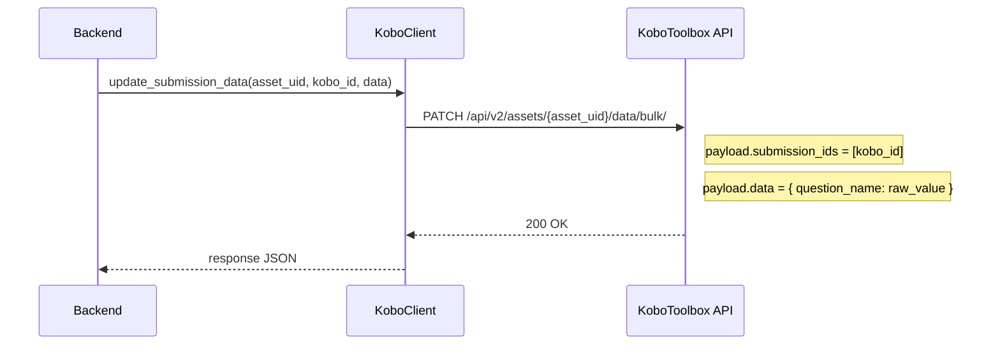

The `data` dict keys are `FormQuestion.name` values, and values must be **raw** option names (not labels) for `select_one` fields.

---

## Solution Overview

### End-to-End Architecture

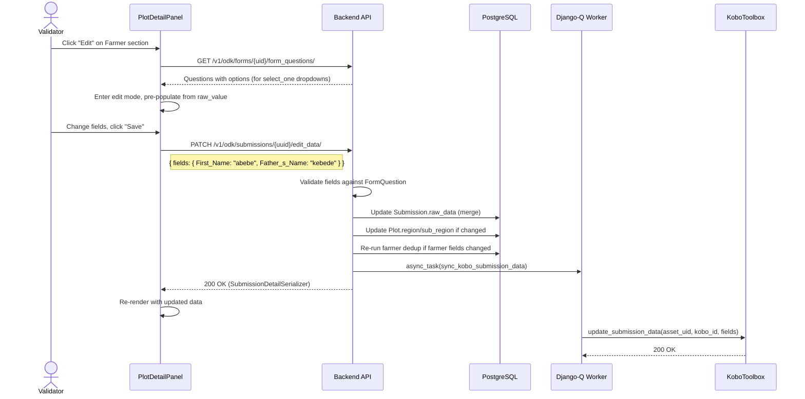

---

## Two Data Paths for Editing

There are two distinct data paths used for editing, depending on the section:

### Path 1: `field_mapped_data` (Enumerator, Farmer sections)

Uses `FieldMapping` entries to map standardized names (e.g., `"farmer"`) to `FormQuestion` names (e.g., `"First_Name"`).

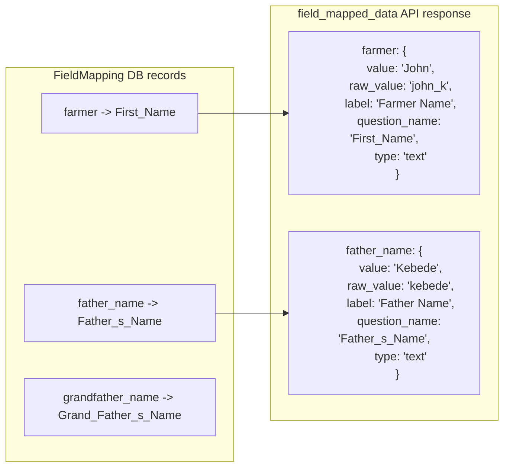

Frontend uses `SECTION_FIELD_MAP` to know which standardized names belong to each section:

```javascript
const SECTION_FIELD_MAP = {
  enumerator: ["enumerator"],
  farmer: ["farmer", "father_name", "grandfather_name"],
};
```

### Path 2: `plot_field_specs` (Plot Details section)

Region and sub_region fields are **not** FieldMapping entries. They come from `FormMetadata.region_field` and `sub_region_field` — comma-separated field specs (e.g., `"woreda,woreda_specify"`).

**The problem**: A spec like `"woreda,woreda_specify"` means two `raw_data` keys could hold the value. During sync, non-empty values are joined with `" - "`. For editing, we need to:
1. Identify which field(s) actually have values in `raw_data`
2. Look up each field's `FormQuestion` to determine its type (text vs select_one)
3. Render the correct input (text input or dropdown)
4. Include options for select_one fields so no extra API call is needed

**Solution**: `SubmissionDetailSerializer.get_plot_field_specs()` resolves these specs server-side:

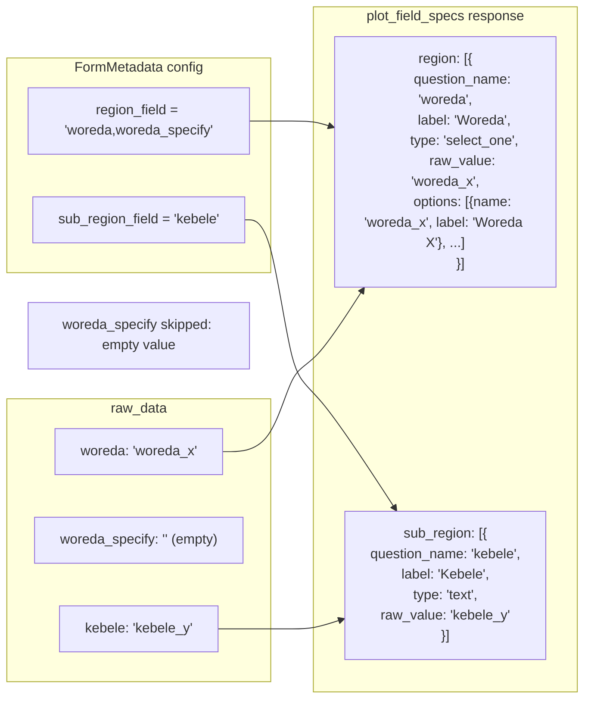

Note: `_resolve_field_spec` skips fields where `raw_value` is `None` or `""`, so only populated fields appear in the edit form.

---

## Edit Mode Data Flow

### View Mode -> Edit Mode Transition (Farmer — uses field_mapped_data)

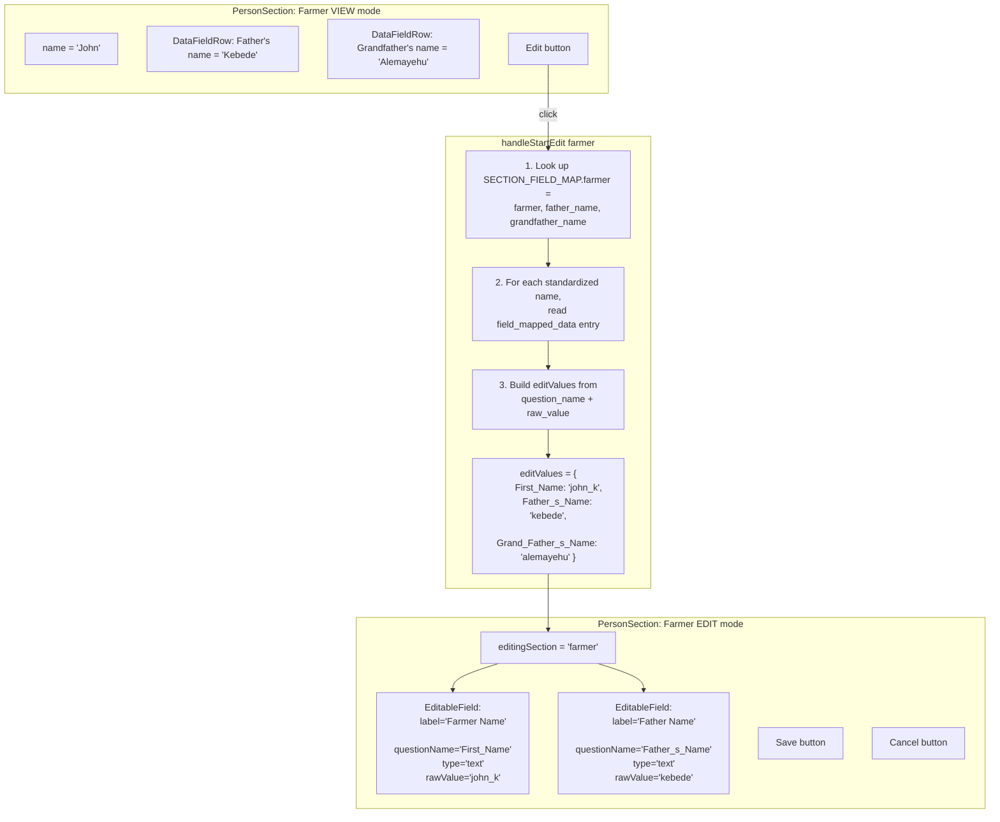

### View Mode -> Edit Mode Transition (Plot Details — uses plot_field_specs)

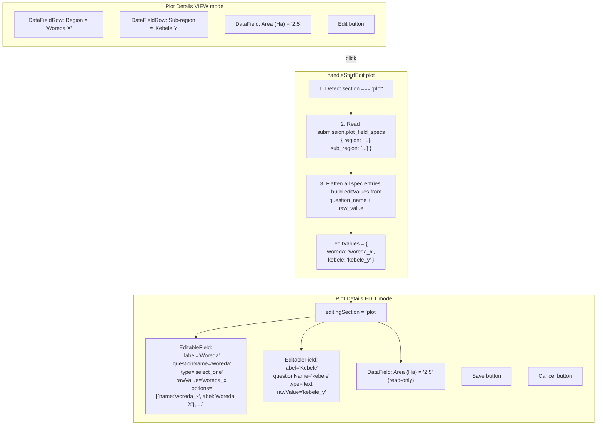

Key difference: plot_field_specs already includes `options` for select_one fields, so the frontend doesn't need to look them up from `formQuestions`. Area remains read-only (computed from geometry).

---

### Editing and Saving

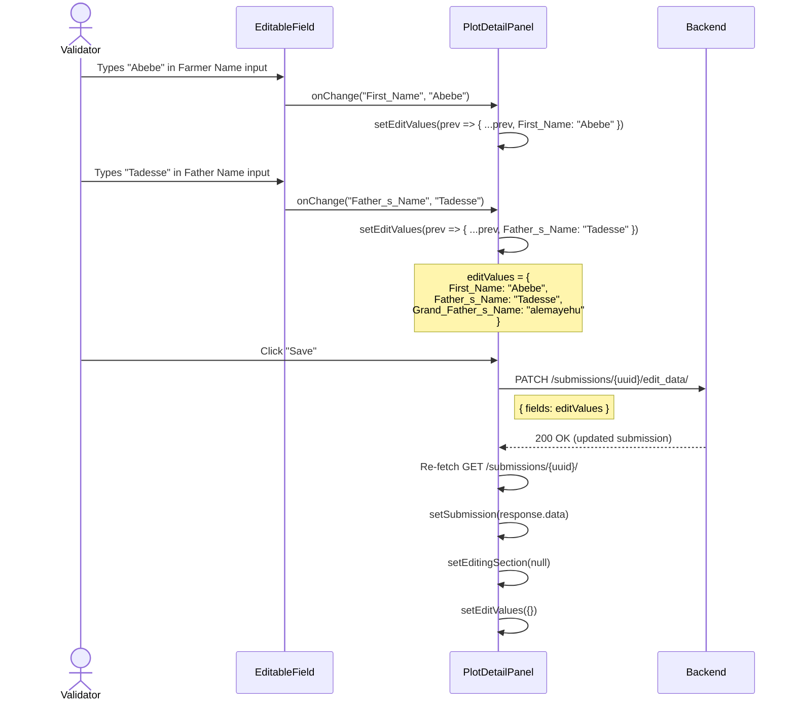

### select_one Field Scenario

When a field is `select_one` (e.g., Enumerator or a region woreda), the `EditableField` renders a dropdown:

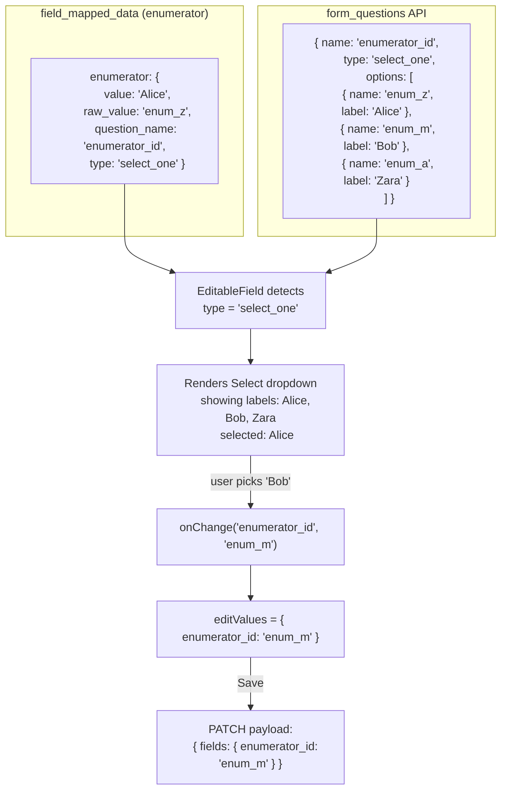

For **plot_field_specs** select_one fields, options come directly from the backend response (no `formQuestions` lookup needed).

### EditableField Rendering Logic

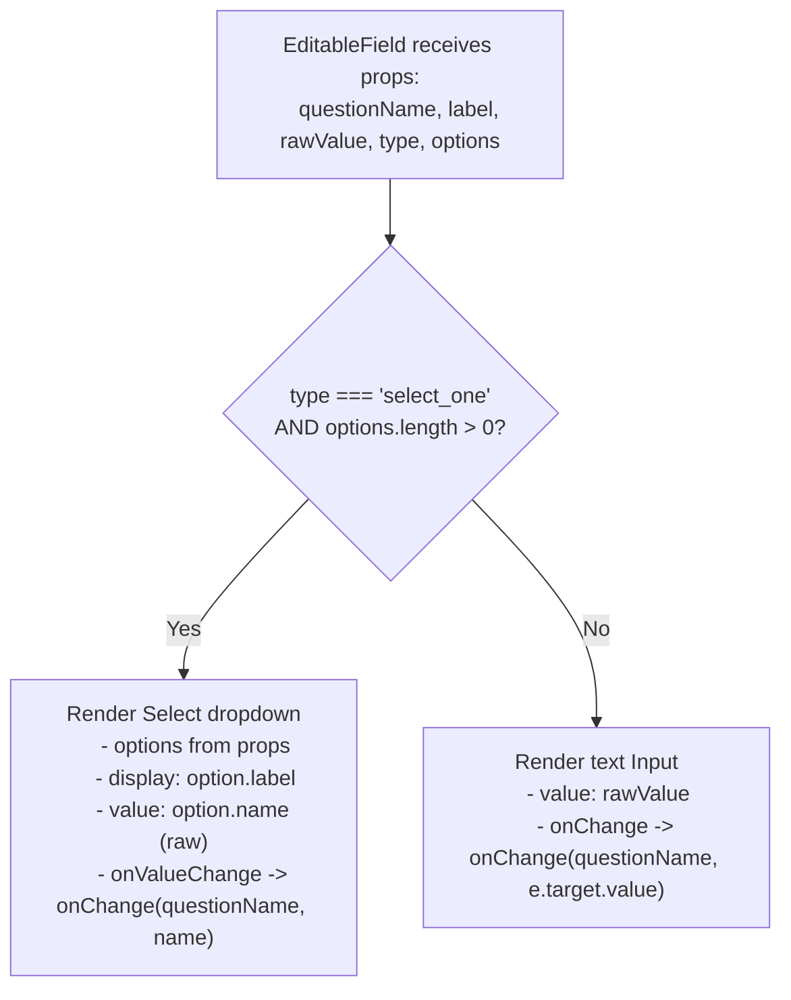

---

## SectionHeader State Machine

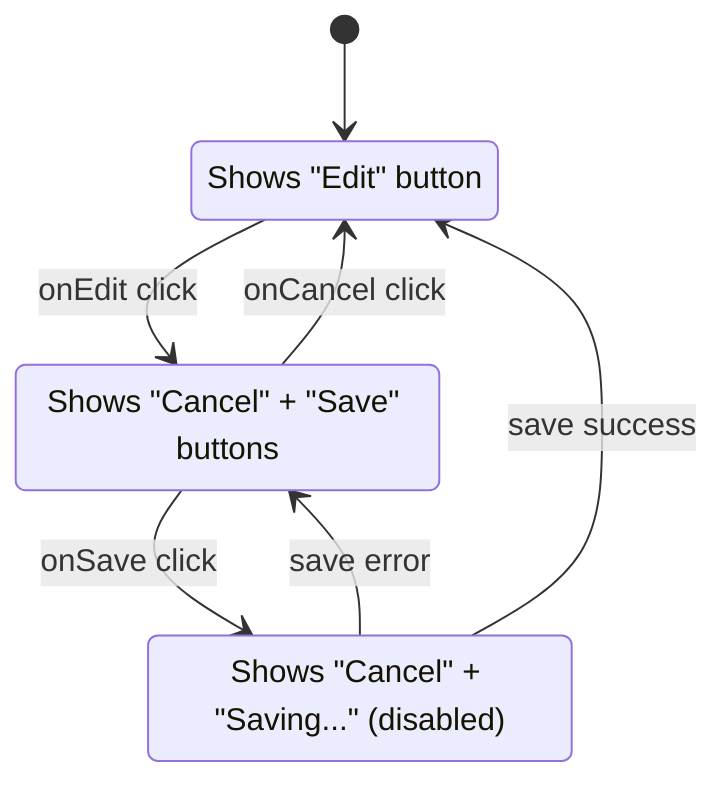

---

## Backend Validation Flow

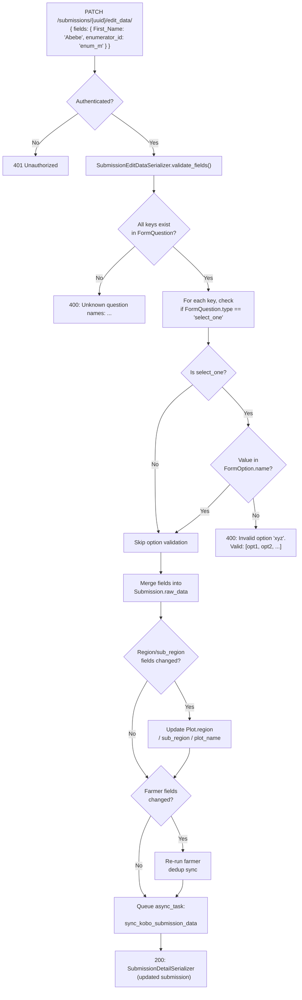

---

## Implementation

### Backend: `SubmissionDetailSerializer` — `field_mapped_data` with edit metadata

**File:** `backend/api/v1/v1_odk/serializers.py`, method `get_field_mapped_data()` (line 362)

Returns `question_name` and `type` so the frontend knows which `raw_data` key to edit and what input type to render:

```python
result[field_name] = {
    "value": resolved,
    "raw_value": raw_value,
    "label": q.label,
    "question_name": q.name,
    "type": q.type,
}
```

### Backend: `SubmissionDetailSerializer` — `plot_field_specs` for region/sub_region

**File:** `backend/api/v1/v1_odk/serializers.py`, methods `_resolve_field_spec()` (line 408) and `get_plot_field_specs()` (line 455)

Region/sub_region fields come from `FormMetadata.region_field`/`sub_region_field` (comma-separated specs like `"woreda,woreda_specify"`), **not** from `FieldMapping`. The `_resolve_field_spec` method:
1. Parses the comma-separated spec into field names
2. Looks up each `FormQuestion` (with prefetched options)
3. Skips fields with no value in `raw_data`
4. Returns a list of editable field metadata including `options` for select_one fields

```python
def _resolve_field_spec(self, form, raw, spec):
    if not spec:
        return []
    names = [
        f.strip()
        for f in spec.split(",")
        if f.strip()
    ]
    questions = {
        q.name: q
        for q in FormQuestion.objects.filter(
            form=form, name__in=names
        ).prefetch_related("options")
    }
    result = []
    for name in names:
        raw_value = raw.get(name)
        if raw_value is None or raw_value == "":
            continue
        q = questions.get(name)
        if not q:
            continue
        entry = {
            "question_name": q.name,
            "label": q.label,
            "type": q.type,
            "raw_value": raw_value,
        }
        if q.type.startswith("select_"):
            entry["options"] = [
                {
                    "name": o.name,
                    "label": o.label,
                }
                for o in q.options.all()
            ]
        result.append(entry)
    return result

def get_plot_field_specs(self, obj):
    form = obj.form
    raw = obj.raw_data or {}
    return {
        "region": self._resolve_field_spec(
            form, raw, form.region_field
        ),
        "sub_region": self._resolve_field_spec(
            form, raw, form.sub_region_field
        ),
    }
```

### Backend: `form_questions` endpoint with options

**File:** `backend/api/v1/v1_odk/views.py`, method `form_questions()` (line 213)

Returns `FormQuestion` records with `options` array for select_* fields (used by enumerator/farmer edit mode):

```python
@action(detail=True, methods=["get"])
def form_questions(self, request, asset_uid=None):
    form = self.get_object()
    qs = (
        FormQuestion.objects.filter(form=form)
        .prefetch_related("options")
        .order_by("pk")
    )
    data = []
    for q in qs:
        item = {
            "id": q.pk,
            "name": q.name,
            "label": q.label,
            "type": q.type,
        }
        if q.type.startswith("select_"):
            item["options"] = [
                {
                    "name": o.name,
                    "label": o.label,
                }
                for o in q.options.all()
            ]
        data.append(item)
    return Response(data)
```

### Backend: `SubmissionEditDataSerializer`

**File:** `backend/api/v1/v1_odk/serializers.py` (line 651)

```python
class SubmissionEditDataSerializer(
    serializers.Serializer
):
    fields = serializers.DictField(
        child=serializers.CharField(
            allow_blank=True,
            allow_null=True,
        ),
    )

    def validate_fields(self, value):
        submission = self.context["submission"]
        form = submission.form
        valid_questions = set(
            FormQuestion.objects.filter(
                form=form
            ).values_list("name", flat=True)
        )
        invalid = (
            set(value.keys()) - valid_questions
        )
        if invalid:
            raise serializers.ValidationError(
                "Unknown question names: "
                f"{', '.join(sorted(invalid))}"
            )

        for q_name, new_val in value.items():
            if new_val is None or new_val == "":
                continue
            q = FormQuestion.objects.filter(
                form=form, name=q_name
            ).first()
            if q and q.type == "select_one":
                valid_opts = set(
                    q.options.values_list(
                        "name", flat=True
                    )
                )
                if new_val not in valid_opts:
                    raise serializers.ValidationError(
                        {
                            q_name: (
                                "Invalid option "
                                f"'{new_val}'. "
                                "Valid: "
                                f"{sorted(valid_opts)}"
                            )
                        }
                    )
        return value
```

### Backend: `edit_data` action on `SubmissionViewSet`

**File:** `backend/api/v1/v1_odk/views.py` (line 820)

```python
@action(
    detail=True,
    methods=["patch"],
    url_path="edit_data",
)
def edit_data(self, request, uuid=None):
    submission = self.get_object()
    serializer = SubmissionEditDataSerializer(
        data=request.data,
        context={
            "submission": submission,
            "request": request,
        },
    )
    serializer.is_valid(raise_exception=True)
    fields = (
        serializer.validated_data["fields"]
    )

    raw = submission.raw_data or {}
    raw.update(fields)
    submission.raw_data = raw
    submission.updated_by = request.user
    submission.updated_at = timezone.now()
    submission.save(
        update_fields=[
            "raw_data",
            "updated_by",
            "updated_at",
        ]
    )

    plot = getattr(submission, "plot", None)
    if plot:
        self._update_plot_from_edit(
            plot, submission, fields
        )

    self._resync_farmers_if_needed(
        submission, fields
    )

    self._sync_edit_to_kobo(
        request.user, submission, fields
    )

    detail_serializer = (
        SubmissionDetailSerializer(submission)
    )
    return Response(detail_serializer.data)
```

### Backend: Helper — `_parse_field_spec`

**File:** `backend/api/v1/v1_odk/views.py` (line 91)

```python
def _parse_field_spec(spec):
    """Parse a comma-separated field spec
    into a list of stripped field names."""
    if not spec:
        return []
    return [
        f.strip() for f in spec.split(",")
        if f.strip()
    ]
```

### Backend: Helper — `_update_plot_from_edit`

**File:** `backend/api/v1/v1_odk/views.py` (line 878)

Updates `Plot.region`, `sub_region`, and `plot_name` when corresponding `raw_data` fields are edited. Uses `_parse_field_spec` to get field names from `FormMetadata` config, then joins non-empty values from `raw_data`.

```python
def _update_plot_from_edit(
    self, plot, submission, fields
):
    form = submission.form
    raw = submission.raw_data or {}
    changed = False

    region_names = _parse_field_spec(
        form.region_field
    )
    sub_region_names = _parse_field_spec(
        form.sub_region_field
    )
    plot_name_fields = _parse_field_spec(
        form.plot_name_field
    )

    if any(f in fields for f in region_names):
        vals = [
            str(raw.get(f, ""))
            for f in region_names
            if raw.get(f)
        ]
        if vals:
            plot.region = " - ".join(vals)
            changed = True

    # ... same pattern for sub_region, plot_name

    if changed:
        plot.save()
```

### Backend: Helper — `_resync_farmers_if_needed`

**File:** `backend/api/v1/v1_odk/views.py` (line 940)

Checks if any edited field maps to a farmer field via `FieldMapping` + `FarmerFieldMapping`. If so, re-runs `sync_farmers_for_form(form)` to update deduplication.

### Backend: Helper — `_sync_edit_to_kobo`

**File:** `backend/api/v1/v1_odk/views.py` (line 976)

Queues `sync_kobo_submission_data` async task if user has Kobo credentials configured.

### Backend: Async Task — `sync_kobo_submission_data`

**File:** `backend/api/v1/v1_odk/tasks.py` (line 240)

```python
def sync_kobo_submission_data(
    kobo_url,
    kobo_username,
    kobo_password_enc,
    asset_uid,
    kobo_id,
    data,
):
    try:
        password = decrypt(kobo_password_enc)
        client = KoboClient(
            kobo_url, kobo_username, password
        )
        client.update_submission_data(
            asset_uid, kobo_id, data
        )
        logger.info(
            "Synced field data for kobo_id=%s "
            "on asset %s: %s",
            kobo_id,
            asset_uid,
            list(data.keys()),
        )
    except KoboUnauthorizedError:
        logger.error(...)
    except Exception:
        logger.exception(...)
```

---

### Frontend: Edit State Management

**File:** `frontend/src/components/map/plot-detail-panel.js`

#### Section-to-Field Mapping (for field_mapped_data sections only)

```javascript
const SECTION_FIELD_MAP = {
  enumerator: ["enumerator"],
  farmer: ["farmer", "father_name", "grandfather_name"],
};
```

Note: `"plot"` is **not** in `SECTION_FIELD_MAP` because it uses `plot_field_specs` instead.

#### Edit State

```javascript
const [editingSection, setEditingSection] =
  useState(null);
const [editValues, setEditValues] = useState({});
const [isSaving, setIsSaving] = useState(false);
const [formQuestions, setFormQuestions] =
  useState([]);

const handleFieldChange = useCallback(
  (questionName, value) => {
    setEditValues((prev) => ({
      ...prev,
      [questionName]: value,
    }));
  }, []
);
```

#### `handleStartEdit` — branching on section type

```javascript
const handleStartEdit = useCallback(
  async (section) => {
    if (!submission) return;
    // Fetch form questions with options (cached)
    let questions = formQuestions;
    if (questions.length === 0) {
      const res = await api.get(
        `/v1/odk/forms/${submission.form}/form_questions/`,
      );
      questions = res.data;
      setFormQuestions(questions);
    }

    const initial = {};
    if (section === "plot") {
      // Plot fields come from plot_field_specs
      // (region_field / sub_region_field config)
      const specs =
        submission?.plot_field_specs || {};
      for (const fields of Object.values(specs)) {
        for (const f of fields) {
          if (f.question_name) {
            initial[f.question_name] =
              f.raw_value ?? "";
          }
        }
      }
    } else {
      // Other sections use field_mapped_data
      const mapped =
        submission?.field_mapped_data || {};
      const stdNames =
        SECTION_FIELD_MAP[section] || [];
      for (const stdName of stdNames) {
        const entry = mapped[stdName];
        if (entry?.question_name) {
          initial[entry.question_name] =
            entry.raw_value ?? "";
        }
      }
    }
    setEditValues(initial);
    setEditingSection(section);
  },
  [submission, formQuestions],
);
```

#### `getEditableFields` — branching on section type

```javascript
const getEditableFields = useCallback(
  (section) => {
    if (section === "plot") {
      // Plot fields come from plot_field_specs
      const specs =
        submission?.plot_field_specs || {};
      return Object.values(specs)
        .flat()
        .map((f) => ({
          questionName: f.question_name,
          label: f.label,
          rawValue:
            editValues[f.question_name] ?? "",
          type: f.type,
          options: f.options || [],
        }));
    }
    // Other sections use field_mapped_data
    const mapped =
      submission?.field_mapped_data || {};
    const stdNames =
      SECTION_FIELD_MAP[section] || [];
    return stdNames
      .map((stdName) => {
        const entry = mapped[stdName];
        if (!entry?.question_name) return null;
        const q = formQuestions.find(
          (fq) => fq.name === entry.question_name,
        );
        return {
          questionName: entry.question_name,
          label: entry.label,
          rawValue:
            editValues[entry.question_name] ?? "",
          type: entry.type,
          options: q?.options || [],
        };
      })
      .filter(Boolean);
  },
  [submission, formQuestions, editValues],
);
```

Key difference: for `"plot"`, options come directly from `plot_field_specs` (no `formQuestions` lookup needed). For other sections, options are looked up from the cached `formQuestions` response.

#### `handleSave` and `handleCancelEdit`

```javascript
const handleSave = useCallback(async () => {
  if (!plot?.submission_uuid) return;
  setIsSaving(true);
  try {
    await api.patch(
      `/v1/odk/submissions/${plot.submission_uuid}/edit_data/`,
      { fields: editValues },
    );
    // Re-fetch to get updated resolved values
    const res = await api.get(
      `/v1/odk/submissions/${plot.submission_uuid}/`,
    );
    setSubmission(res.data);
    setEditingSection(null);
    setEditValues({});
  } catch {
    // TODO: show error toast
  } finally {
    setIsSaving(false);
  }
}, [plot?.submission_uuid, editValues]);

const handleCancelEdit = useCallback(() => {
  setEditingSection(null);
  setEditValues({});
}, []);
```

#### Updated `SectionHeader`

```jsx
function SectionHeader({
  icon: Icon,
  title,
  isEditing,
  onEdit,
  onSave,
  onCancel,
  isSaving,
}) {
  return (
    <div className="w-full flex items-center justify-between">
      <div className="flex items-center gap-2 text-sm text-muted-foreground">
        {Icon && <Icon className="size-4" />}
        <span>{title}</span>
      </div>
      {isEditing ? (
        <div className="flex items-center gap-2">
          <button type="button" onClick={onCancel}
            className="text-sm text-muted-foreground
              hover:text-foreground cursor-pointer">
            Cancel
          </button>
          <button type="button" onClick={onSave}
            disabled={isSaving}
            className="text-sm text-primary
              hover:text-primary/80 cursor-pointer
              font-medium disabled:opacity-50">
            {isSaving ? "Saving..." : "Save"}
          </button>
        </div>
      ) : onEdit ? (
        <button type="button" onClick={onEdit}
          className="ml-2 text-muted-foreground
            hover:text-foreground cursor-pointer
            text-sm">
          Edit
        </button>
      ) : null}
    </div>
  );
}
```

---

### Frontend: `EditableField` Component

**File:** `frontend/src/components/map/editable-field.js`

```jsx
import { Input } from "@/components/ui/input";
import {
  Select,
  SelectContent,
  SelectItem,
  SelectTrigger,
  SelectValue,
} from "@/components/ui/select";

export default function EditableField({
  questionName,
  label,
  rawValue,
  type,
  options,
  onChange,
}) {
  if (type === "select_one" && options?.length) {
    return (
      <div className="flex flex-1 flex-col gap-1">
        <span className="text-sm text-muted-foreground">
          {label}
        </span>
        <Select
          value={rawValue ?? ""}
          onValueChange={(v) =>
            onChange(questionName, v)
          }
        >
          <SelectTrigger className="h-8 text-sm">
            <SelectValue />
          </SelectTrigger>
          <SelectContent>
            {options.map((opt) => (
              <SelectItem
                key={opt.name}
                value={opt.name}
              >
                {opt.label}
              </SelectItem>
            ))}
          </SelectContent>
        </Select>
      </div>
    );
  }

  return (
    <div className="flex flex-1 flex-col gap-1">
      <span className="text-sm text-muted-foreground">
        {label}
      </span>
      <Input
        className="h-8 text-sm"
        value={rawValue ?? ""}
        onChange={(e) =>
          onChange(questionName, e.target.value)
        }
      />
    </div>
  );
}
```

---

### Frontend: Section Integration

#### Plot Details Section (Edit Mode)

```jsx
<div className="flex flex-col gap-3 rounded-md border border-card-foreground/10 p-3 bg-card">
  <SectionHeader
    icon={Map}
    title="Plot details"
    {...editProps("plot")}
  />
  <Separator className="bg-muted-foreground/20" />
  {editingSection === "plot" ? (
    <div className="flex flex-col gap-3">
      {getEditableFields("plot").map((f) => (
        <EditableField
          key={f.questionName}
          {...f}
          onChange={handleFieldChange}
        />
      ))}
      {/* Area is read-only (computed) */}
      <DataField label="Area (Ha)" value={details?.area} />
    </div>
  ) : (
    <DataFieldRow
      fields={[
        { label: "Region", value: plot?.region },
        { label: "Sub-region", value: plot?.sub_region },
        { label: "Area (Ha)", value: details?.area },
      ]}
    />
  )}
</div>
```

#### Farmer PersonSection (Edit Mode)

```jsx
<PersonSection
  icon={User}
  title="Farmer"
  name={
    editingSection === "farmer"
      ? undefined
      : details?.farmer?.name
  }
  {...editProps("farmer")}
>
  {editingSection === "farmer" ? (
    <div className="flex flex-col gap-3">
      {getEditableFields("farmer").map((f) => (
        <EditableField
          key={f.questionName}
          {...f}
          onChange={handleFieldChange}
        />
      ))}
    </div>
  ) : (
    <>
      {/* existing DataFieldRow + title deed */}
    </>
  )}
</PersonSection>
```

Same pattern applies to Enumerator section.

---

## Backend Tests

**File:** `backend/api/v1/v1_odk/tests/tests_submissions_edit_data_endpoint.py`

| Test | Description |
|---|---|
| `test_edit_text_field` | PATCH with text field -> raw_data updated, 200 |
| `test_edit_select_one_valid` | PATCH with valid option name -> raw_data updated |
| `test_edit_select_one_invalid` | PATCH with invalid option name -> 400 |
| `test_edit_unknown_field` | PATCH with non-existent question name -> 400 |
| `test_edit_updates_plot_region` | Edit region field -> Plot.region updated |
| `test_edit_updates_plot_sub_region` | Edit sub_region field -> Plot.sub_region updated |
| `test_edit_updates_plot_name` | Edit plot_name field -> Plot.plot_name updated |
| `test_edit_syncs_to_kobo` | Verify async_task queued with correct args |
| `test_edit_requires_auth` | Unauthenticated -> 401 |
| `test_edit_sets_updated_by` | `updated_by` and `updated_at` set |
| `test_edit_returns_updated_detail` | Response matches SubmissionDetailSerializer |
| `test_edit_empty_fields_dict` | Empty `fields` dict -> no-op, 200 |
| `test_edit_blank_value` | Setting value to empty string updates raw_data |
| `test_edit_resyncs_farmer` | Editing farmer-mapped field triggers farmer sync |

---

## Files Modified

| File | Change |
|---|---|
| `backend/api/v1/v1_odk/serializers.py` | Add `SubmissionEditDataSerializer`; extend `field_mapped_data` with `question_name` and `type`; add `plot_field_specs` field with `_resolve_field_spec` helper |
| `backend/api/v1/v1_odk/views.py` | Add `edit_data` action + helpers (`_update_plot_from_edit`, `_resync_farmers_if_needed`, `_sync_edit_to_kobo`); extend `form_questions()` with options; add `_parse_field_spec()` |
| `backend/api/v1/v1_odk/tasks.py` | Add `sync_kobo_submission_data()` task |
| `backend/api/v1/v1_odk/tests/tests_submissions_edit_data_endpoint.py` | New test file |
| `frontend/src/components/map/plot-detail-panel.js` | Add edit state, section editing with dual data paths (field_mapped_data vs plot_field_specs), save/cancel flow |
| `frontend/src/components/map/editable-field.js` | New component for inline editing |

## Files NOT Modified

- `backend/utils/kobo_client.py` -- `update_submission_data()` already handles the Kobo API call
- `backend/api/v1/v1_odk/models.py` -- no schema changes, no migration needed
- `frontend/src/lib/api.js` -- existing `api.patch()` works for the new endpoint
- `frontend/src/lib/field-mapping.js` -- `extractPlotDetails` unchanged, only used for view mode
- `frontend/src/components/map/plot-header-card.js` -- tab structure unchanged

---

## Key Design Decisions

### 1. Section-Level Editing (Not Field-Level)

Edit mode is toggled per section (Plot details, Enumerator, Farmer) -- not per individual field. This keeps the UX simple and avoids a cluttered UI with many small edit buttons.

### 2. Two Data Paths: `field_mapped_data` vs `plot_field_specs`

Enumerator and Farmer sections use `field_mapped_data` (backed by `FieldMapping` entries) because they map standardized names to form questions. Plot Details uses `plot_field_specs` (backed by `FormMetadata.region_field`/`sub_region_field` config) because region/sub_region are comma-separated field specs that may reference multiple `raw_data` keys — only the ones with values are shown.

This separation exists because:
- `FieldMapping` maps one standardized name to one `FormQuestion`
- `region_field`/`sub_region_field` are comma-separated fallback chains (e.g., `"woreda,woreda_specify"`) where multiple fields may contribute but typically only one has a value
- `plot_field_specs` includes `options` inline for select_one fields, eliminating the need for a separate `form_questions` API call

### 3. Raw Values in Payload

The frontend sends **raw** option names (e.g., `"enum_z"`) not labels (e.g., `"Alice"`) in the edit payload. The backend validates against `FormOption.name`. This matches what KoboToolbox expects.

### 4. Optimistic Local Update + Async Kobo Sync

Same pattern as polygon editing: update local DB immediately, queue async Kobo sync. User sees instant feedback; Kobo sync happens in background.

### 5. No New Models

All changes work with existing models. `Submission.raw_data` is a JSONField -- we merge edited fields into it. No migration needed.

---

## Performance

- `form_questions` with options: one extra `prefetch_related("options")` -- negligible at current scale (<50 questions per form)
- `plot_field_specs`: one `FormQuestion` query per spec (region + sub_region), with `prefetch_related("options")` -- 2 queries max
- Edit endpoint: single `Submission.save()` + optional `Plot.save()` + async task queue
- No additional queries on the read path for existing fields

---

## Verification

```bash
# Run new edit data tests
docker-compose exec backend python manage.py test \
  api.v1.v1_odk.tests.tests_submissions_edit_data_endpoint

# Run all tests to check regressions
docker-compose exec backend python manage.py test

# Lint
docker-compose exec backend bash -c "black . && isort . && flake8"
```

Manual test:
1. Open map view, select a plot
2. Click "Edit" on the Plot Details section
3. Verify region field renders as dropdown (if select_one) or text input (if text)
4. Verify only fields with values in raw_data appear (e.g., `woreda` shows but `woreda_specify` doesn't if empty)
5. Click "Edit" on the Farmer section
6. Edit farmer name (text input) and verify `EditableField` renders correctly
7. If a field is `select_one`, verify dropdown shows option labels
8. Click "Save" -> verify data updates in the panel immediately
9. Reload page -> verify data persists
10. Check Kobo submission -> verify data synced
11. Click "Cancel" during edit -> verify original values restored
