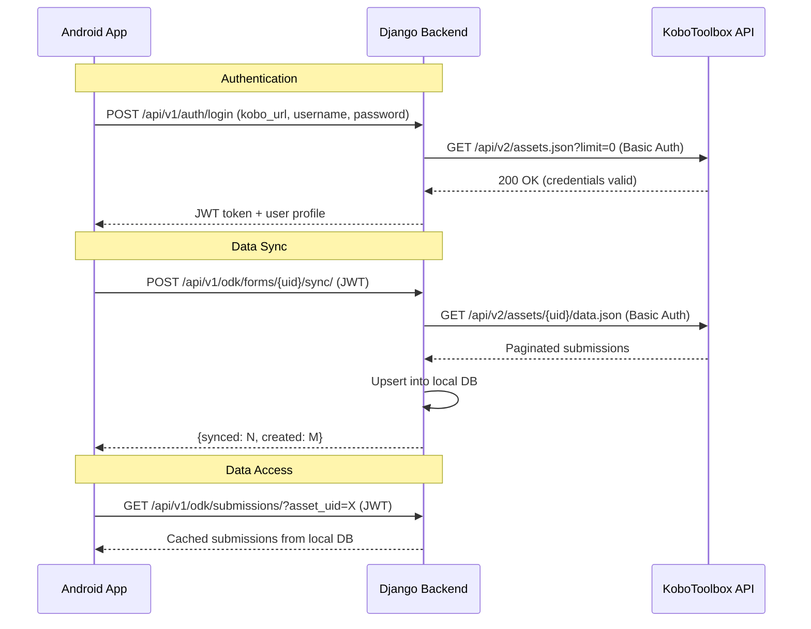
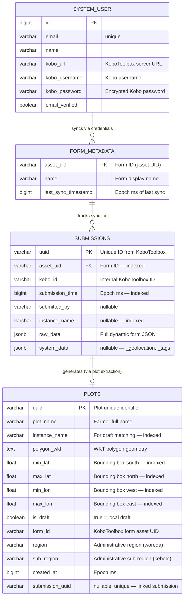

# v1_odk Module & ODK-based Authentication — Implementation Plan

Comprehensive implementation plan for the KoboToolbox proxy backend. Combines and supersedes `v1_odk_model_development_plan.md` and `v1_odk_api_development_plan.md`.

---

## Table of Contents

1. [Overview](#1-overview)
2. [Architecture](#2-architecture)
3. [v1_users Changes — ODK-based Authentication](#3-v1_users-changes--odk-based-authentication)
4. [v1_odk Models](#4-v1_odk-models)
5. [KoboClient Service](#5-koboclient-service)
6. [v1_odk Serializers](#6-v1_odk-serializers)
7. [v1_odk Views](#7-v1_odk-views)
8. [URL Configuration](#8-url-configuration)
9. [Settings & App Registration](#9-settings--app-registration)
10. [Tests](#10-tests)
11. [API Endpoints Reference](#11-api-endpoints-reference)
12. [Verification Checklist](#12-verification-checklist)

---

## 1. Overview

### Goal

Build a Django REST Framework backend that:

1. **Authenticates users via KoboToolbox** — users log in with their Kobo credentials; the backend validates against the KoboToolbox API, stores credentials server-side, and issues JWT tokens.
2. **Proxies KoboToolbox data** — fetches and caches form submissions from KoboToolbox with incremental (delta) sync support.
3. **Manages spatial plot data** — stores farm boundary polygons with bounding-box indexing for overlap detection.

### KoboToolbox API Reference

| Setting | Value |
|---------|-------|
| **Default Base URL** | `https://kf.kobotoolbox.org/` |
| **Alt Base URL** | `https://eu.kobotoolbox.org/` |
| **API Version** | v2 |
| **Auth** | HTTP Basic Auth (`Authorization: Basic base64(user:pass)`) |
| **Pagination** | Offset-based: `limit` + `start` params |

**Key endpoints consumed:**

| Kobo Endpoint | Purpose |
|---------------|---------|
| `GET /api/v2/assets.json?limit=0` | Credential verification (lightweight call) |
| `GET /api/v2/assets/{uid}/data.json?limit=N&start=M` | Fetch submissions (paginated) |
| `GET /api/v2/assets/{uid}/data.json?query={"_submission_time":{"$gt":"ISO"}}` | Delta sync |

---

## 2. Architecture

```
Android App ──► Django DRF Backend ──► KoboToolbox API
  (JWT auth)     (proxy + cache)        (Basic Auth)
```



### ERD



---

## 3. v1_users Changes — ODK-based Authentication

### 3.1 SystemUser Model Additions

**File:** `backend/api/v1/v1_users/models.py`

Add three fields to `SystemUser`:

```python
kobo_url = models.URLField(
    max_length=500,
    null=True,
    blank=True,
    help_text="KoboToolbox server URL",
)
kobo_username = models.CharField(
    max_length=255,
    null=True,
    blank=True,
    help_text="KoboToolbox username",
)
kobo_password = models.TextField(
    null=True,
    blank=True,
    help_text="Encrypted KoboToolbox password",
)
```

**Migration:** Auto-generated via `makemigrations`. All three fields are nullable to avoid breaking existing users.

### 3.2 Encryption Utility

**File:** `backend/utils/encryption.py`

Fernet-based symmetric encryption using a key derived from Django's `SECRET_KEY`:

```python
import base64
import hashlib
from cryptography.fernet import Fernet
from django.conf import settings


def _get_fernet():
    key = hashlib.sha256(
        settings.SECRET_KEY.encode()
    ).digest()
    return Fernet(base64.urlsafe_b64encode(key))


def encrypt(plaintext: str) -> str:
    return _get_fernet().encrypt(
        plaintext.encode()
    ).decode()


def decrypt(ciphertext: str) -> str:
    return _get_fernet().decrypt(
        ciphertext.encode()
    ).decode()
```

**Dependency:** Add `cryptography` to `requirements.txt`.

### 3.3 Login Serializer Changes

**File:** `backend/api/v1/v1_users/serializers.py`

Replace the existing `LoginSerializer`:

```python
from utils.custom_serializer_fields import (
    CustomCharField,
    CustomUrlField,
)


class LoginSerializer(serializers.Serializer):
    kobo_url = CustomUrlField()
    kobo_username = CustomCharField()
    kobo_password = CustomCharField()
```

Update `UserSerializer` to include Kobo fields:

```python
class UserSerializer(serializers.ModelSerializer):
    class Meta:
        model = SystemUser
        fields = [
            "id",
            "name",
            "email",
            "email_verified",
            "kobo_url",
            "kobo_username",
        ]
```

### 3.4 Login View Changes

**File:** `backend/api/v1/v1_users/views.py`

Replace the existing `login` function:

```python
from utils.kobo_client import KoboClient
from utils.encryption import encrypt


@extend_schema(
    request=LoginSerializer,
    responses={
        200: UserSerializer,
        401: DefaultResponseSerializer,
    },
    tags=["Auth"],
)
@api_view(["POST"])
def login(request, version):
    serializer = LoginSerializer(data=request.data)
    if not serializer.is_valid():
        return Response(
            {
                "message": validate_serializers_message(
                    serializer.errors
                )
            },
            status=status.HTTP_400_BAD_REQUEST,
        )

    kobo_url = serializer.validated_data["kobo_url"]
    kobo_username = serializer.validated_data[
        "kobo_username"
    ]
    kobo_password = serializer.validated_data[
        "kobo_password"
    ]

    # Validate credentials against KoboToolbox API
    client = KoboClient(
        kobo_url, kobo_username, kobo_password
    )
    if not client.verify_credentials():
        return Response(
            {"message": "Invalid KoboToolbox credentials"},
            status=status.HTTP_401_UNAUTHORIZED,
        )

    # Create or update SystemUser
    user, _ = SystemUser.objects.update_or_create(
        kobo_username=kobo_username,
        kobo_url=kobo_url,
        defaults={
            "name": kobo_username,
            "email": f"{kobo_username}@kobo.local",
            "kobo_password": encrypt(kobo_password),
        },
    )
    user.last_login = timezone.now()
    user.save()

    # Issue JWT
    refresh = RefreshToken.for_user(user)
    expiration_time = datetime.fromtimestamp(
        refresh.access_token["exp"]
    )
    expiration_time = timezone.make_aware(
        expiration_time
    )

    data = {
        "user": UserSerializer(instance=user).data,
        "token": str(refresh.access_token),
        "expiration_time": expiration_time,
    }
    response = Response(data, status=status.HTTP_200_OK)
    response.set_cookie(
        "AUTH_TOKEN",
        str(refresh.access_token),
        expires=expiration_time,
    )
    return response
```

### 3.5 Login Test Updates

**File:** `backend/api/v1/v1_users/tests/tests_login_endpoint.py`

Tests mock `KoboClient.verify_credentials()`:

```python
from unittest.mock import patch


@override_settings(USE_TZ=False, TEST_ENV=True)
class LoginTestCase(TestCase):

    @patch(
        "api.v1.v1_users.views.KoboClient"
    )
    def test_successfully_logged_in(self, mock_client):
        mock_client.return_value\
            .verify_credentials.return_value = True
        payload = {
            "kobo_url": "https://kf.kobotoolbox.org",
            "kobo_username": "testuser",
            "kobo_password": "testpass",
        }
        req = self.client.post(
            "/api/v1/auth/login",
            payload,
            content_type="application/json",
        )
        self.assertEqual(req.status_code, 200)
        res = req.json()
        self.assertEqual(
            list(res),
            ["user", "token", "expiration_time"],
        )

    @patch(
        "api.v1.v1_users.views.KoboClient"
    )
    def test_invalid_kobo_credentials(self, mock_client):
        mock_client.return_value\
            .verify_credentials.return_value = False
        payload = {
            "kobo_url": "https://kf.kobotoolbox.org",
            "kobo_username": "baduser",
            "kobo_password": "badpass",
        }
        req = self.client.post(
            "/api/v1/auth/login",
            payload,
            content_type="application/json",
        )
        self.assertEqual(req.status_code, 401)
```

---

## 4. v1_odk Models

**File:** `backend/api/v1/v1_odk/models.py`

### 4.1 FormMetadata

```python
class FormMetadata(models.Model):
    asset_uid = models.CharField(
        max_length=255, primary_key=True
    )
    name = models.CharField(
        max_length=500,
        default="",
        help_text="Form display name",
    )
    last_sync_timestamp = models.BigIntegerField(
        default=0,
        help_text="Epoch ms of last successful sync",
    )

    class Meta:
        db_table = "form_metadata"
        verbose_name_plural = "form metadata"

    def __str__(self):
        return f"Form {self.asset_uid}"
```

### 4.2 Submission

```python
class Submission(models.Model):
    uuid = models.CharField(
        max_length=255, primary_key=True
    )
    form = models.ForeignKey(
        FormMetadata,
        on_delete=models.CASCADE,
        db_column="asset_uid",
        related_name="submissions",
    )
    kobo_id = models.CharField(max_length=255)
    submission_time = models.BigIntegerField(
        db_index=True,
        help_text="Epoch ms",
    )
    submitted_by = models.CharField(
        max_length=255, null=True, blank=True
    )
    instance_name = models.CharField(
        max_length=255,
        null=True,
        blank=True,
        db_index=True,
    )
    raw_data = models.JSONField(
        help_text="Full dynamic form JSON",
    )
    system_data = models.JSONField(
        null=True,
        blank=True,
        help_text="_geolocation, _tags, etc.",
    )

    class Meta:
        db_table = "submissions"
        ordering = ["-submission_time"]

    def __str__(self):
        return self.instance_name or self.uuid
```

### 4.3 Plot

```python
import uuid


class Plot(models.Model):
    uuid = models.CharField(
        max_length=255,
        primary_key=True,
        default=uuid.uuid4,
    )
    plot_name = models.CharField(
        max_length=500,
        help_text="Farmer full name",
    )
    instance_name = models.CharField(
        max_length=255, db_index=True
    )
    polygon_wkt = models.TextField(
        help_text="Polygon in WKT format",
    )
    min_lat = models.FloatField(db_index=True)
    max_lat = models.FloatField(db_index=True)
    min_lon = models.FloatField(db_index=True)
    max_lon = models.FloatField(db_index=True)
    is_draft = models.BooleanField(default=True)
    form_id = models.CharField(max_length=255)
    region = models.CharField(max_length=255)
    sub_region = models.CharField(max_length=255)
    created_at = models.BigIntegerField(
        help_text="Epoch ms",
    )
    submission = models.OneToOneField(
        Submission,
        on_delete=models.SET_NULL,
        null=True,
        blank=True,
        db_column="submission_uuid",
        related_name="plot",
    )

    class Meta:
        db_table = "plots"

    def __str__(self):
        tag = "draft" if self.is_draft else "synced"
        return f"{self.plot_name} ({tag})"
```

### 4.4 PostgreSQL DDL (Reference)

```sql
CREATE TABLE form_metadata (
    asset_uid VARCHAR(255) PRIMARY KEY,
    name VARCHAR(500) NOT NULL DEFAULT '',
    last_sync_timestamp BIGINT NOT NULL DEFAULT 0
);

CREATE TABLE submissions (
    uuid VARCHAR(255) PRIMARY KEY,
    asset_uid VARCHAR(255) NOT NULL
        REFERENCES form_metadata(asset_uid)
        ON DELETE CASCADE,
    kobo_id VARCHAR(255) NOT NULL,
    submission_time BIGINT NOT NULL,
    submitted_by VARCHAR(255),
    instance_name VARCHAR(255),
    raw_data JSONB NOT NULL,
    system_data JSONB
);

-- Indexes via db_index=True on model fields
CREATE INDEX submissions_submission_time ON submissions(submission_time);
CREATE INDEX submissions_instance_name ON submissions(instance_name);

CREATE TABLE plots (
    uuid VARCHAR(255) PRIMARY KEY,
    plot_name VARCHAR(500) NOT NULL,
    instance_name VARCHAR(255) NOT NULL,
    polygon_wkt TEXT NOT NULL,
    min_lat DOUBLE PRECISION NOT NULL,
    max_lat DOUBLE PRECISION NOT NULL,
    min_lon DOUBLE PRECISION NOT NULL,
    max_lon DOUBLE PRECISION NOT NULL,
    is_draft BOOLEAN NOT NULL DEFAULT TRUE,
    form_id VARCHAR(255) NOT NULL,
    region VARCHAR(255) NOT NULL,
    sub_region VARCHAR(255) NOT NULL,
    created_at BIGINT NOT NULL,
    submission_uuid VARCHAR(255) UNIQUE
        REFERENCES submissions(uuid)
        ON DELETE SET NULL
);

-- Indexes via db_index=True on model fields
CREATE INDEX plots_instance_name ON plots(instance_name);
CREATE INDEX plots_min_lat ON plots(min_lat);
CREATE INDEX plots_max_lat ON plots(max_lat);
CREATE INDEX plots_min_lon ON plots(min_lon);
CREATE INDEX plots_max_lon ON plots(max_lon);
```

---

## 5. KoboClient Service

**File:** `backend/utils/kobo_client.py`

```python
import requests
from base64 import b64encode


class KoboClient:
    """Server-side client for KoboToolbox API."""

    def __init__(
        self,
        base_url: str,
        username: str,
        password: str,
    ):
        self.base_url = base_url.rstrip("/")
        self.session = requests.Session()
        credentials = b64encode(
            f"{username}:{password}".encode()
        ).decode()
        self.session.headers["Authorization"] = (
            f"Basic {credentials}"
        )

    def verify_credentials(self) -> bool:
        """Validate credentials with a lightweight
        API call."""
        try:
            url = (
                f"{self.base_url}"
                "/api/v2/assets.json"
            )
            resp = self.session.get(
                url, params={"limit": 0}
            )
            return resp.status_code == 200
        except requests.RequestException:
            return False

    def get_submissions(
        self,
        asset_uid: str,
        limit: int = 300,
        start: int = 0,
    ):
        """Fetch a page of submissions."""
        url = (
            f"{self.base_url}"
            f"/api/v2/assets/{asset_uid}/data.json"
        )
        resp = self.session.get(
            url,
            params={"limit": limit, "start": start},
        )
        resp.raise_for_status()
        return resp.json()

    def get_submissions_since(
        self,
        asset_uid: str,
        since_iso: str,
        limit: int = 300,
        start: int = 0,
    ):
        """Fetch submissions newer than a timestamp."""
        url = (
            f"{self.base_url}"
            f"/api/v2/assets/{asset_uid}/data.json"
        )
        query = (
            '{"_submission_time":'
            f'{{"$gt":"{since_iso}"}}}}'
        )
        resp = self.session.get(
            url,
            params={
                "query": query,
                "limit": limit,
                "start": start,
            },
        )
        resp.raise_for_status()
        return resp.json()

    def fetch_all_submissions(
        self,
        asset_uid: str,
        since_iso: str = None,
    ):
        """Paginate through all submissions."""
        all_results = []
        start = 0
        page_size = 300

        while True:
            if since_iso:
                data = self.get_submissions_since(
                    asset_uid, since_iso,
                    page_size, start,
                )
            else:
                data = self.get_submissions(
                    asset_uid, page_size, start
                )

            all_results.extend(data["results"])
            start += page_size

            if data.get("next") is None:
                break

        return all_results
```

---

## 6. v1_odk Serializers

**File:** `backend/api/v1/v1_odk/serializers.py`

All serializers use custom fields from `backend/utils/custom_serializer_fields.py` for consistent error messages, matching the pattern in `v1_users/serializers.py`.

```python
from rest_framework import serializers
from api.v1.v1_odk.models import (
    FormMetadata,
    Submission,
    Plot,
)
from utils.custom_serializer_fields import (
    CustomCharField,
    CustomFloatField,
)


class FormMetadataSerializer(
    serializers.ModelSerializer
):
    submission_count = (
        serializers.SerializerMethodField()
    )

    class Meta:
        model = FormMetadata
        fields = [
            "asset_uid",
            "name",
            "last_sync_timestamp",
            "submission_count",
        ]

    def get_submission_count(self, obj):
        return obj.submissions.count()


class SubmissionListSerializer(
    serializers.ModelSerializer
):
    """Lightweight — excludes raw_data."""

    class Meta:
        model = Submission
        fields = [
            "uuid",
            "form",
            "kobo_id",
            "submission_time",
            "submitted_by",
            "instance_name",
        ]


class SubmissionDetailSerializer(
    serializers.ModelSerializer
):
    """Full serializer with raw_data."""

    class Meta:
        model = Submission
        fields = "__all__"


class PlotSerializer(serializers.ModelSerializer):
    submission_uuid = serializers.CharField(
        source="submission.uuid",
        read_only=True,
        allow_null=True,
    )

    class Meta:
        model = Plot
        fields = [
            "uuid",
            "plot_name",
            "instance_name",
            "polygon_wkt",
            "min_lat",
            "max_lat",
            "min_lon",
            "max_lon",
            "is_draft",
            "form_id",
            "region",
            "sub_region",
            "created_at",
            "submission_uuid",
        ]


class PlotOverlapQuerySerializer(
    serializers.Serializer
):
    """Input serializer for bounding-box queries."""

    min_lat = CustomFloatField()
    max_lat = CustomFloatField()
    min_lon = CustomFloatField()
    max_lon = CustomFloatField()
    exclude_uuid = CustomCharField(
        required=False, default=""
    )


class SyncTriggerSerializer(serializers.Serializer):
    """Input for triggering a form sync."""

    asset_uid = CustomCharField()
```

---

## 7. v1_odk Views

**File:** `backend/api/v1/v1_odk/views.py`

All views require `IsAuthenticated`.

```python
from datetime import datetime, timezone as tz
from rest_framework import viewsets, status
from rest_framework.decorators import action
from rest_framework.permissions import IsAuthenticated
from rest_framework.response import Response
from drf_spectacular.utils import extend_schema

from api.v1.v1_odk.models import (
    FormMetadata,
    Submission,
    Plot,
)
from api.v1.v1_odk.serializers import (
    FormMetadataSerializer,
    SubmissionListSerializer,
    SubmissionDetailSerializer,
    PlotSerializer,
    PlotOverlapQuerySerializer,
    SyncTriggerSerializer,
)
from utils.kobo_client import KoboClient
from utils.encryption import decrypt


class FormMetadataViewSet(viewsets.ModelViewSet):
    queryset = FormMetadata.objects.all()
    serializer_class = FormMetadataSerializer
    permission_classes = [IsAuthenticated]

    @extend_schema(
        request=SyncTriggerSerializer,
        tags=["ODK"],
        summary="Trigger sync from KoboToolbox",
    )
    @action(detail=True, methods=["post"])
    def sync(self, request, pk=None):
        """Fetch submissions from KoboToolbox and
        upsert into local DB."""
        form = self.get_object()
        user = request.user

        if not user.kobo_url or not user.kobo_username:
            return Response(
                {"message": "No Kobo credentials"},
                status=status.HTTP_400_BAD_REQUEST,
            )

        client = KoboClient(
            user.kobo_url,
            user.kobo_username,
            decrypt(user.kobo_password),
        )

        since_iso = None
        if form.last_sync_timestamp > 0:
            since_iso = datetime.fromtimestamp(
                form.last_sync_timestamp / 1000,
                tz=tz.utc,
            ).strftime("%Y-%m-%dT%H:%M:%S")

        results = client.fetch_all_submissions(
            form.asset_uid, since_iso
        )

        created = 0
        for item in results:
            _, is_new = Submission.objects.update_or_create(
                uuid=item["_uuid"],
                defaults={
                    "form": form,
                    "kobo_id": str(item["_id"]),
                    "submission_time": int(
                        datetime.fromisoformat(
                            item["_submission_time"]
                        ).timestamp()
                        * 1000
                    ),
                    "submitted_by": item.get(
                        "_submitted_by"
                    ),
                    "instance_name": item.get(
                        "meta/instanceName"
                    ),
                    "raw_data": item,
                    "system_data": {
                        "_geolocation": item.get(
                            "_geolocation"
                        ),
                        "_tags": item.get("_tags", []),
                    },
                },
            )
            if is_new:
                created += 1

        # Update sync timestamp
        if results:
            latest = max(
                r["_submission_time"] for r in results
            )
            form.last_sync_timestamp = int(
                datetime.fromisoformat(
                    latest
                ).timestamp()
                * 1000
            )
            form.save()

        return Response(
            {"synced": len(results), "created": created}
        )


class SubmissionViewSet(
    viewsets.ReadOnlyModelViewSet
):
    queryset = Submission.objects.all()
    permission_classes = [IsAuthenticated]

    def get_serializer_class(self):
        if self.action == "retrieve":
            return SubmissionDetailSerializer
        return SubmissionListSerializer

    def get_queryset(self):
        qs = super().get_queryset()
        asset_uid = self.request.query_params.get(
            "asset_uid"
        )
        if asset_uid:
            qs = qs.filter(form__asset_uid=asset_uid)
        return qs

    @extend_schema(tags=["ODK"])
    @action(detail=False, methods=["get"])
    def latest_sync_time(self, request):
        """Get latest submission_time for a form."""
        asset_uid = request.query_params.get(
            "asset_uid"
        )
        if not asset_uid:
            return Response(
                {"message": "asset_uid is required"},
                status=status.HTTP_400_BAD_REQUEST,
            )
        latest = (
            Submission.objects.filter(
                form__asset_uid=asset_uid
            )
            .order_by("-submission_time")
            .values_list(
                "submission_time", flat=True
            )
            .first()
        )
        return Response(
            {"latest_submission_time": latest}
        )


class PlotViewSet(viewsets.ModelViewSet):
    queryset = Plot.objects.all()
    serializer_class = PlotSerializer
    permission_classes = [IsAuthenticated]

    def get_queryset(self):
        qs = super().get_queryset()
        form_id = self.request.query_params.get(
            "form_id"
        )
        is_draft = self.request.query_params.get(
            "is_draft"
        )
        if form_id:
            qs = qs.filter(form_id=form_id)
        if is_draft is not None:
            qs = qs.filter(
                is_draft=is_draft.lower() == "true"
            )
        return qs

    @extend_schema(
        request=PlotOverlapQuerySerializer,
        tags=["ODK"],
        summary="Find overlapping plots",
    )
    @action(detail=False, methods=["post"])
    def overlap_candidates(self, request):
        """Find plots whose bounding boxes overlap
        with the given bounds.

        Two bounding boxes intersect when they
        overlap on BOTH axes:
        - X: existing.min_lon <= q.max_lon AND
             existing.max_lon >= q.min_lon
        - Y: existing.min_lat <= q.max_lat AND
             existing.max_lat >= q.min_lat
        """
        serializer = PlotOverlapQuerySerializer(
            data=request.data
        )
        serializer.is_valid(raise_exception=True)
        d = serializer.validated_data

        plots = Plot.objects.filter(
            min_lon__lte=d["max_lon"],
            max_lon__gte=d["min_lon"],
            min_lat__lte=d["max_lat"],
            max_lat__gte=d["min_lat"],
        )
        if d.get("exclude_uuid"):
            plots = plots.exclude(
                uuid=d["exclude_uuid"]
            )

        return Response(
            PlotSerializer(plots, many=True).data
        )
```

---

## 8. URL Configuration

### 8.1 v1_odk URLs

**File:** `backend/api/v1/v1_odk/urls.py`

```python
from rest_framework.routers import DefaultRouter
from api.v1.v1_odk import views

router = DefaultRouter()
router.register(
    r"forms", views.FormMetadataViewSet
)
router.register(
    r"submissions", views.SubmissionViewSet
)
router.register(r"plots", views.PlotViewSet)

urlpatterns = router.urls
```

### 8.2 Root URL Mount

**File:** `backend/african_bamboo_dashboard/urls.py`

Add:

```python
path(
    "api/v1/odk/",
    include("api.v1.v1_odk.urls"),
    name="v1_odk",
),
```

---

## 9. Settings & App Registration

### 9.1 Register App

**File:** `backend/african_bamboo_dashboard/settings.py`

```python
API_APPS = [
    "api.v1.v1_init",
    "api.v1.v1_users",
    "api.v1.v1_odk",  # Add this
]
```

### 9.2 Fix App Config

**File:** `backend/api/v1/v1_odk/apps.py`

```python
class V1OdkConfig(AppConfig):
    default_auto_field = (
        "django.db.models.BigAutoField"
    )
    name = "api.v1.v1_odk"  # Fix: was "v1_odk"
```

### 9.3 Dependencies

Add to `backend/requirements.txt`:

```
cryptography
requests
```

---

## 10. Tests

### 10.1 v1_users Login Tests

**File:** `backend/api/v1/v1_users/tests/tests_login_endpoint.py`

- Mock `KoboClient.verify_credentials()` return value
- Test successful Kobo login creates user + returns JWT
- Test failed Kobo login returns 401
- Test re-login updates stored credentials
- Test missing/blank fields return 400

### 10.2 v1_odk Model Tests

**File:** `backend/api/v1/v1_odk/tests/test_models.py`

- FormMetadata CRUD and defaults
- Submission FK constraint to FormMetadata
- Plot OneToOne constraint to Submission
- Cascade delete behavior

### 10.3 v1_odk View Tests

Tests are split by endpoint following the project convention (one file per resource):

**File:** `backend/api/v1/v1_odk/tests/mixins.py`

- `OdkTestHelperMixin` — shared helpers (`create_kobo_user()`, `get_auth_header()`)

**File:** `backend/api/v1/v1_odk/tests/tests_forms_endpoint.py`

- Form CRUD endpoints (authenticated)
- `sync` action (mock `KoboClient.fetch_all_submissions`)
- Unauthenticated requests return 401

**File:** `backend/api/v1/v1_odk/tests/tests_submissions_endpoint.py`

- Submission list + filtering by `asset_uid`
- Submission detail returns `raw_data`
- `latest_sync_time` action

**File:** `backend/api/v1/v1_odk/tests/tests_plots_endpoint.py`

- Plot CRUD + filtering by `form_id`, `is_draft`
- `overlap_candidates` POST with bounding box

---

## 11. API Endpoints Reference

### Authentication

| Method | Endpoint | Description |
|--------|----------|-------------|
| `POST` | `/api/v1/auth/login` | Login with Kobo credentials, returns JWT |

### ODK — Forms

| Method | Endpoint | Description |
|--------|----------|-------------|
| `GET` | `/api/v1/odk/forms/` | List all tracked forms |
| `POST` | `/api/v1/odk/forms/` | Register a new form |
| `GET` | `/api/v1/odk/forms/{asset_uid}/` | Form detail |
| `PUT` | `/api/v1/odk/forms/{asset_uid}/` | Update form |
| `DELETE` | `/api/v1/odk/forms/{asset_uid}/` | Delete form + cascade |
| `POST` | `/api/v1/odk/forms/{asset_uid}/sync/` | Trigger Kobo sync |

### ODK — Submissions

| Method | Endpoint | Description |
|--------|----------|-------------|
| `GET` | `/api/v1/odk/submissions/` | List (filter: `?asset_uid=`) |
| `GET` | `/api/v1/odk/submissions/{uuid}/` | Detail with raw_data |
| `GET` | `/api/v1/odk/submissions/latest_sync_time/?asset_uid=` | Latest submission time |

### ODK — Plots

| Method | Endpoint | Description |
|--------|----------|-------------|
| `GET` | `/api/v1/odk/plots/` | List (filter: `?form_id=`, `?is_draft=`) |
| `POST` | `/api/v1/odk/plots/` | Create plot |
| `GET` | `/api/v1/odk/plots/{uuid}/` | Plot detail |
| `PUT` | `/api/v1/odk/plots/{uuid}/` | Update plot |
| `DELETE` | `/api/v1/odk/plots/{uuid}/` | Delete plot |
| `POST` | `/api/v1/odk/plots/overlap_candidates/` | Spatial overlap query |

---

## 12. Verification Checklist

```bash
# Generate and apply migrations
python manage.py makemigrations v1_users v1_odk
python manage.py migrate

# Run all tests
python manage.py test api.v1.v1_users api.v1.v1_odk

# Lint
flake8
black --check .
isort --check .

# Generate updated DB diagram
python manage.py dbml > db.dbml

# Verify Swagger shows new endpoints
# Visit http://localhost:8000/api/docs/
```

### Android App Migration Notes

Once the proxy is deployed, update the Android app:

| Current (direct to Kobo) | New (via Django proxy) |
|--------------------------|------------------------|
| Basic Auth to `kf.kobotoolbox.org` | `POST /api/v1/auth/login` → JWT |
| `GET /api/v2/assets/{uid}/data.json` | `GET /api/v1/odk/submissions/?asset_uid=` |
| `GET ...?query={"_submission_time":{"$gt":"..."}}` | `GET /api/v1/odk/submissions/latest_sync_time/` + `POST /api/v1/odk/forms/{uid}/sync/` |
| N/A | `POST /api/v1/odk/plots/overlap_candidates/` |

---

## Files Modified/Created Summary

| Action | Path |
|--------|------|
| Modify | `backend/api/v1/v1_users/models.py` |
| Modify | `backend/api/v1/v1_users/serializers.py` |
| Modify | `backend/api/v1/v1_users/views.py` |
| Modify | `backend/api/v1/v1_users/tests/tests_login_endpoint.py` |
| Create | `backend/utils/encryption.py` |
| Create | `backend/utils/kobo_client.py` |
| Modify | `backend/api/v1/v1_odk/apps.py` |
| Modify | `backend/api/v1/v1_odk/models.py` |
| Create | `backend/api/v1/v1_odk/serializers.py` |
| Modify | `backend/api/v1/v1_odk/views.py` |
| Create | `backend/api/v1/v1_odk/urls.py` |
| Modify | `backend/api/v1/v1_odk/admin.py` |
| Create | `backend/api/v1/v1_odk/tests/__init__.py` |
| Create | `backend/api/v1/v1_odk/tests/mixins.py` |
| Create | `backend/api/v1/v1_odk/tests/test_models.py` |
| Create | `backend/api/v1/v1_odk/tests/tests_forms_endpoint.py` |
| Create | `backend/api/v1/v1_odk/tests/tests_submissions_endpoint.py` |
| Create | `backend/api/v1/v1_odk/tests/tests_plots_endpoint.py` |
| Modify | `backend/african_bamboo_dashboard/settings.py` |
| Modify | `backend/african_bamboo_dashboard/urls.py` |