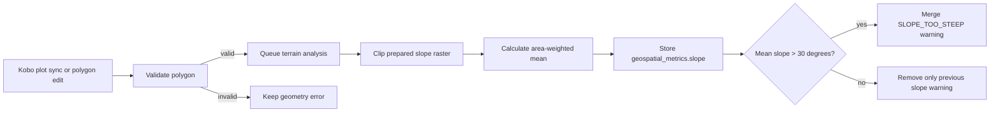

# V24 — Flag Average Plot Slope Over 30 Degrees

> **Purpose**: Design the slope validation feature before implementation. This
> document is intended for product, GIS, and engineering review.

---

## Feature: Average Slope Over 30 Degrees

**Task ID**: V24  
**Author**: Iwan  
**Date**: 2026-08-14  
**Status**: Developer approved — product/GIS resolution decision pending

---

## 1. Context & Problem Statement

The dashboard currently validates polygon geometry, overlap, GPS accuracy,
point spacing, area, and vertex count. It does not assess the terrain inside a
plot. African Bamboo wants the User to see a warning when the **average terrain
slope inside a submitted polygon is greater than 30 degrees**.

```text
Currently:
- Plot polygons are stored as WGS84 WKT in Plot.polygon_wkt.
- Plot.flagged_reason stores structured error/warning objects.
- The User can approve, reject, or edit plot geometry.
- Geometry edits are synced to Kobo and existing validation is rerun.
- No raster datasets or terrain-analysis pipeline are installed.

Goal:
- Calculate mean slope from Copernicus DEM GLO-30 for every valid plot.
- Store the measured value and dataset provenance.
- Add a warning when mean slope is strictly greater than 30 degrees.
- Recalculate after a polygon edit and support backfilling existing plots.
- Never silently mark a plot clean when terrain analysis fails.
```

### Proposed data flow



---

## 2. Requirements

### User Acceptance Criteria

- [ ] **AC-1:** The User sees the measured mean slope in degrees in the plot
      detail panel.
- [ ] **AC-2:** A plot with mean slope `> 30.0` is flagged for review.
- [ ] **AC-3:** A plot with mean slope exactly `30.0` is not flagged by this
      rule.
- [ ] **AC-4:** The warning explains the measured value, threshold, and dataset
      source.
- [ ] **AC-5:** The User can approve, reject, or adjust a flagged plot using the existing
      workflow.
- [ ] **AC-6:** After the User adjusts the polygon, slope is recalculated for the
      new shape.
- [ ] **AC-7:** An unavailable calculation is displayed as unavailable, not as
      a pass.

### Technical Acceptance Criteria

- [ ] Copernicus DEM GLO-30 is the terrain source and its version is recorded.
- [ ] A slope raster in degrees is prepared once from the DEM; slope is not
      derived independently for every plot request.
- [ ] Only valid raster coverage is included in the mean; nodata is excluded.
- [ ] The calculation runs outside the HTTP response-critical path through the
      existing Django-Q2 PostgreSQL ORM queue and `qcluster` worker.
- [ ] Updating slope preserves every non-slope flag already on the plot.
- [ ] Polygon sync, edit, reset, and backfill use the same analysis function.
- [ ] The `30.0` degree threshold and rule version are defined once in
      `v1_geospatial/constants.py`; calculation and warning code contain no
      repeated threshold literal, and each result stores the applied values.
- [ ] Existing API clients remain compatible because all new fields are
      nullable/additive.
- [ ] Dataset files and their manifest are versioned. The approved small
      regional package may be committed under `backend/assets/geospatial/`;
      larger future coverage uses mounted persistent storage.

### Progress measurement

Engineering delivery and User AC acceptance are tracked separately so code
progress cannot be mistaken for user acceptance.

#### Engineering progress

Each engineering task in Section 12 has a planning weight based on the
midpoint of its non-AI estimate. A task earns progress through these evidence
gates:

| Task state | Earned value | Required evidence |
|------------|-------------:|-------------------|
| Not started | 0% | No implementation branch/PR evidence. |
| In progress | 25% | Scoped code or fixture work has started. |
| Code complete | 50% | Implementation is reviewable and related files are identified in the PR. |
| Automated verification complete | 75% | Required unit, integration, API, and frontend tests pass in CI. |
| Done | 100% | Code is merged/deployed to the target environment and the task's linked AC evidence is recorded. |

```text
engineering_progress_percent =
    sum(task_planning_weight * task_earned_value)
    / sum(task_planning_weight)
    * 100
```

The six remaining tasks have midpoint weights of `5, 5, 7, 7, 5, 5` hours,
for a total planning weight of **34 hours**. AI assistance may reduce elapsed
effort, but it does not change the earned-value or acceptance rules.

#### User AC progress

Each AC moves through `not demonstrated`, `automated pass`, `UAT ready`, and
`accepted`. Only `accepted` counts toward the final User AC completion number:

```text
user_ac_progress = accepted_user_acs / 7
```

The notebook threshold demo is supporting evidence for AC-2 through AC-4, but
it does not mark them accepted because it does not exercise the deployed API,
queue, database, and UI together.

| User AC | Engineering tasks that enable it | Automated evidence | Final acceptance evidence |
|---------|----------------------------------|--------------------|---------------------------|
| AC-1: Display measured slope | E2, E3, E5, E6 | Serializer/API test and plot-detail component test | The User confirms value, unit, source, and confidence display in UAT. |
| AC-2: `> 30.0` is flagged | E2, E3, E4, E6 | Strict-threshold unit test, task integration test, and API response test | The User sees a `SLOPE_TOO_STEEP` plot in the review queue. |
| AC-3: Exactly `30.0` is not flagged | E3, E4, E6 | Boundary unit test and existing-flag preservation API test | Product verifies no slope warning is added at exactly `30.0`. |
| AC-4: Warning explains value, threshold, and source | E2, E3, E5, E6 | Warning-contract unit test plus backend/frontend snapshot assertions | The User approves the production wording. |
| AC-5: Existing review actions still work | E4, E5, E6 | Approve/reject/edit regression tests | The User completes approve, reject, and adjust actions in UAT. |
| AC-6: Adjustment recalculates slope | E3, E4, E6 | Edit dispatch, fingerprint, stale-task, and completed-result integration tests | Adjusted polygon shows a new analysis timestamp/value in UAT. |
| AC-7: Unavailable is not a pass | E2, E3, E5, E6 | Missing/out-of-coverage raster, API-state, and frontend-state tests | The User sees an unavailable state without a false pass. |

### Metric definition

For valid slope raster pixels intersecting polygon `P`:

```text
mean_slope_degrees = sum(pixel_slope * intersection_area)
                     / sum(intersection_area)

flag = mean_slope_degrees > SLOPE_MAX_DEGREES
```

The reviewed product rule is `30.0`. Changing the constant requires a rule
version increment and controlled warning re-evaluation/backfill so stored
warnings and the threshold reported by the API remain consistent.

Area weighting avoids giving a partially intersected edge pixel the same
influence as a pixel fully inside the plot. During implementation, results
must be compared with a GIS reference calculation on representative plots.

### Notebook POC result (2026-08-14)

The feasibility POC is implemented in
`notebooks/v24_average_slope_poc.ipynb`. It uses the actual ignored submission
data, the existing Django polygon parsing/validation helpers, and a real
Copernicus GLO-30 subset downloaded through the OpenTopography Global DEM API.

The POC processed 166 valid submission polygons:

| Check | Result |
|-------|--------|
| Valid input polygons | 166 / 166 |
| Completed slope calculations | 166 / 166 |
| Mean slope strictly over 30 degrees | 0 / 166 |
| Observed mean-slope range | 0.30–20.69 degrees |
| Observed median mean slope | 3.77 degrees |
| Intersecting 30 m cells per plot | 1–11; median 3.5 |
| Effective full-pixel equivalents | 0.083–3.431; median 0.343 |
| Below the proposed four-effective-pixel confidence floor | 166 / 166 |

This proves that the pipeline is technically feasible, but also identifies a
product limitation: every current plot is smaller than four effective 30 m
pixels. For most plots, GLO-30 describes the surrounding terrain rather than
providing a detailed within-plot surface measurement. The `> 30` rule can
still be applied, but the UI and stored result must not imply survey-grade or
fine-grained accuracy.

The notebook writes a tracked, reviewable summary to
`notebooks/outputs/v24_slope_summary.json`, and keeps the sensitive artifacts
under the ignored `notebooks/data/v24_poc_output/`:

- `slope_results_private.json` — detailed POC results keyed by hashed IDs.
- `v24_acceptance_demo.json` — deterministic `30.01` and `30.00` threshold
  scenarios using existing hashed plot records, including the proposed warning
  and metric response structures.
- `v24_django_aligned_sensitive.csv` — current-model-aligned rows with exact
  plot geometry and proposed geospatial metric JSON.

The aligned CSV contains no names, phone numbers, attachment URLs, or raw
submission IDs. Exact geometry is still sensitive, so the entire data folder
is ignored. In the running backend container, all 166 CSV rows successfully
constructed and validated unsaved `FormMetadata`, `Submission`, and `Plot`
instances. No records were saved to the database.

---

## 3. Data Model Changes

### New Models

No new model is proposed. V24 establishes one shared JSON container on `Plot`
that V25–V27 can extend without adding a migration for every metric.

### Modified Models

| Model | Change | Reason |
|-------|--------|--------|
| `Plot` | Add nullable `geospatial_metrics` JSONField | Store metric results, status, units, source, version, and timestamp |

### New geospatial application

V24 introduces `api.v1.v1_geospatial` so geographic validation does not grow
inside the Kobo/ODK integration application:

```text
backend/api/v1/v1_geospatial/
├── __init__.py
├── apps.py
├── constants.py
├── services/
│   ├── __init__.py
│   ├── geospatial_metrics.py
│   └── slope.py
├── warning_rules.py
├── tasks.py
├── management/commands/
│   └── backfill_geospatial_metric.py
└── tests/
    ├── tests_slope.py
    ├── tests_geospatial_metrics.py
    ├── tests_slope_tasks.py
    ├── tests_slope_lifecycle.py
    ├── tests_slope_warning_rules.py
    └── tests_backfill_geospatial_metric_command.py
```

`v1_geospatial` owns calculation, rule constants, queue execution, warning
evaluation, and backfill. The existing `Plot` model and its API serializer
remain in `v1_odk`, so the field migration also remains a `v1_odk` migration.
The only V24 responsibilities left in `v1_odk` are exposing the additive field
and dispatching a geospatial task after plot sync/edit/reset.

Register `api.v1.v1_geospatial` in `API_APPS` so Django discovers its checks
and management commands. It adds no `urls.py`, view, or public endpoint. The
dependency direction is `v1_geospatial -> v1_odk.models`; ODK dispatches the
task by dotted string so it does not import geospatial calculation code.

```python
# backend/api/v1/v1_odk/models.py
class Plot(models.Model):
    # Existing fields...
    geospatial_metrics = models.JSONField(
        null=True,
        blank=True,
        default=None,
        help_text=(
            "Calculated geospatial metrics keyed by metric name; "
            "includes status and dataset provenance."
        ),
    )
```

Proposed slope value:

```json
{
  "slope": {
    "status": "complete",
    "value": 31.742,
    "unit": "degrees",
    "source": "Copernicus DEM GLO-30",
    "source_version": "DGED-2023_1",
    "source_provider": "OpenTopography",
    "threshold": {
      "operator": ">",
      "value": 30.0,
      "unit": "degrees",
      "rule_version": "v1"
    },
    "analysed_at": "2026-08-14T09:00:00Z",
    "details": {
      "intersecting_cell_count": 4,
      "effective_pixel_equivalent": 0.37,
      "coverage_percent": 100.0,
      "resolution_confidence": "low"
    }
  }
}
```

Allowed metric statuses are `pending`, `complete`, `unavailable`, and
`failed`. Error details exposed through the API must be safe summaries, not
filesystem paths, credentials, or raw exception traces.

### Migration Strategy

```python
# New nullable field: no data rewrite or table default is required.
migrations.AddField(
    model_name="plot",
    name="geospatial_metrics",
    field=models.JSONField(null=True, blank=True, default=None),
)
```

- Existing rows remain `NULL` until backfilled.
- The reverse migration removes only the new field.
- Deploy the schema before workers that write the new value.
- Run the backfill only after the DEM and derived slope raster are validated.

---

## 4. API Contract

### Endpoints

| Method | URL | Purpose | Auth |
|--------|-----|---------|------|
| GET | `/api/v1/odk/plots/{uuid}/` | Return the slope result with existing plot details | Required |
| PATCH | `/api/v1/odk/plots/{uuid}/` | Existing geometry edit; queues recalculation | Required |
| POST | `/api/v1/odk/forms/{asset_uid}/sync/` | Existing Kobo sync; queues calculation for changed plots | Required |

No public endpoint is added for arbitrary polygons. Dataset preparation and
backfill are operator commands so untrusted users cannot submit expensive
raster queries.

### Plot-detail response change

The existing `GET /api/v1/odk/plots/{uuid}/` response remains backward
compatible. V24 adds one nullable, read-only top-level field to
`PlotSerializer`:

```python
class Meta:
    fields = [
        # All existing fields remain in their current order/shape.
        # ...
        "farmer_uid",
        "geospatial_metrics",  # New, nullable and read-only
    ]
    read_only_fields = [
        # Existing read-only fields...
        "geospatial_metrics",
    ]
```

| Existing response field | Difference after V24 |
|-------------------------|----------------------|
| All current identity, geometry, location, form, submission, approval, farmer, and audit fields | No change to names, types, or values. |
| `geospatial_metrics` | New read-only field. It is `null` before analysis/backfill, then contains `slope.status` and the result/provenance fields. |
| `flagged_for_review` | Still represents all validation rules together. It becomes/remains `true` when any flag exists; it is not a slope-only boolean. |
| `flagged_reason` | Existing entries are preserved. V24 removes/replaces only the prior `SLOPE_TOO_STEEP` entry and appends one when the completed mean is strictly over `30.0`. |

The supplied example is already flagged by `POINT_GAP_LARGE` and `OVERLAP`, so
`flagged_for_review` remains `true` whether its slope passes or fails. The
meaningful response difference for that plot is shown below. The `31.742`
value is an illustrative threshold-failing result; production returns the
value calculated by the worker for the submitted polygon.

```diff
 {
   "plot_id": "752997504",
   "uuid": "c83ca02e-c5d1-4aba-a5c4-f16fd5494e11",
   "polygon_wkt": "POLYGON((...))",
+  "geospatial_metrics": {
+    "slope": {
+      "status": "complete",
+      "value": 31.742,
+      "unit": "degrees",
+      "source": "Copernicus DEM GLO-30",
+      "source_version": "DGED-2023_1",
+      "source_provider": "OpenTopography",
+      "threshold": {
+        "operator": ">",
+        "value": 30.0,
+        "unit": "degrees",
+        "rule_version": "v1"
+      },
+      "analysed_at": "2026-08-14T09:00:00Z",
+      "details": {
+        "intersecting_cell_count": 4,
+        "effective_pixel_equivalent": 0.37,
+        "coverage_percent": 100.0,
+        "resolution_confidence": "low"
+      }
+    }
+  },
   "flagged_for_review": true,
   "flagged_reason": [
     { "type": "POINT_GAP_LARGE", "severity": "warning", "note": "..." },
     { "type": "OVERLAP", "severity": "error", "note": "..." },
+    {
+      "type": "SLOPE_TOO_STEEP",
+      "severity": "warning",
+      "note": "Average slope is 31.74 degrees (threshold: > 30.0 degrees). Dataset source: Copernicus DEM GLO-30 DGED-2023_1 via OpenTopography."
+    }
   ],
   "farmer_uid": "00361"
 }
```

The abbreviated existing warnings above represent the original array. The
implementation does not remove, reorder, or deduplicate non-slope warnings.

### Response lifecycle

The endpoint does not wait for raster processing. The expected response state
progression is:

1. Existing row before it has been queued or backfilled:

   ```json
   {
     "geospatial_metrics": null
   }
   ```

2. Immediately after sync/edit/reset dispatches the Django-Q2 task:

   ```json
   {
     "geospatial_metrics": {
       "slope": {
         "status": "pending",
         "value": null,
         "unit": "degrees",
         "source": "Copernicus DEM GLO-30",
         "source_version": "DGED-2023_1",
         "source_provider": "OpenTopography",
         "threshold": {
           "operator": ">",
           "value": 30.0,
           "unit": "degrees",
           "rule_version": "v1"
         }
       }
     }
   }
   ```

3. After the worker completes, `status` becomes `complete` and `value`,
   `analysed_at`, and `details` are populated. A safe `unavailable` or `failed`
   result has `value: null`; it is never interpreted as a pass.

No Django-Q task ID or `v1_jobs` record is added to this plot response. The
metric status is the frontend's polling/display contract.

### Strict-threshold examples

For a completed mean of exactly `30.0`, the response contains the measured
metric but V24 adds no warning:

```json
{
  "geospatial_metrics": {
    "slope": {
      "status": "complete",
      "value": 30.0,
      "unit": "degrees",
      "source": "Copernicus DEM GLO-30",
      "source_version": "DGED-2023_1",
      "source_provider": "OpenTopography",
      "threshold": {
        "operator": ">",
        "value": 30.0,
        "unit": "degrees",
        "rule_version": "v1"
      }
    }
  },
  "flagged_for_review": true,
  "flagged_reason": [
    {
      "type": "POINT_GAP_LARGE",
      "severity": "warning",
      "note": "Existing point-gap warning remains unchanged."
    },
    {
      "type": "OVERLAP",
      "severity": "error",
      "note": "Existing overlap warning remains unchanged."
    }
  ]
}
```

In this example `flagged_for_review` is still `true` because other rules are
present, not because the slope is exactly 30 degrees.

For `30.01`, V24 adds `SLOPE_TOO_STEEP`. The response warning must include
the measured value, strict threshold, dataset name/version, and provider.

### Complete response fragment

```json
{
  "uuid": "plot-uuid",
  "polygon_wkt": "POLYGON((...))",
  "geospatial_metrics": {
    "slope": {
      "status": "complete",
      "value": 31.742,
      "unit": "degrees",
      "source": "Copernicus DEM GLO-30",
      "source_version": "DGED-2023_1",
      "source_provider": "OpenTopography",
      "threshold": {
        "operator": ">",
        "value": 30.0,
        "unit": "degrees",
        "rule_version": "v1"
      },
      "analysed_at": "2026-08-14T09:00:00Z",
      "details": {
        "effective_pixel_equivalent": 0.37,
        "resolution_confidence": "low"
      }
    }
  },
  "flagged_for_review": true,
  "flagged_reason": [
    {
      "type": "SLOPE_TOO_STEEP",
      "severity": "warning",
      "note": "Average slope is 31.74 degrees (threshold: > 30.0 degrees). Dataset source: Copernicus DEM GLO-30 DGED-2023_1 via OpenTopography."
    }
  ]
}
```

Concurrent metric writers must merge one key under a row lock:

```python
@transaction.atomic
def store_metric(plot_id, metric_name, result):
    plot = Plot.objects.select_for_update().get(pk=plot_id)
    metrics = dict(plot.geospatial_metrics or {})
    metrics[metric_name] = result
    plot.geospatial_metrics = metrics
    plot.save(update_fields=["geospatial_metrics"])
```

---

## 5. Decision Log

### D-1: Terrain dataset

**Options Considered**:
1. Copernicus DEM GLO-30 — open, global, approximately 30 m.
2. SRTM 1 Arc-Second — mature 30 m alternative.
3. Query Google Earth Engine for every plot — less local storage but creates a
   runtime external dependency.

**Decision**: Ship a versioned static Copernicus GLO-30 dataset for the agreed
collection areas under `backend/assets/geospatial/`. Include both the DEM
subset, so V25 can reuse it for elevation, and the derived slope raster used
by V24. The OpenTopography API is a release/provisioning source only; plot
requests and Django-Q2 tasks never download terrain data.

Proposed layout:

```text
backend/assets/geospatial/cop30_dged_2023_1/
├── dem.tif
├── slope_degrees.tif
└── manifest.json
```

The manifest records source, version, provider, bounding box, CRS, resolution,
nodata value, checksums, generation timestamp, and the slope-generation
parameters. Dataset coverage must be based on the agreed collection area with
a processing halo, not only the current plot bounding boxes.

**Rationale**: Terrain is effectively static, and local processing makes plot
sync independent of an external API, account quota, and network availability.

**Impact**: For a small regional subset, the backend and worker receive the
same read-only files through the existing source checkout/container image, as
they already do for `backend/assets/ethiopia_admin_boundaries.geojson`. No
OpenTopography API key is required in the deployed backend or worker. If the
approved coverage grows enough that the raster package is unsuitable for Git
or the container image, retain the same file contract but publish/mount it
under `STORAGE_PATH/geospatial/` instead.

### D-2: Precompute slope raster

**Decision**: Generate the versioned slope-in-degrees raster once while
preparing the static release asset. Runtime tasks only read the prepared file.

**Rationale**: Deriving slope per plot repeats expensive neighbourhood
calculations and may create inconsistent edge handling.

### D-3: Warning rather than automatic rejection

**Decision**: Add a warning to the User's existing review queue.

**Rationale**: The source is a 30 m digital surface model and the result needs
human interpretation, especially for small plots.

### D-4: Calculation failure behavior

**Decision**: Persist an unavailable/failed status and retain any prior valid
result until a successful replacement is available. Never remove a prior slope
warning because a refresh failed.

### D-5: Resolution confidence

**POC finding**: All 166 current plots contain fewer than four effective 30 m
pixels; the median plot contains only 0.343 effective pixels.

**Provisional decision**: Store the effective-pixel equivalent and a
`resolution_confidence` value with every result. Display a low-resolution
notice separately from `SLOPE_TOO_STEEP`; do not automatically reject plots
or create a second review flag solely because the source resolution is low.

**Decision required before implementation**: Product/GIS must either approve
GLO-30 as contextual terrain evidence, define a different confidence policy,
or select a higher-resolution source. This choice may change the remaining
estimate and operating cost.

### D-6: Background queue and job tracking

**Decision**: Use the existing Django-Q2 queue. Dispatch slope work with
`django_q.tasks.async_task`, use the configured PostgreSQL ORM broker, and run
it through the existing `python manage.py qcluster` worker. Do not introduce
Celery, Redis, or another queue system for V24.

The current execution path is:

```text
plot sync/edit/reset
    -> async_task("api.v1.v1_geospatial.tasks.analyse_plot_slope", ...)
    -> PostgreSQL ORM queue configured by Q_CLUSTER
    -> qcluster started by run_worker.sh or Dockerfile.worker
    -> calculate and transactionally store Plot.geospatial_metrics.slope
    -> merge/remove only the SLOPE_TOO_STEEP warning
```

Queue arguments must be serializable primitives, such as the plot UUID,
polygon fingerprint, and dataset version. The worker reloads the plot and
checks the fingerprint before writing so an older task cannot overwrite a
newer polygon result.

`api.v1.v1_jobs` is the application's user-visible job-status layer; it is not
the queue broker. Automatic per-plot slope tasks will use
`Plot.geospatial_metrics.slope.status` for `pending`, `complete`,
`unavailable`, and `failed` state rather than creating a `Jobs` row for every
plot. The `Jobs` model should be extended with a slope-backfill job type only
if an operator-visible API/UI for backfill progress is added later; that UI is
outside the current V24 scope.

**Worker impact**: The existing worker image must receive Rasterio/GDAL and
read access to `backend/assets/geospatial/`. If the dataset later moves out of
the image because of size, both backend and worker must instead share the same
`STORAGE_PATH/geospatial` volume.
Slope tasks should be one plot or a bounded small batch so they fit the worker
timeout and do not monopolize both configured workers. Retry limits and stale
task handling are enforced by V24 task code rather than assuming that the
cluster's `timeout` and `retry` settings provide a business-level attempt cap.

### D-7: Geospatial module and versioned threshold constant

**Decision**: Put V24 domain logic in the new
`api.v1.v1_geospatial` application. `v1_odk` remains the system of record for
plots and the integration point that dispatches validation after geometry
changes; it does not own slope calculation or warning rules.

The threshold is a reviewed, versioned product-rule constant rather than an
environment setting:

```python
# backend/api/v1/v1_geospatial/constants.py
SLOPE_MAX_DEGREES = 30.0
SLOPE_RULE_VERSION = "v1"
```

Geospatial code imports these constants directly and contains no repeated
threshold literal. This prevents silent environment drift between the backend
and worker. The completed metric stores the applied threshold and rule version,
making results auditable after a code change. Changing the rule requires code
review, a `SLOPE_RULE_VERSION` increment, boundary-test updates, coordinated
backend/worker deployment, and the reflag/backfill command.

---

## 6. Type/Constant Mappings

| Frontend | Backend Constant | Stored Value |
|----------|------------------|--------------|
| `SLOPE_TOO_STEEP` | `v1_geospatial.constants.GeospatialFlagType.SLOPE_TOO_STEEP` | `"SLOPE_TOO_STEEP"` |
| Warning | `v1_geospatial.constants.GeospatialFlagSeverity.WARNING` | `"warning"` |
| Complete | `v1_geospatial.constants.GeoMetricStatus.COMPLETE` | `"complete"` |

```python
# backend/api/v1/v1_geospatial/constants.py
class GeospatialFlagType:
    SLOPE_TOO_STEEP = "SLOPE_TOO_STEEP"


class GeospatialFlagSeverity:
    WARNING = "warning"


class GeoMetricStatus:
    PENDING = "pending"
    COMPLETE = "complete"
    UNAVAILABLE = "unavailable"
    FAILED = "failed"


SLOPE_MAX_DEGREES = 30.0
SLOPE_RULE_VERSION = "v1"
```

```python
def slope_flag(mean_slope):
    if mean_slope <= SLOPE_MAX_DEGREES:
        return None
    return {
        "type": GeospatialFlagType.SLOPE_TOO_STEEP,
        "severity": GeospatialFlagSeverity.WARNING,
        "note": (
            f"Average slope is {mean_slope:.2f} degrees "
            f"(threshold: > {SLOPE_MAX_DEGREES:.1f} degrees)."
        ),
    }
```

The flag updater removes only a previous `SLOPE_TOO_STEEP` entry before adding
the newly evaluated one. Geometry, overlap, GPS, area, road, elevation, and
tree-cover flags are preserved.

---

## 7. Compatibility & Migration

### Backward Compatibility

- [x] Existing API consumers can ignore the additive nullable field.
- [x] Existing flags and approval records are preserved.
- [x] Kobo payloads and geometry serialization are unchanged.
- [x] Export behavior is unchanged unless metric columns are added separately.

### Seeder/CLI Compatibility

- [ ] Add the versioned DEM, slope raster, and manifest under
      `backend/assets/geospatial/cop30_dged_2023_1/`.
- [ ] Validate the manifest, checksum, CRS, resolution, nodata, and configured
      coverage at application/worker startup or before deployment.
- [ ] Add the `v1_geospatial` command
      `backfill_geospatial_metric --metric slope [--form UID]`.
- [ ] Support `--dry-run`, bounded `--batch-size`, resume, and progress output.

There is no runtime `prepare_terrain_dataset` management command in this
approach. Dataset preparation is a release-time operation performed only when
the source version or supported collection area changes. The POC notebook can
produce the initial subset; a small reproducible release script may be added
if preparation will be repeated. The deployed application only validates and
reads the static files.

The raster is not imported into PostgreSQL. A relational raster import would
increase database size and backup/restore cost without benefiting the current
file-based Rasterio calculation. The database stores only each plot's derived
metric, status, warning, and dataset provenance in `Plot.geospatial_metrics`.
The one-time `backfill_geospatial_metric` command calculates those values for
existing plots; new or edited plots use the normal Django-Q2 task.

Example processing core:

```python
def calculate_mean_slope(polygon_wkt, slope_dataset):
    polygon = shapely.from_wkt(polygon_wkt)
    projected = transform_geometry(
        polygon, "EPSG:4326", slope_dataset.crs
    )
    values, weights = read_weighted_pixels(
        slope_dataset, projected
    )
    if not len(values):
        raise MetricUnavailable("No valid slope pixels")
    return float(numpy.average(values, weights=weights))
```

---

## 8. Security Considerations

- [x] No user-provided dataset path is accepted by public API endpoints.
- [x] Dataset operator commands require server access.
- [x] Polygon validity and Ethiopia bounds are checked before raster access.
- [x] API error messages exclude local paths and exception traces.
- [x] Dataset source/version are allow-listed operator metadata.
- [ ] Document Copernicus attribution in deployment/user documentation.

Resource controls must cap polygon complexity, task retries, batch size, and
concurrent raster readers so malformed or unusually large polygons cannot
exhaust worker memory.

---

## 9. Testing Strategy

| Test Type | Coverage |
|-----------|----------|
| Unit | Weighted mean, nodata exclusion, threshold at 29.99/30/30.01, flag replacement, metric merge |
| Integration | Prepared raster to Plot result, background task retry, backfill resume, geometry edit recalculation |
| API | Additive response shape, pending/failed status, preservation of existing flags |
| Frontend | Value/unit/source display, warning label, unavailable and loading states |
| GIS acceptance | Independently compare a small flat/steep/raster-edge fixture against QGIS; the notebook already covers actual-data feasibility |

### Unit-test specification

Unit tests use a tiny generated/committed raster fixture and must never call
OpenTopography or depend on the sensitive notebook data.

| Planned test file | Test case | Verifies | AC/task evidence |
|-------------------|-----------|----------|------------------|
| `backend/api/v1/v1_geospatial/tests/tests_slope.py` *(new)* | `test_weighted_mean_uses_intersection_area` | Partially covered edge cells are weighted by intersection area. | E3 foundation |
| Same | `test_weighted_mean_excludes_nodata` | Nodata does not lower or increase the mean. | AC-7, E3 |
| Same | `test_outside_dataset_is_unavailable` | Missing coverage returns `unavailable`, never `complete` with a false value. | AC-7, E3 |
| Same | `test_resolution_confidence_uses_effective_pixels` | Effective-pixel count and low-resolution status are deterministic. | AC-1, E3 |
| Same | `test_slope_threshold_is_strict` | `29.99` and `30.0` do not produce a slope flag; `30.01` does. | AC-2, AC-3, E3 |
| Same | `test_slope_result_records_rule_contract` | The result stores `SLOPE_MAX_DEGREES` and `SLOPE_RULE_VERSION`, rather than repeated literals. | AC-2, AC-3, E1, E3 |
| Same | `test_slope_warning_contract` | Warning contains `31.74`, `> 30.0`, dataset name/version, and provider. | AC-4, E3 |
| `backend/api/v1/v1_geospatial/tests/tests_slope_warning_rules.py` *(new)* | `test_replace_only_slope_warning` | A recalculation replaces/removes only `SLOPE_TOO_STEEP` and preserves point-gap, overlap, and future metric flags. | AC-2, AC-3, AC-5, E4 |
| `backend/api/v1/v1_geospatial/tests/tests_geospatial_metrics.py` *(new)* | `test_store_metric_merges_slope_key` | A slope write preserves other `geospatial_metrics` keys. | E2 |
| `backend/api/v1/v1_geospatial/tests/tests_slope_tasks.py` *(new)* | `test_stale_polygon_result_is_discarded` | A queued slope result cannot overwrite a newer polygon. | AC-6, E4 |
| `backend/api/v1/v1_geospatial/tests/tests_slope_lifecycle.py` *(new)* | `test_polygon_edit_dispatches_current_slope_task` | Sync/edit/reset dispatch uses the current polygon fingerprint and shared slope task. | AC-6, E4 |
| `backend/api/v1/v1_geospatial/tests/tests_backfill_geospatial_metric_command.py` *(new)* | `test_slope_backfill_resumes_after_last_completed_batch` | The slope backfill is bounded, resumable, and does not duplicate completed work. | E4 |

Representative threshold and warning-contract test:

```python
def test_slope_threshold_is_strict(self):
    self.assertIsNone(slope_flag(30.0))
    warning = slope_flag(30.01)
    self.assertEqual(
        warning["type"],
        GeospatialFlagType.SLOPE_TOO_STEEP,
    )
    self.assertIn("30.01 degrees", warning["note"])
    self.assertIn("threshold: > 30.0 degrees", warning["note"])
    self.assertIn("Copernicus DEM GLO-30", warning["note"])
    self.assertIn("OpenTopography", warning["note"])
```

### Integration, API, and frontend acceptance tests

| Test surface | Required scenario | User AC |
|--------------|-------------------|---------|
| Django-Q2 slope task | `pending -> complete`, retry-to-failed, and fingerprint mismatch in `tests_slope_tasks.py` | AC-2, AC-6, AC-7 |
| Slope lifecycle | Sync/edit/reset dispatch and stale-result protection in `tests_slope_lifecycle.py` | AC-5, AC-6 |
| Slope backfill command | Bounded batches, dry-run, resume, and idempotency in `tests_backfill_geospatial_metric_command.py` | Engineering completion evidence |
| Plot API | Legacy `geospatial_metrics: null`, pending, complete, unavailable, and failed response shapes | AC-1, AC-7 |
| Plot API | Existing warning array plus `SLOPE_TOO_STEEP`; then recalculation removes only the slope warning | AC-2, AC-3, AC-5 |
| Plot edit/reset API | Geometry change queues exactly one current slope calculation and exposes the new result | AC-6 |
| Plot detail UI | Complete value/unit/source/confidence, pending state, and unavailable state | AC-1, AC-7 |
| Review UI | Slope warning wording plus existing approve/reject/adjust actions | AC-4, AC-5 |

Primary `v1_geospatial` files are `tests_slope.py`,
`tests_geospatial_metrics.py`, `tests_slope_tasks.py`,
`tests_slope_lifecycle.py`, `tests_backfill_geospatial_metric_command.py`,
and `tests_slope_warning_rules.py`. Existing `v1_odk` test modules cover only
the Plot API and dispatch integration boundary: `tests_plots_endpoint.py` and
`tests_plots_reset_endpoint.py`. Frontend evidence remains in
`frontend/__tests__/page.test.js` and
`frontend/__tests__/validation-rules-content.test.js`.

Required failure scenarios include missing tile, all-nodata result, invalid
WKT, dataset version removed during analysis, worker retry, and a geometry edit
arriving while an older analysis is running. A task must compare the polygon
fingerprint captured at queue time and discard stale results.

---

## 10. Open Questions

- [ ] Product/GIS decision: approve GLO-30 as contextual terrain evidence for
      sub-pixel plots, change the confidence policy, or select a
      higher-resolution terrain source.
- [ ] GIS review: approve the result tolerance after a short independent QGIS
      comparison of the production calculation.
- [ ] Engineering/operations: approve the collection-area coverage and maximum
      package size for keeping the static raster under `backend/assets`; move
      to mounted storage if that limit is exceeded.
- [ ] Product: decide whether slope values should be included in XLSX/SHP/
      GeoJSON exports; this is not included in the estimate below.

These questions do not change the core threshold or architecture, but they
must be resolved before production activation.

---

## 11. References

- [Copernicus DEM documentation](https://documentation.dataspace.copernicus.eu/APIs/SentinelHub/Data/DEM.html)
- [Copernicus DEM collection](https://dataspace.copernicus.eu/explore-data/data-collections/copernicus-contributing-missions/collections-description/COP-DEM)
- [OpenTopography Global Datasets API](https://opentopography.org/developers)
- [OpenTopography Copernicus GLO-30 metadata](https://portal.opentopography.org/datasetMetadata?otCollectionID=OT.032021.4326.1)
- POC notebook: `notebooks/v24_average_slope_poc.ipynb`
- Existing flag architecture: `docs/v11_extended_validation_warnings_plan.md`
- Existing polygon editing: `docs/v17_map_plot_edit_functionality_plan.md`
- Existing Telegram workflow: `docs/v7_telegram_notifications_plan.md`

---

## 12. Estimate and Work Breakdown

One developer-day is capped at **8 hours**. Every task below is independently
reviewable, is engineering-owned, and is grouped into **4–8 hours** of effort.
Validation and expert-review activities are listed separately and are not
mixed into the engineering task estimate. Both estimates assume one engineer;
the AI-assisted version means the engineer uses AI for repository discovery,
scaffolding, test generation, refactoring, and documentation while retaining
human code review and ownership.

### Completed engineering discovery

The actual-data notebook POC, OpenTopography acquisition, private aligned CSV,
acceptance-criteria demo, and unsaved Django model validation are complete.
See `notebooks/v24_average_slope_poc.ipynb` and the ignored artifacts under
`notebooks/data/v24_poc_output/`. This completed discovery work is not included
in the remaining estimate.

### Engineering tasks

| Engineering sub-task | Deliverable | Related files | Without AI | With AI |
|----------------------|-------------|---------------|-----------:|--------:|
| E1. Backend — geospatial app, static terrain assets, and rule constants | Scaffold the `v1_geospatial` Django app; promote the approved DEM subset and derived slope raster into a versioned read-only asset package; add provenance/checksum manifest, Rasterio/GDAL-compatible worker dependencies, versioned slope-rule constants, and startup/deployment validation. OpenTopography access is release-time only. | `backend/api/v1/v1_geospatial/apps.py` *(new)*<br>`backend/api/v1/v1_geospatial/constants.py` *(new)*<br>`backend/assets/geospatial/cop30_dged_2023_1/dem.tif` *(new)*<br>`backend/assets/geospatial/cop30_dged_2023_1/slope_degrees.tif` *(new)*<br>`backend/assets/geospatial/cop30_dged_2023_1/manifest.json` *(new)*<br>`backend/requirements.txt`<br>`backend/Dockerfile.worker`<br>`backend/african_bamboo_dashboard/settings.py` *(app registration and asset path only)*<br>`notebooks/v24_average_slope_poc.ipynb` *(release preparation reference)* | 4–6 h | 4–5 h |
| E2. Backend — metric persistence and API integration contract | Add nullable `Plot.geospatial_metrics` and its `v1_odk` migration/serializer exposure; implement transaction-safe metric merging in `v1_geospatial`. The ODK app remains only the persistence/API boundary. | `backend/api/v1/v1_odk/models.py` *(integration boundary)*<br>`backend/api/v1/v1_odk/migrations/00xx_plot_geospatial_metrics.py` *(new integration migration)*<br>`backend/api/v1/v1_odk/serializers.py` *(integration boundary)*<br>`backend/api/v1/v1_geospatial/services/geospatial_metrics.py` *(new)*<br>`backend/api/v1/v1_geospatial/tests/tests_geospatial_metrics.py` *(new)*<br>`backend/api/v1/v1_odk/tests/tests_plots_endpoint.py` *(API contract only)* | 4–6 h | 4–5 h |
| E3. Backend — production slope calculation service | Extract the POC calculation into `v1_geospatial`; load the static slope raster, transform polygons to its CRS, calculate the area-weighted mean, exclude nodata, apply `SLOPE_MAX_DEGREES`, and return coverage, effective-pixel confidence, and `SLOPE_RULE_VERSION` metadata. | `backend/api/v1/v1_geospatial/services/slope.py` *(new)*<br>`backend/api/v1/v1_geospatial/tests/tests_slope.py` *(new)*<br>`backend/api/v1/v1_geospatial/tests/fixtures/` *(new)*<br>`notebooks/v24_average_slope_poc.ipynb` *(reference only)* | 6–8 h | 5–7 h |
| E4. Backend — Django-Q2 geospatial processing and plot lifecycle integration | Implement the queue task, warning ownership, retries, fingerprint protection, and backfill in `v1_geospatial`. Existing `v1_odk` sync/edit/reset code only dispatches `api.v1.v1_geospatial.tasks.analyse_plot_slope`; it does not calculate slope or construct slope warnings. Track each plot through `geospatial_metrics.slope.status`; do not create one `Jobs` record per plot. | `backend/api/v1/v1_geospatial/tasks.py` *(new)*<br>`backend/api/v1/v1_geospatial/warning_rules.py` *(new)*<br>`backend/api/v1/v1_geospatial/management/commands/backfill_geospatial_metric.py` *(new)*<br>`backend/api/v1/v1_geospatial/tests/tests_slope_tasks.py` *(new)*<br>`backend/api/v1/v1_geospatial/tests/tests_slope_lifecycle.py` *(new)*<br>`backend/api/v1/v1_geospatial/tests/tests_slope_warning_rules.py` *(new)*<br>`backend/api/v1/v1_geospatial/tests/tests_backfill_geospatial_metric_command.py` *(new)*<br>`backend/api/v1/v1_odk/funcs.py` *(dispatch hook only)*<br>`backend/api/v1/v1_odk/plot_views.py` *(dispatch hook only)*<br>`backend/api/v1/v1_odk/tests/tests_forms_endpoint.py` *(integration only)*<br>`backend/api/v1/v1_odk/tests/tests_plots_reset_endpoint.py` *(integration only)*<br>`backend/african_bamboo_dashboard/settings.py`<br>`backend/run_worker.sh`<br>`backend/Dockerfile.worker`<br>`docker-compose.yml`<br>`docker-compose.override.yml` | 6–8 h | 5–7 h |
| E5. Frontend — slope result and warning UI | Display value, unit, source, low-resolution notice, pending/unavailable states, and `SLOPE_TOO_STEEP` warning in the existing plot review UI while retaining the existing accept/reject/edit workflow. | `frontend/src/components/map/plot-detail-panel.js`<br>`frontend/src/components/map/plot-header-card.js`<br>`frontend/src/components/map/plot-card-item.js`<br>`frontend/src/lib/plot-utils.js`<br>`frontend/__tests__/page.test.js`<br>`frontend/__tests__/validation-rules-content.test.js` | 4–6 h | 4–5 h |
| E6. Backend & Frontend — automated regression, deployment notes, and engineering smoke test | Cover constant-backed strict-threshold behavior, stored rule-version metadata, source-bearing warning text, failure states, flag preservation, API compatibility, worker setup, and a staging smoke test; document static dataset preparation, rule changes/reflagging, backfill, rollback, and monitoring. | `backend/api/v1/v1_geospatial/tests/` *(feature test suite)*<br>`backend/api/v1/v1_odk/tests/tests_plots_endpoint.py` *(API integration only)*<br>`backend/api/v1/v1_odk/tests/tests_plots_reset_endpoint.py` *(dispatch integration only)*<br>`frontend/__tests__/validation-rules-content.test.js`<br>`docker-compose.yml`<br>`README.md`<br>`docs/v24_average_slope_over_30_degrees.md` | 4–6 h | 4–5 h |

### Validation and expert tasks

These tasks provide approval or independent scientific/GIS validation. They
are not implementation subtasks and are excluded from the engineering total.

| Validation/expert task | Owner | Evidence or related files | Estimate |
|------------------------|-------|---------------------------|---------:|
| Decide whether GLO-30 is acceptable as contextual terrain evidence when all current plots contain fewer than four effective pixels; otherwise select a confidence policy or higher-resolution source. | Product + GIS expert | `notebooks/data/v24_poc_output/slope_results_private.json` *(ignored/sensitive)*<br>Section 5, D-5 | 1–2 h |
| Independently compare the implementation with a small QGIS fixture, checking CRS, slope units, nodata handling, partial-cell weighting, and agreed numerical tolerance. | GIS expert | `backend/api/v1/v1_geospatial/tests/fixtures/` *(planned)*<br>`notebooks/data/v24_poc_output/cop30_slope_degrees_utm.tif` *(ignored/sensitive)* | 1–2 h |
| Verify the three main user acceptance scenarios and low-resolution wording in the User's review workflow. | Product owner / User | `notebooks/data/v24_poc_output/v24_acceptance_demo.json` *(ignored)*<br>`frontend/src/components/map/plot-detail-panel.js` | 1–2 h |

| Delivery version | Base engineering tasks | Contingency included | Developer-days at 8 h/day |
|------------------|-----------------------:|---------------------:|--------------------------:|
| Without AI | 28–40 h | **29–43 h** | **3.6–5.4 days** |
| With AI assistance | 26–34 h | **27–37 h** | **3.4–4.6 days** |

The completed POC is not included in either remaining engineering estimate.
AI savings are deliberately modest because raster correctness, queue behavior,
deployment, code review, and acceptance evidence still require engineering
judgment. AI does not reduce the **3–6 additional expert-validation hours**,
which may run alongside engineering where dependencies allow.

A decision to procure or integrate a higher-resolution terrain source requires
a revised estimate.

| Combined V24 + V25 delivery | Estimate |
|-----------------------------|---------:|
| Without AI | **41–61 h (5.1–7.6 days)** |
| With AI assistance | **38–52 h (4.75–6.5 days)** |

The V25 increment is now backed by its own actual-data POC; see
`docs/v25_elevation_under_2400_meters_or_above_3500.md` Section 12.

Estimate excludes scientific field validation, export-column changes, dataset
hosting fees, and production infrastructure expansion.

---

## Approval

| Role | Name | Date | Status |
|------|------|------|--------|
| Developer | Iwan | 2026-08-15 | Approved |
| GIS reviewer | | | |
| Tech Lead | | | |
| Product | | | |
