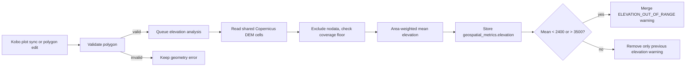

# V25 — Flag Mean Elevation Outside 2,400–3,500 Metres

> **Purpose**: Design the elevation validation feature before implementation.
> This document is intended for product, GIS, and engineering review. It reuses
> the terrain foundation, geospatial application, and metric container defined
> by V24.

---

## Feature: Elevation Under 2,400 Metres or Above 3,500 Metres

**Task ID**: V25
**Author**: Iwan
**Date**: 2026-08-15
**Status**: Developer approved — product/GIS range confirmation pending

---

## 1. Context & Problem Statement

The dashboard validates polygon geometry, overlap, GPS accuracy, point spacing,
area, and vertex count. V24 adds the first terrain rule. African Bamboo wants
the User to also see a warning when the **mean terrain elevation inside a
submitted polygon is below 2,400 m or above 3,500 m**.

```text
Currently:
- Plot polygons are stored as WGS84 WKT in Plot.polygon_wkt.
- Plot.flagged_reason stores structured error/warning objects.
- The User can approve, reject, or edit plot geometry.
- V24 introduces api.v1.v1_geospatial, Plot.geospatial_metrics, the
  Django-Q2 analysis task, and the static Copernicus GLO-30 asset package.
- Elevation is not currently measured or displayed.

Goal:
- Calculate the area-weighted mean elevation for every valid plot.
- Flag means strictly below 2,400 m or strictly above 3,500 m.
- Show value, unit, source, version, coverage, and analysis status to the User.
- Reuse exactly one terrain import for V24 slope and V25 elevation.
- Never silently mark a plot clean when terrain analysis fails.
```

The rule uses **mean plot elevation**, consistent with the supplied dataset
guidance. It does not flag merely because one edge pixel crosses a threshold.

### Proposed data flow



---

## 2. Requirements

### User Acceptance Criteria

- [ ] **AC-1:** The User sees the measured mean elevation in metres in the plot
      detail panel.
- [ ] **AC-2:** A plot with mean elevation `< 2,400.0` is flagged for review.
- [ ] **AC-3:** A plot with mean elevation `> 3,500.0` is flagged for review.
- [ ] **AC-4:** Mean elevation of exactly `2,400.0` or exactly `3,500.0` is not
      flagged by this rule.
- [ ] **AC-5:** The warning states whether the plot is below or above the range
      and names the measured value, the range, and the dataset source.
- [ ] **AC-6:** The User can approve, reject, or adjust a flagged plot using the
      existing workflow.
- [ ] **AC-7:** After the User adjusts the polygon, mean elevation is recalculated
      for the new shape.
- [ ] **AC-8:** An unavailable calculation is displayed as unavailable, not as
      a pass.

### Technical Acceptance Criteria

- [ ] The same versioned Copernicus GLO-30 asset package prepared by V24 is the
      elevation source; no second download, storage location, or manifest.
- [ ] Elevation is read from the **native DEM grid without resampling**. The
      V24 reprojected slope raster is not used as an elevation source.
- [ ] The mean is area-weighted by each cell's true intersection area with the
      polygon, measured in the plot's UTM zone; nodata is excluded.
- [ ] A result whose valid coverage is below the configured quality floor is
      stored as `unavailable`, never as `complete`.
- [ ] The calculation runs outside the HTTP response-critical path through the
      existing Django-Q2 PostgreSQL ORM queue and `qcluster` worker.
- [ ] Updating elevation preserves every non-elevation flag on the plot and
      every other key in `geospatial_metrics`.
- [ ] Polygon sync, edit, reset, and backfill use the same analysis function.
- [ ] The `2,400.0`/`3,500.0` bounds, coverage floor, and rule version are
      defined once in `v1_geospatial/constants.py`; calculation and warning code
      contain no repeated literal, and each result stores the applied values.
- [ ] Existing API clients remain compatible because all new data is additive
      inside the nullable `geospatial_metrics` field.
- [ ] No six-month DEM refresh job is scheduled. Copernicus documents the DEM
      instances as static; version upgrades are operator-controlled releases.

### Progress measurement

Engineering delivery and User AC acceptance are tracked separately so code
progress cannot be mistaken for user acceptance. The earned-value gates are
identical to V24.

#### Engineering progress

| Task state | Earned value | Required evidence |
|------------|-------------:|-------------------|
| Not started | 0% | No implementation branch/PR evidence. |
| In progress | 25% | Scoped code or fixture work has started. |
| Code complete | 50% | Implementation is reviewable and related files are identified in the PR. |
| Automated verification complete | 75% | Required unit, integration, API, and frontend tests pass in CI. |
| Done | 100% | Code is merged/deployed to the target environment and the task's linked AC evidence is recorded. |

```text
engineering_progress_percent =
    sum(task_planning_weight * task_earned_value)
    / sum(task_planning_weight)
    * 100
```

The incremental-after-V24 tasks in Section 12 have midpoint weights of
`5, 4, 5` hours, for a total planning weight of **14 hours**. AI assistance may
reduce elapsed effort, but it does not change the earned-value or acceptance
rules.

#### User AC progress

Each AC moves through `not demonstrated`, `automated pass`, `UAT ready`, and
`accepted`. Only `accepted` counts toward the final User AC completion number:

```text
user_ac_progress = accepted_user_acs / 8
```

The notebook boundary demo is supporting evidence for AC-2 through AC-5, but it
does not mark them accepted because it does not exercise the deployed API,
queue, database, and UI together.

| User AC | Engineering tasks that enable it | Automated evidence | Final acceptance evidence |
|---------|----------------------------------|--------------------|---------------------------|
| AC-1: Display mean elevation | E1, E3 | Serializer/API test and plot-detail component test | The User confirms value, unit, source, and confidence display in UAT. |
| AC-2: `< 2,400.0` is flagged | E1, E2, E3 | Strict-boundary unit test, task integration test, and API response test | The User sees an `ELEVATION_OUT_OF_RANGE` plot in the review queue. |
| AC-3: `> 3,500.0` is flagged | E1, E2, E3 | Strict-boundary unit test and API response test | Product verifies an above-range plot is flagged. |
| AC-4: Exact bounds are not flagged | E1, E2 | Boundary unit test and existing-flag preservation API test | Product verifies no warning at exactly `2,400.0` and `3,500.0`. |
| AC-5: Warning explains direction, value, range, source | E1, E2, E3 | Warning-contract unit test plus backend/frontend snapshot assertions | The User approves the production wording. |
| AC-6: Existing review actions still work | E2, E3 | Approve/reject/edit regression tests | The User completes approve, reject, and adjust actions in UAT. |
| AC-7: Adjustment recalculates elevation | E2 | Edit dispatch, fingerprint, and stale-task integration tests | Adjusted polygon shows a new analysis timestamp/value in UAT. |
| AC-8: Unavailable is not a pass | E1, E2, E3 | Coverage-floor, API-state, and frontend-state tests | The User sees an unavailable state without a false pass. |

### Metric definition

For valid DEM cells intersecting polygon `P`:

```text
mean_elevation_m = sum(cell_elevation_m * intersection_area_m2)
                   / sum(intersection_area_m2)

coverage_percent = sum(intersection_area_m2) / plot_area_m2 * 100

flag_low  = mean_elevation_m < ELEVATION_MIN_METRES
flag_high = mean_elevation_m > ELEVATION_MAX_METRES
```

The reviewed product rule is `2,400.0`–`3,500.0` inclusive. Changing either
bound requires an `ELEVATION_RULE_VERSION` increment and a controlled warning
re-evaluation/backfill so stored warnings and the range reported by the API stay
consistent.

Area weighting avoids giving a partially intersected edge cell the same
influence as a cell fully inside the plot. This matters at GLO-30 resolution,
where the current plots intersect between one and nine cells.

### Notebook POC result (2026-08-15)

The feasibility POC is implemented in
`notebooks/v25_elevation_range_poc.ipynb`. It uses the actual ignored submission
data, the existing Django polygon parsing/validation helpers, and **the same
Copernicus GLO-30 subset the V24 POC already downloaded**. The run performed no
network request, which is direct evidence for decision D-2 below.

The POC processed 166 valid submission polygons:

| Check | Result |
|-------|--------|
| Valid input polygons | 166 / 166 |
| Completed elevation calculations | 166 / 166 |
| Unavailable results | 0 / 166 |
| Mean elevation below 2,400 m | 0 / 166 |
| Mean elevation above 3,500 m | 0 / 166 |
| Observed mean-elevation range | 2,569.10–2,920.73 m |
| Observed median mean elevation | 2,761.73 m |
| Minimum valid raster coverage | 100.0% |
| Intersecting 30 m cells per plot | 1–9 |
| Below the four-effective-pixel confidence floor | 166 / 166 |
| Boundary demo: 2,399.99 / 2,400.00 / 3,500.00 / 3,500.01 | flag / no flag / no flag / flag |

Three conclusions follow, and each one changes a decision:

1. **The pipeline is feasible and cheap.** Elevation reuses V24's dataset with
   no extra acquisition, storage, or operational surface. Section 12 therefore
   prices V25 primarily as an increment on V24.
2. **The rule does not flag anything in the current collection area.** Every
   plot sits between 2,569 m and 2,921 m — 169 m above the lower bound and 579 m
   below the upper bound. The rule is not vacuous, but in this area it is a
   guard against future collection sites rather than an active filter. Product
   should confirm the range is intended as a guard before engineering time is
   spent on it.
3. **The low-resolution caveat from V24 applies, but weakly.** All 166 plots
   are smaller than four effective 30 m cells. For slope this was a serious
   limitation because gradient varies sharply within a cell. For elevation the
   effect is much smaller: elevation varies far less than gradient across 30 m,
   and observed coverage was 100% for every plot. GLO-30 remains a location-level
   estimate and the UI must label it as such, but it does not undermine a
   1,100 m-wide acceptance band.

The notebook writes a tracked, reviewable summary to
`notebooks/outputs/v25_elevation_summary.json`, and keeps the sensitive
artifacts under the ignored `notebooks/data/v25_poc_output/`:

- `elevation_results_private.json` — per-plot results keyed by hashed ID, each
  carrying the proposed `geospatial_metrics.elevation` document.
- `v25_acceptance_demo.json` — deterministic `2,399.99`, `2,400.00`,
  `3,500.00`, and `3,500.01` boundary scenarios built on existing hashed plot
  records, including the proposed warning and metric response structures.

Shared loader code lives in the tracked `notebooks/poc_common.py`; it contains
no data. Exact geometry is sensitive, so the entire `notebooks/data` folder is
ignored.

---

## 3. Data Model Changes

### New Models

No new model. V25 writes one additional key into the shared
`Plot.geospatial_metrics` JSON container introduced by V24.

If V25 is implemented before V24, its first sub-task must include the V24 field
migration, the `api.v1.v1_geospatial` application scaffold, the static terrain
asset package, and the transaction-safe metric merge helper. Section 12 prices
that path separately.

### Modified Models

| Model | Change | Reason |
|-------|--------|--------|
| `Plot` | Add/update `geospatial_metrics.elevation` | Persist the calculation, its quality, and dataset provenance independently from flags |

### Geospatial application placement

V25 adds no new Django application. It extends `api.v1.v1_geospatial`:

```text
backend/api/v1/v1_geospatial/
├── constants.py                 # + elevation bounds and rule version
├── services/
│   ├── geospatial_metrics.py    # unchanged shared merge helper
│   ├── slope.py                 # V24
│   └── elevation.py             # NEW
├── warning_rules.py             # + elevation_flag and replacement rule
├── tasks.py                     # + analyse_plot_elevation
├── management/commands/
│   └── backfill_geospatial_metric.py   # + --metric elevation
└── tests/
    ├── tests_elevation.py                    # NEW
    ├── tests_elevation_warning_rules.py      # NEW
    ├── tests_elevation_tasks.py              # NEW
    └── tests_elevation_lifecycle.py          # NEW
```

The dependency direction remains `v1_geospatial -> v1_odk.models`. `v1_odk`
dispatches by dotted string and never imports elevation calculation code.

Proposed elevation value:

```json
{
  "elevation": {
    "status": "complete",
    "value": 2761.73,
    "unit": "metres",
    "source": "Copernicus DEM GLO-30",
    "source_version": "DGED-2023_1",
    "source_provider": "OpenTopography",
    "threshold": {
      "operator": "outside",
      "min": 2400.0,
      "max": 3500.0,
      "unit": "metres",
      "rule_version": "v1"
    },
    "analysed_at": "2026-08-15T09:10:00Z",
    "polygon_fingerprint": "sha256:...",
    "details": {
      "valid_pixel_count": 4,
      "coverage_percent": 100.0,
      "plot_area_m2": 308.7,
      "effective_pixel_equivalent": 0.343,
      "pixel_resolution_m": 30,
      "resolution_confidence": "low"
    }
  }
}
```

Allowed metric statuses are the V24 set: `pending`, `complete`, `unavailable`,
and `failed`. Error details exposed through the API must be safe summaries, not
filesystem paths, credentials, or raw exception traces.

Measurements are retained when the User accepts or rejects a plot, so the evidence
behind a decision stays available even after review flags are cleared.

### Migration Strategy

- No additional schema migration once V24 has shipped; `geospatial_metrics` is
  already nullable JSON.
- Writes copy existing `geospatial_metrics` keys before setting `elevation`, so
  a concurrent slope write is never lost.
- `NULL` and an absent `elevation` key both remain valid for unprocessed plots.
- Backfill records progress by plot primary key and is safe to rerun.
- Rollback disables the task dispatch and the flag constant. Stored JSON can
  remain harmlessly for forward recovery; older application versions ignore it.

---

## 4. API Contract

### Endpoints

| Method | URL | Purpose | Auth |
|--------|-----|---------|------|
| GET | `/api/v1/odk/plots/{uuid}/` | Return the elevation result with existing plot details | Required |
| PATCH | `/api/v1/odk/plots/{uuid}/` | Existing geometry edit; queues recalculation | Required |
| POST | `/api/v1/odk/forms/{asset_uid}/sync/` | Existing Kobo sync; queues calculation for changed plots | Required |

No public calculation endpoint is added. Dataset preparation and backfill remain
operator commands so untrusted users cannot submit expensive raster queries.

### Plot-detail response change

| Existing response field | Difference after V25 |
|-------------------------|----------------------|
| All current identity, geometry, location, form, submission, approval, farmer, and audit fields | No change to names, types, or values. |
| `geospatial_metrics` | Gains an `elevation` key alongside V24's `slope`. Absent before analysis/backfill. |
| `flagged_for_review` | Still represents all validation rules together. It is not an elevation-only boolean. |
| `flagged_reason` | Existing entries are preserved. V25 removes/replaces only the prior `ELEVATION_OUT_OF_RANGE` entry and appends one when the completed mean is outside the range. |

The serializer exposes the stored result; it never calculates during a GET:

```python
class Meta:
    fields = [
        # All existing fields remain in their current order/shape.
        # ...
        "farmer_uid",
        "geospatial_metrics",  # Added by V24, nullable and read-only
    ]
    read_only_fields = [
        # Existing read-only fields...
        "geospatial_metrics",
    ]
```

The meaningful response difference for a below-range plot is shown below. The
`2,368.55` value is an illustrative range-failing result; production returns the
value calculated by the worker for the submitted polygon.

```diff
 {
   "plot_id": "752997504",
   "uuid": "c83ca02e-c5d1-4aba-a5c4-f16fd5494e11",
   "polygon_wkt": "POLYGON((...))",
   "geospatial_metrics": {
     "slope": { "status": "complete", "value": 3.77, "unit": "degrees" },
+    "elevation": {
+      "status": "complete",
+      "value": 2368.55,
+      "unit": "metres",
+      "source": "Copernicus DEM GLO-30",
+      "source_version": "DGED-2023_1",
+      "source_provider": "OpenTopography",
+      "threshold": {
+        "operator": "outside",
+        "min": 2400.0,
+        "max": 3500.0,
+        "unit": "metres",
+        "rule_version": "v1"
+      },
+      "analysed_at": "2026-08-15T09:10:00Z",
+      "details": {
+        "valid_pixel_count": 4,
+        "coverage_percent": 100.0,
+        "effective_pixel_equivalent": 0.343,
+        "resolution_confidence": "low"
+      }
+    }
   },
   "flagged_for_review": true,
   "flagged_reason": [
     { "type": "POINT_GAP_LARGE", "severity": "warning", "note": "..." },
     { "type": "OVERLAP", "severity": "error", "note": "..." },
+    {
+      "type": "ELEVATION_OUT_OF_RANGE",
+      "severity": "warning",
+      "note": "Mean elevation is 2,368.55 m, which is below the expected range of 2,400-3,500 m. Dataset source: Copernicus DEM GLO-30 DGED-2023_1 via OpenTopography."
+    }
   ],
   "farmer_uid": "00361"
 }
```

The abbreviated existing warnings above represent the original array. The
implementation does not remove, reorder, or deduplicate non-elevation warnings,
and it does not touch the `slope` metric key.

### Response lifecycle

The endpoint does not wait for raster processing. The expected state progression
mirrors V24:

1. Existing row before it has been queued or backfilled:

   ```json
   { "geospatial_metrics": null }
   ```

2. Immediately after sync/edit/reset dispatches the Django-Q2 task:

   ```json
   {
     "geospatial_metrics": {
       "elevation": {
         "status": "pending",
         "value": null,
         "unit": "metres",
         "source": "Copernicus DEM GLO-30",
         "source_version": "DGED-2023_1",
         "source_provider": "OpenTopography",
         "threshold": {
           "operator": "outside",
           "min": 2400.0,
           "max": 3500.0,
           "unit": "metres",
           "rule_version": "v1"
         }
       }
     }
   }
   ```

3. After the worker completes, `status` becomes `complete` and `value`,
   `analysed_at`, and `details` are populated. A safe `unavailable` or `failed`
   result has `value: null`; it is never interpreted as a pass.

No Django-Q task ID or `v1_jobs` record is added to this plot response.
`geospatial_metrics.elevation.status` is the frontend's polling/display
contract.

### Strict-boundary examples

For a completed mean of exactly `2,400.0` or exactly `3,500.0`, the response
contains the measured metric but V25 adds no warning:

```json
{
  "geospatial_metrics": {
    "elevation": {
      "status": "complete",
      "value": 2400.0,
      "unit": "metres",
      "threshold": {
        "operator": "outside",
        "min": 2400.0,
        "max": 3500.0,
        "unit": "metres",
        "rule_version": "v1"
      }
    }
  },
  "flagged_for_review": true,
  "flagged_reason": [
    {
      "type": "POINT_GAP_LARGE",
      "severity": "warning",
      "note": "Existing point-gap warning remains unchanged."
    }
  ]
}
```

In this example `flagged_for_review` is still `true` because another rule is
present, not because elevation is exactly 2,400 m.

For `2,399.99` and `3,500.01`, V25 adds `ELEVATION_OUT_OF_RANGE`. The warning
must name the direction, the measured value, the range, and the dataset
name/version/provider.

### Concurrent metric writes

V25 reuses the V24 merge helper unchanged. Slope and elevation tasks can run
concurrently on the same plot, so the row lock is required rather than optional:

```python
@transaction.atomic
def store_metric(plot_id, metric_name, result):
    plot = Plot.objects.select_for_update().get(pk=plot_id)
    metrics = dict(plot.geospatial_metrics or {})
    metrics[metric_name] = result
    plot.geospatial_metrics = metrics
    plot.save(update_fields=["geospatial_metrics"])
```

---

## 5. Decision Log

### D-1: Mean versus minimum/maximum elevation

**Options Considered**:
1. Area-weighted mean elevation across the plot.
2. Flag when any pixel is outside the range.
3. Flag when a configured percentage of area is outside the range.

**Decision**: Use the area-weighted mean elevation.

**Rationale**: It matches the requested analysis and prevents a single edge
pixel or DEM artefact from flagging an otherwise suitable plot.

**Impact**: The UI must label the result "Mean elevation", not "Elevation".

### D-2: Share the terrain source with slope

**Decision**: V24 and V25 use the exact same DEM version, asset package, and
manifest under `backend/assets/geospatial/cop30_dged_2023_1/`.

**Rationale**: It avoids duplicate downloads, storage, attribution, and
operational checks.

**POC evidence**: The V25 notebook produced all 166 results from the subset the
V24 notebook had already downloaded, with no network request. The shared-asset
assumption is verified rather than asserted.

### D-3: Read the DEM, not the derived slope raster

**Decision**: Elevation is read from `dem.tif` on its native grid. The
reprojected `slope_degrees.tif` is not used as an elevation source, and the DEM
is not resampled before averaging.

**Rationale**: Slope needs a metric grid because it is a gradient computed from
neighbours. Elevation is a per-cell value, so reprojection would only smooth the
source and introduce resampling error into the number the User reads. Correct
metric weighting is achieved by projecting the *intersection geometry*, not the
raster.

**Impact**: The elevation service and the slope service read different files
from the same versioned package. Both are validated by the same manifest check.

### D-4: Static source lifecycle

**Decision**: Import once and upgrade only through an explicit operator release.

**Rationale**: Copernicus documents the DEM service instances as static and
date-independent. A six-month download would add operational risk and cost
without producing new terrain.

### D-5: Partial raster coverage

**Decision**: Mark the result `unavailable` when valid coverage is below a
configurable quality floor, initially `90%`. Do not emit a pass or a warning.

**Rationale**: A mean over a small covered portion of the polygon could be
misleading in either direction.

**POC evidence**: Minimum observed coverage across all 166 plots was `100.0%`,
so the floor is currently never triggered. It remains necessary for plots
collected near the edge of the prepared asset coverage.

### D-6: Resolution confidence

**POC finding**: All 166 plots contain fewer than four effective 30 m cells;
plots intersect between one and nine cells.

**Decision**: Store `effective_pixel_equivalent` and `resolution_confidence`
with every result and display a low-resolution notice separately from
`ELEVATION_OUT_OF_RANGE`. Do not create a second review flag for low resolution.

**Rationale**: The V24 concern applies with much less force here. Elevation
varies far less than gradient across a single 30 m cell, coverage was complete
for every plot, and the acceptance band is 1,100 m wide. Treating a sub-cell
plot as unmeasurable would reject a usable result.

### D-7: Failure behaviour

**Decision**: Persist an `unavailable`/`failed` status and retain any prior
valid result until a successful replacement is available. Never remove a prior
elevation warning because a refresh failed.

---

## 6. Type/Constant Mappings

| Frontend | Backend Constant | Stored Value |
|----------|------------------|--------------|
| `ELEVATION_OUT_OF_RANGE` | `v1_geospatial.constants.GeospatialFlagType.ELEVATION_OUT_OF_RANGE` | `"ELEVATION_OUT_OF_RANGE"` |
| Warning | `v1_geospatial.constants.GeospatialFlagSeverity.WARNING` | `"warning"` |
| Complete | `v1_geospatial.constants.GeoMetricStatus.COMPLETE` | `"complete"` |
| Elevation metric | `v1_geospatial.constants.GeoMetricType.ELEVATION` | `"elevation"` |

```python
# backend/api/v1/v1_geospatial/constants.py
class GeospatialFlagType:
    SLOPE_TOO_STEEP = "SLOPE_TOO_STEEP"
    ELEVATION_OUT_OF_RANGE = "ELEVATION_OUT_OF_RANGE"


class GeoMetricType:
    SLOPE = "slope"
    ELEVATION = "elevation"


ELEVATION_MIN_METRES = 2400.0
ELEVATION_MAX_METRES = 3500.0
ELEVATION_RULE_VERSION = "v1"
MIN_RASTER_COVERAGE_PERCENT = 90.0
```

```python
def elevation_flag(mean_elevation_m):
    below = mean_elevation_m < ELEVATION_MIN_METRES
    above = mean_elevation_m > ELEVATION_MAX_METRES
    if not (below or above):
        return None
    direction = "below" if below else "above"
    return {
        "type": GeospatialFlagType.ELEVATION_OUT_OF_RANGE,
        "severity": GeospatialFlagSeverity.WARNING,
        "note": (
            f"Mean elevation is {mean_elevation_m:,.2f} m, which is "
            f"{direction} the expected range of "
            f"{ELEVATION_MIN_METRES:,.0f}-{ELEVATION_MAX_METRES:,.0f} m."
        ),
    }
```

The flag updater removes only a previous `ELEVATION_OUT_OF_RANGE` entry before
adding the newly evaluated one. Geometry, overlap, GPS, area, slope, road, and
tree-cover flags are preserved.

---

## 7. Compatibility & Migration

### Backward Compatibility

- [x] No existing request payload changes.
- [x] Existing plot, flag, and approval data remains valid.
- [x] Missing elevation is represented by an absent metric key, not by a false
      pass.
- [x] Existing approve/reject/Kobo/Telegram behaviour is unchanged.
- [x] Export behaviour is unchanged unless metric columns are added separately.

### Seeder/CLI Compatibility

- [ ] Extend the V24 asset validation so `dem.tif` is checked for CRS,
      resolution, nodata, checksum, and configured coverage in the same startup
      or pre-deployment step as `slope_degrees.tif`.
- [ ] Extend `backfill_geospatial_metric` with `--metric elevation`, reusing the
      existing `--form`, `--plot`, `--batch-size`, `--resume-from`, and
      `--dry-run` options.

There is no runtime `prepare_terrain_dataset` command. Dataset preparation is a
release-time operation performed only when the source version or supported
collection area changes.

Example processing core, matching the POC implementation:

```python
def calculate_mean_elevation(polygon_wkt, dem_dataset, to_utm):
    polygon = shapely.from_wkt(polygon_wkt)
    plot_utm = transform_geometry(polygon, to_utm)
    values, weights, covered_area = read_weighted_cells(
        dem_dataset, polygon, plot_utm, to_utm
    )
    coverage = covered_area / plot_utm.area * 100.0
    if not values or coverage < MIN_RASTER_COVERAGE_PERCENT:
        raise MetricUnavailable(
            f"DEM coverage {coverage:.1f}% is below the quality floor"
        )
    return float(numpy.average(values, weights=weights)), coverage
```

---

## 8. Security Considerations

- [x] Analysis is limited to stored, validated plot polygons.
- [x] Public callers cannot choose filesystem paths or raster sources.
- [x] Polygon validity and Ethiopia bounds are checked before raster access.
- [x] Operator-supplied dataset versions and checksums are logged.
- [x] API error messages exclude local paths and exception traces.
- [x] Worker memory, polygon complexity, task retries, and batch size are
      bounded, reusing the V24 resource controls.
- [ ] Copernicus attribution must accompany published or exported measurements.

---

## 9. Testing Strategy

| Test Type | Coverage |
|-----------|----------|
| Unit | Weighted mean, nodata exclusion, coverage floor, boundaries at 2,399.99/2,400/3,500/3,500.01, flag replacement, metric merge |
| Integration | Shared DEM access, task retry, backfill resume, stale polygon fingerprint rejection, concurrent slope+elevation write |
| API | Additive response shape, pending/unavailable/failed states, preservation of existing flags and the slope key |
| Frontend | "Mean elevation" label, metres formatting, below/above wording, pending and unavailable states |
| GIS acceptance | Compare representative low/mid/high plots against QGIS Zonal Statistics on the same DEM |

### Unit-test specification

Unit tests use a tiny generated/committed raster fixture and must never call
OpenTopography or depend on the sensitive notebook data.

| Planned test file | Test case | Verifies | AC/task evidence |
|-------------------|-----------|----------|------------------|
| `backend/api/v1/v1_geospatial/tests/tests_elevation.py` *(new)* | `test_weighted_mean_uses_intersection_area` | Partially covered edge cells are weighted by intersection area, not counted whole. | E1 foundation |
| Same | `test_weighted_mean_excludes_nodata` | Nodata neither raises nor lowers the mean. | AC-8, E1 |
| Same | `test_coverage_below_floor_is_unavailable` | Coverage under `MIN_RASTER_COVERAGE_PERCENT` returns `unavailable`, never `complete` with a false value. | AC-8, E1 |
| Same | `test_elevation_uses_native_dem_grid` | The service reads `dem.tif` and does not resample or read `slope_degrees.tif`. | D-3, E1 |
| Same | `test_resolution_confidence_uses_effective_pixels` | Effective-cell count and confidence value are deterministic. | AC-1, E1 |
| Same | `test_elevation_bounds_are_inclusive` | `2,400.0` and `3,500.0` produce no flag; `2,399.99` and `3,500.01` do. | AC-2, AC-3, AC-4, E1 |
| Same | `test_elevation_result_records_rule_contract` | The result stores the applied bounds and `ELEVATION_RULE_VERSION` rather than repeated literals. | AC-2, AC-3, E1 |
| Same | `test_elevation_warning_contract` | The warning contains the direction, the measured value, the range, and the dataset name/version/provider. | AC-5, E1 |
| `backend/api/v1/v1_geospatial/tests/tests_elevation_warning_rules.py` *(new)* | `test_replace_only_elevation_warning` | Recalculation replaces/removes only `ELEVATION_OUT_OF_RANGE` and preserves point-gap, overlap, and slope flags. | AC-2, AC-4, AC-6, E2 |
| `backend/api/v1/v1_geospatial/tests/tests_geospatial_metrics.py` *(extend)* | `test_store_metric_merges_elevation_key` | An elevation write preserves the `slope` key written by a concurrent task. | E2 |
| `backend/api/v1/v1_geospatial/tests/tests_elevation_tasks.py` *(new)* | `test_stale_polygon_result_is_discarded` | A queued elevation result cannot overwrite a newer polygon. | AC-7, E2 |
| Same | `test_failed_recalculation_retains_last_result` | A failure does not erase the last successful measurement or its warning. | AC-8, D-7, E2 |
| `backend/api/v1/v1_geospatial/tests/tests_elevation_lifecycle.py` *(new)* | `test_polygon_edit_dispatches_current_elevation_task` | Sync/edit/reset dispatch uses the current polygon fingerprint and the shared elevation task. | AC-7, E2 |
| `backend/api/v1/v1_geospatial/tests/tests_backfill_geospatial_metric_command.py` *(extend)* | `test_elevation_backfill_resumes_after_last_completed_batch` | The elevation backfill is bounded, resumable, and does not duplicate completed work. | E2 |

Representative boundary and warning-contract test:

```python
def test_elevation_bounds_are_inclusive(self):
    self.assertIsNone(elevation_flag(2400.0))
    self.assertIsNone(elevation_flag(3500.0))
    low = elevation_flag(2399.99)
    high = elevation_flag(3500.01)
    self.assertEqual(
        low["type"],
        GeospatialFlagType.ELEVATION_OUT_OF_RANGE,
    )
    self.assertIn("below", low["note"])
    self.assertIn("above", high["note"])
    self.assertIn("2,400-3,500 m", low["note"])
```

### Integration, API, and frontend acceptance tests

| Test surface | Required scenario | User AC |
|--------------|-------------------|---------|
| Django-Q2 elevation task | `pending -> complete`, retry-to-failed, and fingerprint mismatch in `tests_elevation_tasks.py` | AC-2, AC-7, AC-8 |
| Elevation lifecycle | Sync/edit/reset dispatch and stale-result protection in `tests_elevation_lifecycle.py` | AC-6, AC-7 |
| Backfill command | Bounded batches, dry-run, resume, and idempotency | Engineering completion evidence |
| Plot API | Legacy `geospatial_metrics: null`, pending, complete, unavailable, and failed response shapes | AC-1, AC-8 |
| Plot API | Existing warning array plus `ELEVATION_OUT_OF_RANGE`; recalculation removes only the elevation warning and leaves `slope` untouched | AC-2, AC-4, AC-6 |
| Plot edit/reset API | Geometry change queues exactly one current elevation calculation and exposes the new result | AC-7 |
| Plot detail UI | Complete value/unit/source/confidence, pending state, and unavailable state | AC-1, AC-8 |
| Review UI | Below/above wording plus existing approve/reject/adjust actions | AC-5, AC-6 |

Frontend evidence remains in `frontend/__tests__/page.test.js` and
`frontend/__tests__/validation-rules-content.test.js`.

Required failure scenarios include missing tile, all-nodata result, invalid WKT,
dataset version removed during analysis, worker retry, and a geometry edit
arriving while an older analysis is running.

---

## 10. Open Questions

- [ ] **Product:** the POC found no plot outside 2,400–3,500 m in the current
      collection area (observed range 2,569–2,921 m). Confirm the range is
      intended as a forward guard for future collection sites, and not as a
      filter expected to act on today's data. If it is only a guard, product may
      prefer to schedule V25 after V26/V27.
- [ ] **GIS:** approve the 90% valid-coverage floor. The POC never triggered it
      (minimum observed coverage 100%), so it is currently untested against real
      data.
- [ ] **GIS:** approve the result tolerance after a short independent QGIS Zonal
      Statistics comparison against the same DEM subset.
- [ ] **Product:** decide whether mean elevation belongs in XLSX/SHP/GeoJSON
      exports; export changes are outside this estimate.
- [ ] **Operations:** confirm the combined V24/V25 rollout so the terrain asset
      is validated and deployed once.

These questions do not change the core threshold or architecture, but they must
be resolved before production activation.

---

## 11. References

- [Copernicus DEM documentation](https://documentation.dataspace.copernicus.eu/APIs/SentinelHub/Data/DEM.html)
- [Copernicus DEM collection](https://dataspace.copernicus.eu/explore-data/data-collections/copernicus-contributing-missions/collections-description/COP-DEM)
- [OpenTopography Global Datasets API](https://opentopography.org/developers)
- POC notebook: `notebooks/v25_elevation_range_poc.ipynb`
- Shared POC loader: `notebooks/poc_common.py`
- Shared terrain design: `docs/v24_average_slope_over_30_degrees.md`
- Existing flag architecture: `docs/v11_extended_validation_warnings_plan.md`
- Existing polygon editing: `docs/v17_map_plot_edit_functionality_plan.md`

---

## 12. Estimate and Work Breakdown

One developer-day is capped at **8 hours**. Every task below is independently
reviewable, is engineering-owned, and is grouped into **4–8 hours** of effort.
Validation and expert-review activities are listed separately and are not mixed
into the engineering task estimate. Both estimates assume one engineer; the
AI-assisted version means the engineer uses AI for repository discovery,
scaffolding, test generation, refactoring, and documentation while retaining
human code review and ownership.

### Completed engineering discovery

The actual-data notebook POC, shared-DEM reuse proof, boundary-contract demo,
and coverage/confidence measurement are complete. See
`notebooks/v25_elevation_range_poc.ipynb` and the ignored artifacts under
`notebooks/data/v25_poc_output/`. This completed discovery work is not included
in the remaining estimate.

### Engineering tasks — incremental delivery after V24

| Engineering sub-task | Deliverable | Related files | Without AI | With AI |
|----------------------|-------------|---------------|-----------:|--------:|
| E1. Backend — elevation calculation service and rule constants | Add `ELEVATION_MIN_METRES`, `ELEVATION_MAX_METRES`, `ELEVATION_RULE_VERSION`, and the elevation flag type; port the POC calculation into `v1_geospatial`; read the native DEM, weight cells by projected intersection area, exclude nodata, apply the coverage floor, and return coverage plus effective-pixel confidence. | `backend/api/v1/v1_geospatial/constants.py`<br>`backend/api/v1/v1_geospatial/services/elevation.py` *(new)*<br>`backend/api/v1/v1_geospatial/tests/tests_elevation.py` *(new)*<br>`backend/api/v1/v1_geospatial/tests/fixtures/` *(extend)*<br>`notebooks/v25_elevation_range_poc.ipynb` *(reference only)* | 4–6 h | 4–5 h |
| E2. Backend — task, warning ownership, and backfill integration | Add `analyse_plot_elevation`, the elevation warning replacement rule, fingerprint protection, retries, and `--metric elevation` backfill support. `v1_odk` sync/edit/reset gains one additional dotted-string dispatch and nothing else. | `backend/api/v1/v1_geospatial/tasks.py`<br>`backend/api/v1/v1_geospatial/warning_rules.py`<br>`backend/api/v1/v1_geospatial/management/commands/backfill_geospatial_metric.py`<br>`backend/api/v1/v1_geospatial/tests/tests_elevation_tasks.py` *(new)*<br>`backend/api/v1/v1_geospatial/tests/tests_elevation_lifecycle.py` *(new)*<br>`backend/api/v1/v1_geospatial/tests/tests_elevation_warning_rules.py` *(new)*<br>`backend/api/v1/v1_geospatial/tests/tests_geospatial_metrics.py` *(extend)*<br>`backend/api/v1/v1_odk/funcs.py` *(dispatch hook only)*<br>`backend/api/v1/v1_odk/plot_views.py` *(dispatch hook only)* | 3–5 h | 3–4 h |
| E3. Frontend & Backend — result presentation, warning UI, and regression evidence | Display mean elevation with unit, source, low-resolution notice, and pending/unavailable states; add the below/above warning wording; cover API compatibility, flag preservation, and a staging smoke test; document backfill, rule changes, and rollback. | `frontend/src/components/map/plot-detail-panel.js`<br>`frontend/src/components/map/plot-header-card.js`<br>`frontend/src/lib/plot-utils.js`<br>`frontend/__tests__/page.test.js`<br>`frontend/__tests__/validation-rules-content.test.js`<br>`backend/api/v1/v1_odk/tests/tests_plots_endpoint.py` *(API contract only)*<br>`README.md`<br>`docs/v25_elevation_under_2400_meters_or_above_3500.md` | 4–6 h | 3–5 h |

### Additional tasks if V25 ships before V24

If V25 is delivered first, it must also carry the shared foundation. These are
V24 tasks, not new work, and they are not counted twice when both ship together.

| Prerequisite sub-task | Related V24 task | Without AI | With AI |
|-----------------------|------------------|-----------:|--------:|
| Backend — geospatial app scaffold, static terrain asset package, manifest, and worker dependencies | V24 E1 | 4–6 h | 4–5 h |
| Backend — `Plot.geospatial_metrics` field, migration, serializer exposure, and merge helper | V24 E2 | 4–6 h | 4–5 h |

### Validation and expert tasks

These tasks provide approval or independent scientific/GIS validation. They are
not implementation subtasks and are excluded from the engineering total.

| Validation/expert task | Owner | Evidence or related files | Estimate |
|------------------------|-------|---------------------------|---------:|
| Confirm the 2,400–3,500 m range is intended as a forward guard given that no current plot falls outside it. | Product | `notebooks/data/v25_poc_output/elevation_results_private.json` *(ignored/sensitive)*<br>Section 2, POC result | 1 h |
| Independently compare the implementation with a QGIS Zonal Statistics run on the same DEM subset, checking CRS, nodata handling, partial-cell weighting, and agreed tolerance. | GIS expert | `backend/api/v1/v1_geospatial/tests/fixtures/` *(planned)*<br>`notebooks/data/v24_poc_output/cop30_subset.tif` *(ignored/sensitive)* | 1–2 h |
| Verify the below/above wording and the low-resolution notice in the User's review workflow. | Product owner / User | `notebooks/data/v25_poc_output/v25_acceptance_demo.json` *(ignored)*<br>`frontend/src/components/map/plot-detail-panel.js` | 1 h |

### Totals

| Delivery version | Base engineering tasks | Contingency included | Developer-days at 8 h/day |
|------------------|-----------------------:|---------------------:|--------------------------:|
| Incremental after V24, without AI | 11–17 h | **12–18 h** | **1.5–2.25 days** |
| Incremental after V24, with AI assistance | 10–14 h | **11–15 h** | **1.4–1.9 days** |
| Standalone before V24, without AI | 19–29 h | **20–31 h** | **2.5–3.9 days** |
| Standalone before V24, with AI assistance | 18–24 h | **19–26 h** | **2.4–3.25 days** |

The completed POC is not included in either remaining engineering estimate. AI
savings are deliberately modest because raster correctness, queue behaviour,
deployment, code review, and acceptance evidence still require engineering
judgment. AI does not reduce the **3–4 additional expert-validation hours**,
which may run alongside engineering where dependencies allow.

| Combined V24 + V25 delivery | Estimate |
|-----------------------------|---------:|
| Without AI | **41–61 h (5.1–7.6 days)** |
| With AI assistance | **38–52 h (4.75–6.5 days)** |

Estimate excludes scientific field validation, export-column changes, dataset
hosting fees, and production infrastructure expansion.

---

## Approval

| Role | Name | Date | Status |
|------|------|------|--------|
| Developer | Iwan | 2026-08-15 | Approved |
| GIS reviewer | | | |
| Tech Lead | | | |
| Product | | | |
