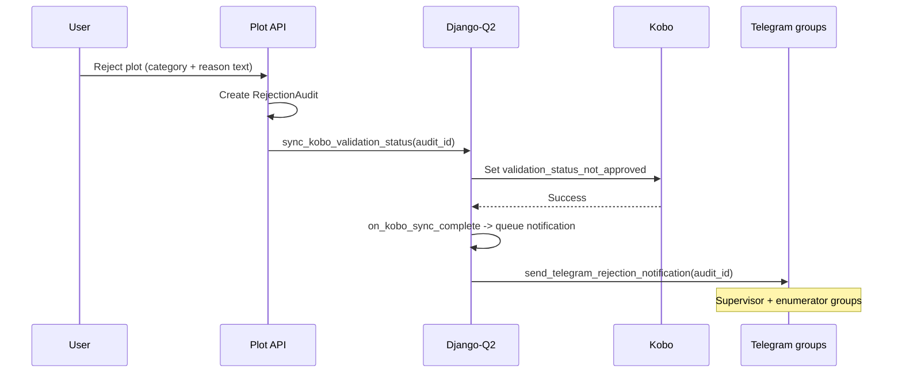

# V26 — Flag Road Proximity or Road Overlap

> **Purpose**: Design road proximity validation before implementation,
> including both a static snapshot and an automated six-month refresh option.
> This document is intended for product, GIS, and engineering review.

---

## Feature: Road Within N Metres or Road Overlap

**Task ID**: V26
**Author**: Iwan
**Date**: 2026-08-15
**Status**: Developer approved — product must supply `N` before activation

---

## 1. Context & Problem Statement

African Bamboo wants the User to review plots that overlap a road or lie within a
configurable distance `N` of a road. Roads are vector lines and change more
frequently than terrain, so this feature needs a versioned import and an
explicit refresh policy.

```text
Currently:
- Plot polygons and bounding boxes are stored in PostgreSQL.
- Shapely and pyproj are already used for polygon calculations.
- PostgreSQL does not have PostGIS enabled.
- Plot-to-plot overlap detection exists, but road data is not stored.
- V24 introduces api.v1.v1_geospatial, Plot.geospatial_metrics, the
  Django-Q2 analysis task, and the metric merge helper.
- The User's review, geometry adjustment, rejection audit, and Telegram group
  notification are already implemented.

Goal:
- Import eligible Ethiopian roads from OpenStreetMap/Geofabrik.
- Calculate the shortest distance from the plot boundary to the nearest
  eligible road.
- Treat an intersection as an overlap with distance zero.
- Flag overlap, or distance less than or equal to a configurable N metres.
- Support either one static import or an atomic refresh every six months.
```

### Proposed data flow


---

## 2. Requirements

### User Acceptance Criteria

- [ ] **AC-1:** The User sees the nearest eligible road distance in metres in the
      plot detail panel.
- [ ] **AC-2:** The User sees an explicit "Road overlaps plot" result for
      intersections.
- [ ] **AC-3:** A plot is flagged when a road overlaps it, or when its boundary
      is `<= N` metres from the nearest eligible road.
- [ ] **AC-4:** A plot whose nearest eligible road is more than `N` metres away
      is not flagged by this rule.
- [ ] **AC-5:** The warning names the measured distance, the configured
      threshold, the road class, the source, and the source date/version.
- [ ] **AC-6:** The User can approve, reject, or adjust a flagged plot using
      the existing workflow. Recollection is requested by rejecting; the
      existing Telegram message already closes with "Please review and
      recollect if needed." There is no separate recollection action.
- [ ] **AC-7:** When the User rejects a plot for road proximity, the existing
      Telegram notification names the measured distance and road class without
      the User retyping them.
- [ ] **AC-8:** Geometry adjustment recalculates road proximity.
- [ ] **AC-9:** A failed or outdated analysis is visible and is not treated as
      clean.

### Technical Acceptance Criteria

- [ ] Geofabrik's Ethiopia OSM extract is the production road source.
- [ ] Distance is measured from the polygon **boundary**, not the centroid or a
      vertex.
- [ ] Geometries are reprojected to the plot's UTM zone before measuring.
- [ ] Eligible classes are allow-listed and documented.
- [ ] `N` is a positive configurable system setting in metres.
- [ ] Changing `N` reevaluates stored distances without downloading roads or
      recalculating geometry.
- [ ] The measured distance is stored even when it far exceeds `N`, so a later
      threshold change needs no recalculation.
- [ ] "No eligible road nearby" is a **pass**, not an unavailable result.
- [ ] Road source version, OSM feature ID and class, and the analysis timestamp
      are stored with each result.
- [ ] Imports write a new version before atomically changing the active pointer.
- [ ] A failed import leaves the previous dataset and its results active.
- [ ] Updating road results preserves all unrelated flags and metric keys.
- [ ] `N`, the eligible class list, and the rule version are defined once in
      `v1_geospatial/constants.py` or `SystemSetting`; calculation and warning
      code contain no repeated literal, and each result stores the applied
      values.

### Road eligibility

Initial "main drivable roads" allow-list:

```python
ELIGIBLE_OSM_HIGHWAYS = {
    "motorway", "motorway_link",
    "trunk", "trunk_link",
    "primary", "primary_link",
    "secondary", "secondary_link",
    "tertiary", "tertiary_link",
}
```

`residential`, `service`, `unclassified`, `track`, `path`, `footway`, and
`bridleway` are excluded. Changing this policy requires a dataset reimport and a
full road-metric recalculation.

### Progress measurement

Engineering delivery and User AC acceptance are tracked separately so code
progress cannot be mistaken for user acceptance. The earned-value gates are
identical to V24.

#### Engineering progress

| Task state | Earned value | Required evidence |
|------------|-------------:|-------------------|
| Not started | 0% | No implementation branch/PR evidence. |
| In progress | 25% | Scoped code or fixture work has started. |
| Code complete | 50% | Implementation is reviewable and related files are identified in the PR. |
| Automated verification complete | 75% | Required unit, integration, API, and frontend tests pass in CI. |
| Done | 100% | Code is merged/deployed to the target environment and the task's linked AC evidence is recorded. |

```text
engineering_progress_percent =
    sum(task_planning_weight * task_earned_value)
    / sum(task_planning_weight)
    * 100
```

The Option A tasks in Section 12 have midpoint weights of `6, 6, 4, 5, 5`
hours, for a total planning weight of **26 hours**. Option B adds
`2.5, 5, 4, 3, 4` for a further **18.5 hours**.

#### User AC progress

```text
user_ac_progress = accepted_user_acs / 9
```

The notebook boundary demo is supporting evidence for AC-3 through AC-5, but it
does not mark them accepted because it does not exercise the deployed API,
queue, database, and UI together.

| User AC | Engineering tasks that enable it | Automated evidence | Final acceptance evidence |
|---------|----------------------------------|--------------------|---------------------------|
| AC-1: Display nearest road distance | E2, E4, E5 | Serializer/API test and plot-detail component test | The User confirms value, unit, class, and source display in UAT. |
| AC-2: Explicit overlap result | E2, E5 | Overlap-path unit test and frontend state test | The User sees an overlapping plot rendered as overlap, not as "0 m". |
| AC-3: Overlap or `<= N` is flagged | E1, E2, E3, E4 | Inclusive-threshold unit test, task integration test, API response test | The User sees a `ROAD_TOO_CLOSE` plot in the review queue. |
| AC-4: Beyond `N` is not flagged | E1, E2, E3 | Boundary unit test and existing-flag preservation API test | Product verifies a distant plot carries no road warning. |
| AC-5: Warning explains distance, threshold, class, source | E2, E3, E5 | Warning-contract unit test plus backend/frontend snapshot assertions | The User approves the production wording. |
| AC-6: Existing review actions still work | E3, E5 | Approve/reject/edit regression tests | The User completes approve, reject, and adjust actions in UAT. |
| AC-7: Telegram carries the measured road result | E5 | Telegram payload test asserting the `Measured:` line, and a no-metric test asserting it is omitted | Enumerator group receives a rejection notice naming the distance and road class. |
| AC-8: Adjustment recalculates proximity | E3 | Edit dispatch, fingerprint, and stale-task integration tests | Adjusted polygon shows a new analysis timestamp/value in UAT. |
| AC-9: Failed/outdated is not clean | E1, E3, E5 | Missing-dataset, activation-failure, API-state, and frontend-state tests | The User sees an unavailable state without a false pass. |

### Metric definition

For plot polygon `P` and the nearest eligible road line `R`, both projected into
the plot's UTM zone:

```text
overlap    = P intersects R
distance_m = 0.0 if overlap else P.boundary.distance(R)

flag = overlap or distance_m <= ROAD_PROXIMITY_M
```

The threshold is **inclusive**: a plot exactly `N` metres away is flagged.
Changing `N` requires a `ROAD_RULE_VERSION` increment and a warning
re-evaluation pass, but never a distance recalculation.

### Notebook POC result (2026-08-15)

The feasibility POC is implemented in
`notebooks/v26_road_proximity_poc.ipynb`. It uses the actual ignored submission
data and the existing Django polygon parsing/validation helpers.

**Road source used by the POC.** Production uses the Geofabrik Ethiopia extract
(D-3). That file is roughly **400 MB** and covers the whole country, which is
disproportionate for a feasibility check on one collection area. The POC
therefore fetched the *same OSM road features, with the same `highway` classes
and the same `osm_id` values*, from the Overpass API for a padded bounding box.
The consequence is carried explicitly into the estimate: the POC validates the
**measurement, threshold, and flag contract**, and provides **no evidence** for
the download, checksum, unpack, filter, registry, and atomic-activation stages.
Those stages remain fully estimated engineering work.

The POC processed 166 valid submission polygons:

| Check | Result |
|-------|--------|
| Valid input polygons | 166 / 166 |
| Completed distance calculations | 166 / 166 |
| Unavailable results | 0 / 166 |
| Eligible road features in the collection area | 17 ways, 122.88 km |
| Observed eligible classes | `tertiary` only |
| Rejected (non-eligible) features | 0 |
| Projected CRS used for measurement | EPSG:32637 (UTM 37N) |
| Plots overlapping a road | 0 / 166 |
| Observed distance range | 11.44–1,655.22 m |
| Observed median distance | 289.39 m |
| Boundary demo: overlap / exactly 100 m / 100.01 m | flag / flag / no flag |
| Threshold-only reevaluation recalculated any distance | No |

Threshold sensitivity — the evidence product needs in order to choose `N`:

| Candidate `N` | Plots flagged | Share of collection |
|--------------:|--------------:|--------------------:|
| 10 m | 0 | 0.0% |
| 25 m | 3 | 1.8% |
| 50 m | 8 | 4.8% |
| 100 m | 24 | 14.5% |
| 200 m | 56 | 33.7% |
| 500 m | 118 | 71.1% |

Four conclusions follow, and each one changes a decision:

1. **The measurement is feasible and cheap at this scale.** 17 road lines and
   166 plots index and measure in seconds. Nothing here justifies PostGIS.
2. **`N` is the single most expensive open decision in this plan.** The review
   queue swings from 0 plots to 118 plots across the candidate range. A change
   from 100 m to 200 m more than doubles the User's workload. Product must supply
   `N` against this table, not in the abstract.
3. **The allow-list is effectively untested.** Every eligible feature in the
   collection area is `tertiary`; no motorway, trunk, primary, or secondary road
   is present, and no feature was rejected. The nine other allow-listed classes
   have not been exercised against real data, and the exclusion policy has not
   been shown to suppress anything. GIS should review the list against a wider
   national sample before rollout.
4. **The overlap branch is untested against real data.** No plot intersects a
   road, so the overlap path is only covered by the controlled demo. Its unit
   tests carry more weight than usual.

The notebook also verifies D-5 directly: flags were derived twice from the same
stored distances at 25 m and 200 m, producing 3 and 56 flagged plots as a strict
superset, with no measurement function called.

The notebook writes a tracked, reviewable summary to
`notebooks/outputs/v26_road_summary.json`, and keeps the sensitive artifacts
under the ignored `notebooks/data/v26_poc_output/`:

- `road_results_private.json` — per-plot results keyed by hashed ID, each
  carrying the proposed `geospatial_metrics.road` document.
- `v26_acceptance_demo.json` — deterministic overlap, exactly-`N`, and
  just-outside-`N` scenarios built on existing hashed plot records.
- `osm_roads_bbox_private.json` — the cached Overpass response.

Shared loader code lives in the tracked `notebooks/poc_common.py`; it contains no
data. OSM way identifiers are public reference data and are kept unhashed so a
GIS reviewer can verify a result; exact plot geometry is sensitive, so the entire
`notebooks/data` folder is ignored.

---

## 3. Data Model Changes

### New Models

**Option A adds no new model.** The prepared road layer is a committed asset,
exactly like V24's terrain package and the existing
`backend/assets/ethiopia_admin_boundaries.geojson`:

```text
backend/assets/geospatial/osm_roads_ethiopia_260813/
├── roads_eligible.geojson
└── manifest.json
```

The filtered layer for the agreed collection area is **21 KB** — 17 eligible
ways covering 122 km. That is three orders of magnitude smaller than the 13 MB
boundaries file already committed, so nothing here justifies a database table,
a persistent volume, or an activation protocol. A data update is a pull
request, reviewed and rolled back like any other commit.

The manifest records source, source version, bounding box, CRS, eligible
classes, feature count, and checksums. It is validated at startup or before
deployment; a missing or mismatched asset makes the rule unavailable rather
than silently clean.

**Option B adds one model.** A refresh swaps data underneath a running system,
which is the only situation that needs a version registry and an atomic
pointer switch:

```python
# backend/api/v1/v1_geospatial/models.py  (Option B only)
class GeospatialDataset(models.Model):
    key = models.CharField(max_length=50)
    version = models.CharField(max_length=100)
    source = models.CharField(max_length=255)
    checksum = models.CharField(max_length=128)
    relative_path = models.CharField(max_length=500)
    imported_at = models.DateTimeField(auto_now_add=True)
    active = models.BooleanField(default=False)
    metadata = models.JSONField(default=dict, blank=True)

    class Meta:
        constraints = [
            models.UniqueConstraint(
                fields=["key", "version"],
                name="unique_geo_dataset_version",
            )
        ]
```

Activation occurs in a transaction that locks rows for `key="roads"`, clears the
previous active flag, and activates exactly one validated version. Option B also
moves the layer out of `backend/assets/` and onto shared persistent storage,
because the running system must be able to write a new version.

### Modified Models

| Model | Change | Reason |
|-------|--------|--------|
| `Plot` | Add/update `geospatial_metrics.road` | Persist nearest distance, overlap, feature identity, and provenance |
| `SystemSetting` | Add group `geospatial`, key `road_proximity_m` | Let product/operations set `N` without a code deployment |

`SystemSetting` already exists in `api.v1.v1_init` with a `group`/`key`/`value`
shape and is already used by the Telegram configuration, so V26 adds a new group
rather than a new model.

### Geospatial application placement

Option A:

```text
backend/assets/geospatial/osm_roads_ethiopia_260813/
├── roads_eligible.geojson       # NEW: committed, 21 KB
└── manifest.json                # NEW: source, version, bounds, checksums

backend/api/v1/v1_geospatial/
├── constants.py                 # + eligible classes, rule version, defaults
├── services/
│   ├── geospatial_metrics.py    # unchanged shared merge helper
│   ├── road.py                  # NEW: nearest-road measurement
│   └── road_asset.py            # NEW: load, validate, cache spatial index
├── warning_rules.py             # + road_flag and replacement rule
├── tasks.py                     # + analyse_plot_road
├── management/commands/
│   └── backfill_geospatial_metric.py    # + --metric road
└── tests/
    ├── tests_road.py                     # NEW
    ├── tests_road_asset.py               # NEW
    ├── tests_road_warning_rules.py       # NEW
    ├── tests_road_tasks.py               # NEW
    └── tests_road_lifecycle.py           # NEW
```

Option B adds, on top of the above:

```text
backend/api/v1/v1_geospatial/
├── models.py                            # NEW: GeospatialDataset
├── migrations/0001_initial.py           # NEW
├── services/road_dataset.py             # NEW: download, validate, activate
├── management/commands/
│   └── sync_geospatial_dataset.py       # NEW
└── tests/tests_road_dataset.py          # NEW
```

There is no runtime import command in Option A. Preparing the layer is a
release-time operation, performed only when the source version or the supported
collection area changes — the same contract V24 uses for terrain.

Proposed road value:

```json
{
  "road": {
    "status": "complete",
    "value": 42.8,
    "unit": "metres",
    "source": "OpenStreetMap via Geofabrik",
    "source_version": "ethiopia-260813",
    "source_provider": "Geofabrik",
    "threshold": {
      "operator": "<=",
      "value": 100.0,
      "unit": "metres",
      "rule_version": "v1"
    },
    "analysed_at": "2026-08-15T10:00:00Z",
    "polygon_fingerprint": "sha256:...",
    "details": {
      "overlap": false,
      "nearest_osm_id": 100000000,
      "nearest_highway_class": "tertiary",
      "projected_crs": "EPSG:32637"
    }
  }
}
```

Allowed metric statuses are the V24 set: `pending`, `complete`, `unavailable`,
and `failed`. A large measured distance is `complete`, never `unavailable` — see
D-6.

The `nearest_osm_id` shown above is a placeholder. Real values are genuine
OpenStreetMap way identifiers, and publishing one alongside its measured
distance would locate the plot, so they stay in the ignored POC output.

### Migration Strategy

- **Option A adds no migration.** The road layer is a committed asset and `N`
  lives in the existing `SystemSetting` table, so there is no new schema.
- **Option B** adds the `GeospatialDataset` registry, independently of the
  geospatial files themselves.
- Reuse `Plot.geospatial_metrics` from V24; include that migration if V26 is
  implemented independently.
- Seed `road_proximity_m` only after product supplies `N`. Do not invent a
  production threshold; the POC sensitivity table shows the cost of guessing.
- Deploy the model and reader first, import and validate data second, then
  activate the flag evaluator and backfill.
- Reverse migration removes registry and config records but does not delete
  files; operators may archive or remove them separately after rollback
  validation.

---

## 4. API Contract

### Endpoints

| Method | URL | Purpose | Auth |
|--------|-----|---------|------|
| GET | `/api/v1/odk/plots/{uuid}/` | Return the stored road metric and flags | Required |
| PATCH | `/api/v1/odk/plots/{uuid}/` | Existing geometry edit; queues recalculation | Required |
| GET | `/api/v1/settings/geospatial/` | Read `N` and active dataset version | Required |
| PATCH | `/api/v1/settings/geospatial/` | Update `N`; superuser write only | Required (superuser) |

The settings endpoint follows the existing `/api/v1/settings/telegram/` pattern
in `api.v1.v1_init`. Dataset imports and activation are operator commands, not
public endpoints.

### Request/Response Examples

```json
// PATCH /api/v1/settings/geospatial/
{
  "road_proximity_m": 100
}

// Response 200
{
  "road_proximity_m": 100,
  "road_dataset_version": "ethiopia-260813",
  "road_dataset_imported_at": "2026-08-15T08:00:00Z"
}
```

### Plot-detail response change

| Existing response field | Difference after V26 |
|-------------------------|----------------------|
| All current identity, geometry, location, form, submission, approval, farmer, and audit fields | No change to names, types, or values. |
| `geospatial_metrics` | Gains a `road` key alongside any `slope`/`elevation` keys. Absent before analysis/backfill. |
| `flagged_for_review` | Still represents all validation rules together. It is not a road-only boolean. |
| `flagged_reason` | Existing entries are preserved. V26 removes/replaces only the prior `ROAD_TOO_CLOSE` entry. |

```diff
 {
   "plot_id": "752997504",
   "uuid": "c83ca02e-c5d1-4aba-a5c4-f16fd5494e11",
   "polygon_wkt": "POLYGON((...))",
   "geospatial_metrics": {
     "slope": { "status": "complete", "value": 3.77, "unit": "degrees" },
+    "road": {
+      "status": "complete",
+      "value": 0.0,
+      "unit": "metres",
+      "source": "OpenStreetMap via Geofabrik",
+      "source_version": "ethiopia-260813",
+      "source_provider": "Geofabrik",
+      "threshold": {
+        "operator": "<=",
+        "value": 100.0,
+        "unit": "metres",
+        "rule_version": "v1"
+      },
+      "analysed_at": "2026-08-15T10:00:00Z",
+      "details": {
+        "overlap": true,
+        "nearest_osm_id": 100000000,
+        "nearest_highway_class": "primary",
+        "projected_crs": "EPSG:32637"
+      }
+    }
   },
   "flagged_for_review": true,
   "flagged_reason": [
     { "type": "POINT_GAP_LARGE", "severity": "warning", "note": "..." },
+    {
+      "type": "ROAD_TOO_CLOSE",
+      "severity": "warning",
+      "note": "A primary road overlaps this plot (threshold: 100 m). Dataset source: OpenStreetMap via Geofabrik ethiopia-260813."
+    }
   ],
   "farmer_uid": "00361"
 }
```

### Response lifecycle

1. Before queueing or backfill: `"geospatial_metrics": null`, or an object with
   no `road` key.
2. After dispatch, `road.status` is `pending` with `value: null` and the applied
   threshold already recorded.
3. After the worker completes, `status` becomes `complete` and `value`,
   `analysed_at`, and `details` are populated. A safe `unavailable` or `failed`
   result has `value: null`; it is never interpreted as a pass.

`geospatial_metrics.road.status` is the frontend's polling/display contract. No
Django-Q task ID or `v1_jobs` record is added to the plot response.

### Inclusive-threshold examples

For a completed distance of exactly `100.0` with `N = 100`, V26 adds the
warning. For `100.01`, it does not:

```json
{
  "geospatial_metrics": {
    "road": {
      "status": "complete",
      "value": 100.01,
      "unit": "metres",
      "threshold": {
        "operator": "<=",
        "value": 100.0,
        "unit": "metres",
        "rule_version": "v1"
      },
      "details": { "overlap": false, "nearest_highway_class": "tertiary" }
    }
  },
  "flagged_for_review": false,
  "flagged_reason": []
}
```

A plot whose nearest eligible road is 1,655 m away is stored the same way, with
`value: 1655.22` and `status: "complete"`. Storing the true distance is what
makes a later change to `N` a pure reevaluation.

---

## 5. Decision Log

### D-1: Distance origin

**Options Considered**:
1. Shortest distance from the polygon boundary.
2. Distance from the plot centroid.
3. Distance from any polygon vertex.

**Decision**: Shortest distance from the polygon boundary; intersection is
distance zero.

**Rationale**: Centroid and vertex measurements can miss a road near a long or
irregular plot edge. At the observed plot sizes (0.01–0.31 ha) the difference
between boundary and centroid is small in absolute terms, but it is systematic
and always in the direction of under-flagging.

### D-2: Road classes

**Decision**: Begin with the main drivable road classes listed in Section 2.

**Rationale**: Including all OSM `highway` values would make footpaths, tracks,
and internal service roads produce excessive flags.

**POC caveat**: Only `tertiary` roads exist in the current collection area, so
the allow-list has not been exercised. This decision is provisional until GIS
reviews it against a wider sample.

### D-3: Spatial storage

**Options Considered**:
1. Versioned spatial file plus an in-process index.
2. Enable PostGIS and import roads into PostgreSQL.
3. Runtime Overpass API queries.

**Decision**: A prepared local spatial file for V26. In Option A it is a
**committed asset** under `backend/assets/geospatial/`; in Option B it moves to
shared persistent storage with a version registry.

**Rationale**: It avoids a database platform migration and a runtime dependency
on Overpass availability. The decisive fact is size: filtered to the agreed
collection area and to eligible classes, the layer is 21 KB. Storing that in
PostGIS, or on a mounted volume behind a registry table, would be machinery
without a load to justify it.

**Sizing check**: the source Geofabrik extract is roughly 400 MB and covers the
whole country, but it is an input to release-time preparation, not a shipped
artifact. Only the filtered result is committed. If the approved collection area
later grows enough that the prepared layer stops being comfortable in Git, the
file contract stays identical and the layer moves to `STORAGE_PATH/geospatial/`
— the same escape hatch V24 defines for terrain.

**POC caveat**: The POC used option 3 for convenience at bounding-box scale. It
demonstrates that Overpass is workable for *preparation*, not that it is
acceptable at runtime — the mirror returned a `504` on the first attempt and the
notebook needed a mirror fallback to complete. That fragility is precisely why
runtime Overpass is rejected.

**Impact**: Workers require persistent shared storage and a per-process cached
spatial index that is invalidated when the active dataset version changes.

### D-4: Refresh policy

**Decision**: Recommend an automated six-month refresh, while documenting a
lower-cost static option.

**Rationale**: Geofabrik extracts are updated daily; a six-month refresh can
capture real road edits and additions. Unlike terrain (V24/V25) and the 2021
land-cover product (V27), the road source genuinely changes, so refresh buys
something.

### D-5: Threshold changes

**Decision**: Store the measured distance independently from the resulting flag.
Changing `N` reevaluates flags from stored values; only polygon or dataset
changes trigger recalculation.

**POC evidence**: Flags were derived twice from the same 166 stored distances at
25 m and 200 m, producing 3 and 56 flagged plots as a strict superset, with no
measurement function called.

### D-6: "No road nearby" is a pass, not an unavailable result

**Decision**: Always store the true nearest-road distance, however large. Never
record "no eligible road within the search radius" as `unavailable`.

**Rationale**: This was found during the POC. An initial implementation queried
the spatial index with an envelope sized to the largest candidate threshold and
recorded a miss as `unavailable`. That put 21 of 166 plots — the *cleanest*
plots, those farthest from any road — into the unavailable state, hiding them
from the User's pass/fail reading and inverting the meaning of the metric.
Nearest-neighbour search removed all 21 unavailable results.

**Impact**: The production query uses the index's nearest-neighbour search, not
a threshold-sized envelope. `unavailable` is reserved for a genuinely missing or
unreadable dataset.

### D-7: Failure behaviour

**Decision**: Persist an `unavailable`/`failed` status and retain any prior valid
result until a successful replacement is available. Never remove a prior road
warning because a refresh failed.

---

## 6. Type/Constant Mappings

| Frontend | Backend Constant | Stored Value |
|----------|------------------|--------------|
| `ROAD_TOO_CLOSE` | `v1_geospatial.constants.GeospatialFlagType.ROAD_TOO_CLOSE` | `"ROAD_TOO_CLOSE"` |
| Warning | `v1_geospatial.constants.GeospatialFlagSeverity.WARNING` | `"warning"` |
| Road metric | `v1_geospatial.constants.GeoMetricType.ROAD` | `"road"` |
| OSM tertiary | eligible class | `"tertiary"` |

```python
# backend/api/v1/v1_geospatial/constants.py
class GeospatialFlagType:
    SLOPE_TOO_STEEP = "SLOPE_TOO_STEEP"
    ELEVATION_OUT_OF_RANGE = "ELEVATION_OUT_OF_RANGE"
    ROAD_TOO_CLOSE = "ROAD_TOO_CLOSE"


class GeoMetricType:
    SLOPE = "slope"
    ELEVATION = "elevation"
    ROAD = "road"


GEOSPATIAL_SETTING_GROUP = "geospatial"
ROAD_PROXIMITY_SETTING_KEY = "road_proximity_m"
ROAD_RULE_VERSION = "v1"

ELIGIBLE_OSM_HIGHWAYS = frozenset({
    "motorway", "motorway_link",
    "trunk", "trunk_link",
    "primary", "primary_link",
    "secondary", "secondary_link",
    "tertiary", "tertiary_link",
})
```

```python
def road_flag(distance_m, overlap, road_class, threshold_m):
    if not overlap and distance_m > threshold_m:
        return None
    if overlap:
        description = f"A {road_class} road overlaps this plot"
    else:
        description = (
            f"The nearest {road_class} road is {distance_m:.1f} m "
            "from the plot boundary"
        )
    return {
        "type": GeospatialFlagType.ROAD_TOO_CLOSE,
        "severity": GeospatialFlagSeverity.WARNING,
        "note": f"{description} (threshold: {threshold_m:g} m).",
    }
```

Core measurement, matching the POC implementation:

```python
def analyse_road_distance(plot_polygon, road_index, roads, to_utm):
    if not roads:
        raise MetricUnavailable("No active road dataset")
    plot_utm = transform_geometry(plot_polygon, to_utm)
    nearest = roads[int(road_index.nearest(plot_utm))]
    overlap = plot_utm.intersects(nearest.line_utm)
    distance = (
        0.0 if overlap else plot_utm.boundary.distance(nearest.line_utm)
    )
    return float(distance), overlap, nearest.properties
```

Nearest-neighbour search is used deliberately rather than an envelope query, so
that a plot with no road nearby yields a large distance rather than a missing
measurement (D-6). The index is built once per process over the projected road
lines and invalidated when the active dataset version changes.

The flag updater removes only a previous `ROAD_TOO_CLOSE` entry before adding
the newly evaluated one. Geometry, overlap, GPS, area, slope, elevation, and
tree-cover flags are preserved.

---

## 7. Compatibility & Migration

### Backward Compatibility

- [x] Plot and API additions are nullable and additive.
- [x] Existing approval, Kobo sync, export, and flag behaviour is unchanged.
- [x] Static mode needs no scheduler.
- [x] Refresh mode keeps the last known-good dataset if download or import
      fails.
- [x] Measurements are retained when the User accepts or rejects a plot.

### Import trigger and cadence

There is **no download path in Option A at all**. The layer is prepared once by
a maintainer and committed, so the deployed application has no importer to
invoke. Option B (E8) introduces both the pipeline and its only automatic
caller.

| Mode | What triggers a download | Frequency |
|------|--------------------------|-----------|
| Option A (committed asset) | A maintainer prepares the layer and commits it | Once at rollout, then on demand only, as a pull request |
| Option B (six-month refresh) | The Django-Q schedule added by E8 calls the E6/E7 pipeline | Every six months, plus on demand |
| Both | Nothing else | Never |

"On demand" means a deliberate operator action for one of these reasons:

- The eligible-class allow-list changed (this also forces a full recalculation).
- The collection area expanded beyond the imported extract's usefulness.
- A reviewer reported roads missing from a result, and a newer OSM extract is
  expected to contain them.
- A previous import failed validation and left the old version active.

What never triggers a download, in either mode:

- An HTTP request. No endpoint reaches the import pipeline; the settings
  endpoint only changes `N`, which is a pure reevaluation (D-5).
- A plot sync, geometry edit, reset, or backfill. These read the **already
  active** prepared file through the cached spatial index.
- Worker or backend startup. Startup validates that an active dataset exists and
  is readable; it does not fetch one.

This is why the roughly 400 MB Geofabrik extract is acceptable. In Option A it
never touches the deployment at all — a maintainer downloads it, filters it to a
21 KB layer, and commits the result. In Option B it is transferred twice a year,
out of band, by a scheduled job that keeps the previous version active until the
new one passes validation.

### Telegram notification impact

V26 adds **no new Telegram trigger**. The existing flow is unchanged:



Facts this design depends on, verified against the current implementation:

| Event | Sends Telegram today | After V26 |
|-------|----------------------|-----------|
| Plot rejected, Kobo sync succeeds | Yes, to supervisor and enumerator groups | Yes, unchanged trigger |
| Plot rejected, Kobo sync fails | No | No |
| Plot approved | No | No |
| Polygon adjusted or reset | No | No |
| Road metric recalculated or flagged | No | No |

The message is built from `RejectionAudit.reason_category` and
`reason_text` — both authored by the User at rejection time. It does not read
`flagged_reason` or `geospatial_metrics`. So without a change, a User rejecting
a plot for road proximity must select category `other` and retype the distance
by hand.

**Decision**: `send_telegram_rejection_notification` gains one optional
`Measured:` line, populated from the plot's completed geospatial metrics for
whichever rules are currently flagged:

```text
*Plot Rejected*

*Submission ID:* #752997504
*Farm ID:* AB00361
*Location:* Oromia - Kofele
*Reason:* Other: too close to the main road
*Measured:* Nearest tertiary road 42.8 m (threshold: 100 m)
*Validated by:* ...
```

The line is omitted when no geospatial rule is flagged, so existing rejections
render exactly as they do now.

This is deliberately **one shared change serving V24–V27**, not four. Whichever
of V26/V27 ships first implements it; the other reuses it and only adds its own
metric formatter. The estimate for E7 assumes V26 ships first and therefore
carries the full cost.

**Deferred to product, not included in this estimate**: adding
`RejectionCategory.ROAD_PROXIMITY`. `reason_category` is a `CharField` with
`choices`, so a new value needs a constant, a migration, a frontend dropdown
option, and a check that the Kobo status mapping is unaffected. Until product
asks for it, road rejections use the existing `other` category and the
`Measured:` line supplies the specifics.

### Seeder/CLI Compatibility

Option A:

- [ ] Commit the prepared layer and manifest under
      `backend/assets/geospatial/osm_roads_<version>/`.
- [ ] Validate the manifest, checksum, CRS, eligible classes, feature count, and
      configured coverage at application/worker startup or before deployment.
- [ ] Extend `backfill_geospatial_metric` with `--metric road`, reusing the
      existing `--form`, `--plot`, `--batch-size`, `--resume-from`, and
      `--dry-run` options.

There is no runtime import command in Option A. The POC notebook can produce the
initial layer; a small reproducible release script may be added if preparation
will be repeated.

Option B additionally:

- [ ] Add `sync_geospatial_dataset roads --source-url ... [--activate]`.
- [ ] Support checksum verification, `--dry-run`, and an explicit version label.
- [ ] Add the six-month Django-Q schedule; in Option A the pipeline has no
      automatic caller because there is no pipeline.

Option B activation:

```python
@transaction.atomic
def activate_dataset(dataset_id):
    new = GeospatialDataset.objects.select_for_update().get(pk=dataset_id)
    validate_dataset_artifact(new)
    GeospatialDataset.objects.filter(
        key=new.key, active=True
    ).update(active=False)
    new.active = True
    new.save(update_fields=["active"])
```

Refresh stages are download → checksum → unpack → filter → validate feature
count/bounds/CRS → build index → sample comparison → activate → recalculate.
Only activation and recalculation affect user-visible results. In Option A the
first six stages happen once, on a maintainer's machine, and their output is
reviewed as a diff.

---

## 8. Security Considerations

- [x] Public users cannot provide source URLs or local paths.
- [x] Import URLs are HTTPS and host allow-listed for Geofabrik.
- [x] Archive extraction rejects absolute paths and `..` traversal.
- [x] Checksums, file-size limits, CRS, Ethiopia bounds, and feature counts are
      validated before activation.
- [x] Only superusers can change `N`.
- [x] API error messages exclude local paths and exception traces.
- [x] Spatial-index memory, polygon complexity, task retries, and batch size are
      bounded.
- [ ] OSM attribution must be shown wherever the measurement is presented or
      exported.
- [ ] Confirm compliance with ODbL attribution and derived-database obligations.

---

## 9. Testing Strategy

| Test Type | Coverage |
|-----------|----------|
| Unit | Class filtering, boundary distance, overlap resolves to 0, exact `N`, distant plot is a pass, UTM selection, flag merge |
| Integration | Geofabrik fixture import, spatial index, atomic activation/rollback, threshold-only reevaluation, stale polygon fingerprint rejection |
| API | Superuser setting permissions, stored metric/flags, attribution and version fields |
| Frontend | Distance, overlap, loading/unavailable states, rejection reason |
| E2E | Import → backfill → review → edit polygon → recalculation → reject → Telegram group notification |

### Unit-test specification

Unit tests use a small committed road fixture and must never call Overpass or
Geofabrik, or depend on the sensitive notebook data.

| Planned test file | Test case | Verifies | AC/task evidence |
|-------------------|-----------|----------|------------------|
| `backend/api/v1/v1_geospatial/tests/tests_road.py` *(new)* | `test_distance_is_measured_from_boundary` | The boundary, not the centroid, drives the result. | AC-1, D-1, E2 |
| Same | `test_intersecting_road_is_zero_and_overlap` | An intersecting road yields `0.0` with `overlap=True`. | AC-2, E2 |
| Same | `test_distance_is_measured_in_utm` | Measurement happens in a projected CRS, not in degrees. | AC-1, E2 |
| Same | `test_road_threshold_is_inclusive` | `100.0` produces a flag; `100.01` does not. | AC-3, AC-4, E2 |
| Same | `test_distant_plot_is_complete_not_unavailable` | A plot far from any road stores the true distance with `status=complete`. | AC-4, AC-9, D-6, E2 |
| Same | `test_ineligible_classes_are_excluded` | `residential`, `service`, `track`, and `path` are not measured against. | D-2, E1 |
| Same | `test_road_result_records_rule_contract` | The result stores the applied `N`, rule version, dataset version, and OSM identity. | AC-5, E2 |
| Same | `test_road_warning_contract` | The warning contains the class, distance or overlap wording, threshold, and dataset name/version. | AC-5, E2 |
| `backend/api/v1/v1_geospatial/tests/tests_road_asset.py` *(new)* | `test_missing_or_corrupt_asset_is_unavailable` | A missing file or checksum mismatch makes the metric `unavailable`, never silently clean. | AC-9, E1 |
| Same | `test_manifest_contract_is_validated` | Source, version, CRS, eligible classes, feature count, and bounds are all checked at startup. | AC-9, E1 |
| Same | `test_spatial_index_is_built_once_per_process` | The `STRtree` is cached rather than rebuilt per plot. | E2 |
| `backend/api/v1/v1_geospatial/tests/tests_road_dataset.py` *(new, Option B only)* | `test_activation_is_atomic_and_single` | Exactly one version is active per key; activation failure leaves the previous version active. | AC-9, E6 |
| Same *(Option B only)* | `test_corrupt_archive_is_rejected_before_activation` | Bad checksum, unexpected CRS, traversal paths, and zero eligible roads all abort before activation. | AC-9, E7 |
| Same *(Option B only)* | `test_index_cache_invalidated_on_version_change` | The per-process index is rebuilt when the active version changes. | E6 |
| `backend/api/v1/v1_geospatial/tests/tests_road_warning_rules.py` *(new)* | `test_replace_only_road_warning` | Recalculation replaces/removes only `ROAD_TOO_CLOSE` and preserves other flags. | AC-3, AC-6, E3 |
| Same | `test_threshold_change_reevaluates_without_recalculation` | Changing `N` re-derives flags from stored distances and calls no measurement function. | D-5, E4 |
| `backend/api/v1/v1_geospatial/tests/tests_road_tasks.py` *(new)* | `test_stale_polygon_result_is_discarded` | A queued road result cannot overwrite a newer polygon. | AC-8, E3 |
| Same | `test_failed_recalculation_retains_last_result` | A failure does not erase the last successful measurement or its warning. | AC-9, D-7, E3 |
| `backend/api/v1/v1_geospatial/tests/tests_road_lifecycle.py` *(new)* | `test_polygon_edit_dispatches_current_road_task` | Sync/edit/reset dispatch uses the current polygon fingerprint. | AC-8, E3 |
| `backend/api/v1/v1_geospatial/tests/tests_backfill_geospatial_metric_command.py` *(extend)* | `test_road_backfill_resumes_after_last_completed_batch` | The road backfill is bounded, resumable, and idempotent. | E3 |

Representative inclusive-threshold test:

```python
def test_road_threshold_is_inclusive(self):
    self.assertIsNotNone(road_flag(100.0, False, "tertiary", 100.0))
    self.assertIsNone(road_flag(100.01, False, "tertiary", 100.0))
    overlap = road_flag(0.0, True, "primary", 100.0)
    self.assertIn("overlaps this plot", overlap["note"])
    self.assertIn("threshold: 100 m", overlap["note"])
```

### Integration, API, and frontend acceptance tests

| Test surface | Required scenario | User AC |
|--------------|-------------------|---------|
| Django-Q2 road task | `pending -> complete`, retry-to-failed, and fingerprint mismatch | AC-3, AC-8, AC-9 |
| Asset validation (Option A) | Startup rejects a missing, truncated, or checksum-mismatched layer and the metric reports unavailable | AC-9 |
| Dataset lifecycle (Option B) | Import → validate → activate → recalculate, plus rollback on each pre-activation failure | AC-9 |
| Settings API | Superuser-only write, validation of positive `N`, and version reporting | AC-3 |
| Plot API | Legacy `null`, pending, complete, unavailable, and failed response shapes | AC-1, AC-9 |
| Plot API | Existing warning array plus `ROAD_TOO_CLOSE`; recalculation removes only the road warning | AC-3, AC-4, AC-6 |
| Plot edit/reset API | Geometry change queues exactly one current road calculation | AC-8 |
| Plot detail UI | Distance, overlap wording, pending state, and unavailable state | AC-1, AC-2, AC-9 |
| Telegram | Rejection payload carries the `Measured:` line; it is omitted when no geospatial rule is flagged; no notification is sent on approval, adjustment, or reset | AC-7 |

Refresh tests must simulate corrupt archives, source timeouts, unexpected CRS,
zero eligible roads, activation failure, recalculation failure, and restart. The
previous version must remain active in every pre-activation failure case.

Frontend evidence remains in `frontend/__tests__/page.test.js` and
`frontend/__tests__/validation-rules-content.test.js`.

---

## 10. Open Questions

- [ ] **Product (blocking):** supply the production value of `N`. The POC
      sensitivity table shows the review-queue cost: 25 m flags 3 plots, 100 m
      flags 24, and 200 m flags 56 out of 166. The feature cannot be activated
      without this number.
- [ ] **GIS/product:** approve the eligible road-class allow-list. The POC found
      only `tertiary` roads in the collection area, so nine of the ten
      allow-listed classes and the entire exclusion policy are untested against
      real data.
- [ ] **Operations:** choose the committed asset (Option A) or the six-month
      refresh (Option B). Option A needs no storage decision; Option B needs a
      shared writable volume holding the current and previous prepared
      versions.
- [ ] **Legal/product:** confirm ODbL attribution and derived-database
      obligations for storing and displaying OSM-derived distances.
- [ ] **Product:** decide whether road identity and distance belong in exports;
      export changes are outside this estimate.

---

## 11. References

- [Geofabrik Ethiopia download](https://download.geofabrik.de/africa/ethiopia.html)
- [Geofabrik technical update information](https://download.geofabrik.de/technical.html)
- [Geofabrik GIS format specification](https://download.geofabrik.de/osm-data-in-gis-formats-free.pdf)
- [OpenStreetMap copyright and licence](https://www.openstreetmap.org/copyright)
- POC notebook: `notebooks/v26_road_proximity_poc.ipynb`
- Shared POC loader: `notebooks/poc_common.py`
- Shared metric foundation: `docs/v24_average_slope_over_30_degrees.md`
- Existing Telegram flow: `docs/v7_telegram_notifications_plan.md`
- Existing flag architecture: `docs/v11_extended_validation_warnings_plan.md`

---

## 12. Estimate and Work Breakdown

One developer-day is capped at **8 hours**. Every task below is independently
reviewable, is engineering-owned, and is grouped into **4–8 hours** of effort.
Validation and expert-review activities are listed separately. Both estimates
assume one engineer; the AI-assisted version means the engineer uses AI for
repository discovery, scaffolding, test generation, refactoring, and
documentation while retaining human code review and ownership.

### Completed engineering discovery

The actual-data notebook POC, the boundary-distance and overlap implementation,
the threshold sensitivity analysis, the boundary-contract demo, and the
threshold-only reevaluation proof are complete. See
`notebooks/v26_road_proximity_poc.ipynb` and the ignored artifacts under
`notebooks/data/v26_poc_output/`. This work is not included in the remaining
estimate.

The POC deliberately did **not** cover the Geofabrik download, checksum,
unpack, filter, registry, or activation pipeline. In Option A that work is
release-time preparation folded into E1; in Option B it is shipped code in E6
and E7. Neither carries POC evidence, so both are estimated conservatively.

### Option A — Single sync, committed asset

The prepared layer ships in `backend/assets/geospatial/`, so this option
contains no registry model, no migration, no activation protocol, and no
scheduler. Preparing the layer is a release activity, not shipped code.

| Engineering sub-task | Deliverable | Related files | Without AI | With AI |
|----------------------|-------------|---------------|-----------:|--------:|
| E1. Backend — road asset package, settings, and constants | Prepare the filtered eligible-road layer from the Geofabrik extract at release time and commit it with a provenance/checksum manifest; add the `geospatial` `SystemSetting` group, `road_proximity_m`, and a `get_geospatial_config()` reader; add the eligible-class allow-list, rule version, and flag type; add startup/deployment validation of the manifest. | `backend/assets/geospatial/osm_roads_ethiopia_260813/roads_eligible.geojson` *(new)*<br>`backend/assets/geospatial/osm_roads_ethiopia_260813/manifest.json` *(new)*<br>`backend/api/v1/v1_geospatial/constants.py`<br>`backend/api/v1/v1_geospatial/services/road_asset.py` *(new)*<br>`backend/api/v1/v1_init/helpers.py` *(settings group)*<br>`backend/api/v1/v1_geospatial/tests/tests_road_asset.py` *(new)*<br>`notebooks/v26_road_proximity_poc.ipynb` *(release preparation reference)* | 5–7 h | 4–6 h |
| E2. Backend — spatial index and boundary distance calculation | Load the committed layer, project to the collection area's UTM zone, build and cache the per-process `STRtree`, and implement nearest-neighbour search, boundary distance, overlap short-circuit, and result/provenance construction. | `backend/api/v1/v1_geospatial/services/road.py` *(new)*<br>`backend/api/v1/v1_geospatial/services/road_asset.py`<br>`backend/api/v1/v1_geospatial/tests/tests_road.py` *(new)*<br>`backend/api/v1/v1_geospatial/tests/fixtures/` *(new road fixture)*<br>`notebooks/v26_road_proximity_poc.ipynb` *(reference only)* | 5–7 h | 4–6 h |
| E3. Backend — task, warning ownership, and backfill | Add `analyse_plot_road`, the road warning replacement rule, fingerprint protection, retries, and `--metric road` backfill. `v1_odk` gains one dotted-string dispatch and nothing else. | `backend/api/v1/v1_geospatial/tasks.py`<br>`backend/api/v1/v1_geospatial/warning_rules.py`<br>`backend/api/v1/v1_geospatial/management/commands/backfill_geospatial_metric.py`<br>`backend/api/v1/v1_geospatial/tests/tests_road_tasks.py` *(new)*<br>`backend/api/v1/v1_geospatial/tests/tests_road_lifecycle.py` *(new)*<br>`backend/api/v1/v1_geospatial/tests/tests_road_warning_rules.py` *(new)*<br>`backend/api/v1/v1_odk/funcs.py` *(dispatch hook only)*<br>`backend/api/v1/v1_odk/plot_views.py` *(dispatch hook only)* | 3–5 h | 3–4 h |
| E4. Backend — settings API and threshold-only reevaluation | Add `GET`/`PATCH /api/v1/settings/geospatial/` with superuser-only write and positive-value validation, and the reevaluation pass that re-derives every stored flag from the stored distances without recalculating geometry or rereading the layer. The endpoint is a small copy of the Telegram settings pattern; the reevaluation sweep is the bulk of this task. | `backend/api/v1/v1_init/views.py`<br>`backend/api/v1/v1_init/serializers.py`<br>`backend/api/v1/v1_init/urls.py`<br>`backend/api/v1/v1_geospatial/warning_rules.py`<br>`backend/api/v1/v1_init/tests/tests_settings_geospatial_endpoint.py` *(new)* | 4–5 h | 3–4 h |
| E5. Frontend & Backend — plot review UI, Telegram measured-result line, and regression evidence | Display distance, overlap wording, class, source/version, and pending/unavailable states; add the shared `Measured:` line to the existing rejection notification (no new Telegram trigger); cover API compatibility, flag preservation, attribution, and a staging backfill smoke test. | `frontend/src/components/map/plot-detail-panel.js`<br>`frontend/src/components/map/plot-header-card.js`<br>`frontend/src/lib/plot-utils.js`<br>`frontend/__tests__/page.test.js`<br>`frontend/__tests__/validation-rules-content.test.js`<br>`backend/api/v1/v1_odk/tasks.py` *(rejection notification only)*<br>`backend/api/v1/v1_odk/tests/tests_plots_endpoint.py` *(API contract only)*<br>`backend/api/v1/v1_odk/tests/tests_telegram_notification.py` *(extend)*<br>`README.md`<br>`docs/v26_road_within_n_meters_or_road_overlap.md` | 4–6 h | 4–5 h |

### Option B — Scheduled sync every six months

Complete Option A, then add the machinery a moving dataset needs. These tasks
are **sized for this deployment**: 17 eligible ways, a 21 KB layer, and 166
plots that recalculate in seconds. See the scale note below before reusing these
figures for a larger collection area.

| Additional sub-task | Deliverable | Related files | Without AI | With AI |
|---------------------|-------------|---------------|-----------:|--------:|
| E6. Backend — active-version pointer and atomic swap | Write each import to its own versioned directory under shared storage and record the active version in a `SystemSetting` row, so activation is a single pointer update and rollback is the same update in reverse. Invalidate the per-process index cache when the version changes. No registry table is warranted at this size. | `backend/api/v1/v1_geospatial/services/road_dataset.py` *(new)*<br>`backend/api/v1/v1_geospatial/constants.py`<br>`backend/api/v1/v1_geospatial/tests/tests_road_dataset.py` *(new)*<br>`docker-compose.yml` *(storage volume)* | 2–3 h | 2–3 h |
| E7. Backend — safe download, checksum, and unpack pipeline | Host-allow-listed HTTPS download, checksum verification, size limits, traversal-safe extraction, and class filtering as shipped code, plus the `sync_geospatial_dataset` command. A 400 MB archive fetched from the internet and extracted on our server is a security boundary; this task does not shrink with dataset size. | `backend/api/v1/v1_geospatial/services/road_dataset.py`<br>`backend/api/v1/v1_geospatial/management/commands/sync_geospatial_dataset.py` *(new)*<br>`backend/api/v1/v1_geospatial/tests/tests_road_dataset.py` | 4–6 h | 4–5 h |
| E8. Backend — scheduled import job | Six-month Django-Q schedule invoking the E6/E7 pipeline, plus distributed locking, retry policy, and operator notification on success or failure. This is the only automatic trigger for a download. | `backend/api/v1/v1_geospatial/tasks.py`<br>`backend/african_bamboo_dashboard/settings.py`<br>`backend/api/v1/v1_geospatial/tests/tests_road_refresh.py` *(new)* | 3–5 h | 3–4 h |
| E9. Backend — version retention and recalculation trigger | Keep the previous two prepared versions and prune older ones; after activation, invoke the existing `backfill_geospatial_metric --metric road` command from E3 over all plots. At 166 plots this is a single batch, so no resume or progress-reporting machinery is built. | `backend/api/v1/v1_geospatial/services/road_dataset.py`<br>`backend/api/v1/v1_geospatial/tasks.py`<br>`backend/api/v1/v1_geospatial/tests/tests_road_refresh.py` | 2–4 h | 2–3 h |
| E10. Backend — refresh failure/recovery tests, delta report, and runbook | Fixtures and tests for corrupt archive, source timeout, unexpected CRS, zero eligible roads, activation failure, and restart; the per-refresh delta report an operator reviews; operator runbook and monitoring notes. This is where refresh risk actually lives and is deliberately not trimmed. | `backend/api/v1/v1_geospatial/tests/tests_road_refresh.py`<br>`backend/api/v1/v1_geospatial/tests/fixtures/`<br>`README.md` | 3–5 h | 3–5 h |

**Scale note.** E6 and E9 are small because the prepared layer is 21 KB and the
plot count is in the hundreds. A registry table, resumable batch recalculation,
and a storage lifecycle stop being over-engineering and become necessary if the
collection area grows to a national road layer or several thousand plots. Revisit
these two tasks before reusing this estimate at that scale.

### Validation and expert tasks

| Validation/expert task | Owner | Evidence or related files | Estimate |
|------------------------|-------|---------------------------|---------:|
| Choose the production value of `N` against the POC sensitivity table. | Product | `notebooks/data/v26_poc_output/road_results_private.json` *(ignored/sensitive)*<br>Section 2, POC result | 1–2 h |
| Approve the eligible road-class allow-list against a wider national sample, given that only `tertiary` appears in the current collection area. | GIS expert | Section 2, road eligibility<br>Geofabrik extract | 1–2 h |
| Independently verify a few boundary distances and one overlap case in QGIS, confirming CRS, boundary origin, and agreed tolerance. | GIS expert | `backend/api/v1/v1_geospatial/tests/fixtures/` *(planned)*<br>`notebooks/data/v26_poc_output/osm_roads_bbox_private.json` *(ignored)* | 1–2 h |
| Verify the distance/overlap wording and the Telegram `Measured:` line in the User's review workflow, and decide whether a dedicated rejection category is wanted. | Product owner / User | `notebooks/data/v26_poc_output/v26_acceptance_demo.json` *(ignored)*<br>`frontend/src/components/map/plot-detail-panel.js` | 1 h |
| Confirm ODbL attribution and derived-database obligations. | Product / legal | Section 8 | 1–2 h |

### Totals

| Delivery version | Base engineering tasks | Contingency included | Developer-days at 8 h/day |
|------------------|-----------------------:|---------------------:|--------------------------:|
| Option A (committed asset), without AI | 21–30 h | **22–32 h** | **2.75–4 days** |
| Option A (committed asset), with AI assistance | 18–25 h | **19–27 h** | **2.4–3.4 days** |
| Option B (six-month refresh), without AI | 35–53 h | **37–56 h** | **4.6–7 days** |
| Option B (six-month refresh), with AI assistance | 32–45 h | **34–48 h** | **4.25–6 days** |

Option A is **8–12 hours cheaper than an earlier draft of this plan**, which
carried the dataset registry, its migration, and the atomic-activation protocol
into the static path. Those exist to swap data safely underneath a running
system, which a committed asset never does, so they now belong to Option B
alone. The gap between the two options is therefore the honest price of
refreshability: roughly **14–23 hours**, or two to three developer-days, plus the
recurring allowance below.

Option B was also re-scoped against this deployment's actual size. An earlier
draft budgeted a registry table, a storage lifecycle, and resumable batch
recalculation — machinery for a dataset and plot count we do not have. What
remains un-trimmed is the download pipeline, because fetching and extracting a
400 MB archive is a security boundary regardless of size, and the failure-mode
tests, because that is where refresh risk lives.

The completed POC is not included in either remaining engineering estimate. AI
savings are deliberately modest because import safety, atomic activation, queue
behaviour, deployment, code review, and acceptance evidence still require
engineering judgment. AI does not reduce the **5–9 additional expert-validation
hours**, which may run alongside engineering where dependencies allow.

**Recurring operational allowance (Option B)**: **2–4 hours per six-month
refresh** for reviewing logs, sample deltas, and the recalculation report.

The estimate excludes changes to OSM itself, manual road-data correction,
PostGIS adoption, export columns, and new infrastructure charges.

---

## Approval

| Role | Name | Date | Status |
|------|------|------|--------|
| Developer | Iwan | 2026-08-15 | Approved |
| GIS reviewer | | | |
| Tech Lead | | | |
| Product | | | |
| Operations | | | |
