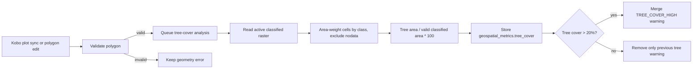
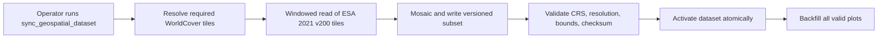
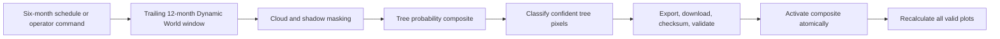

# V27 — Flag Tree Cover Over 20 Percent

> **Purpose**: Design tree-cover validation before implementation, including a
> static product and a meaningful six-month refresh option. This document is
> intended for product, GIS, and engineering review.

---

## Feature: Tree Cover Over 20 Percent

**Task ID**: V27
**Author**: Iwan
**Date**: 2026-08-15
**Status**: Developer approved — product/GIS resolution decision pending

---

## 1. Context & Problem Statement

African Bamboo wants the User to review a submitted plot when more than 20% of its
area is covered by trees. The supplied research mentioned both categorical
land-cover data and canopy-density data; this design resolves the requirement as
**percentage of polygon area classified as tree cover**.

```text
Currently:
- The application has no raster land-cover integration.
- Structured warnings and the User's review workflow already exist.
- V24 introduces api.v1.v1_geospatial, Plot.geospatial_metrics, the
  Django-Q2 analysis task, and the metric merge helper.
- V26 introduces the GeospatialDataset registry and atomic activation.
- ESA WorldCover provides a clear 10 m tree class but only fixed 2020/2021
  products; redownloading it every six months would not show current change.

Goal:
- Calculate tree-classified area as a percentage of each valid polygon.
- Flag percentages strictly greater than 20%.
- Store dataset provenance and make uncertainty and failure visible.
- Offer a low-cost static WorldCover option and a genuinely refreshed option.
```

### Proposed data flow

Per-plot analysis is identical in both source options. It always reads the
**already active** classified raster and never fetches anything, so this diagram
holds whichever option product selects.



The two options differ only in how that active raster is produced. Both
preparation flows below end exactly where the diagram above begins, and both run
out of band — see Section 7, "Import trigger and cadence".

### Dataset preparation — Option A (static WorldCover)



### Dataset preparation — Option B (refreshed Dynamic World)



---

## 2. Requirements

### User Acceptance Criteria

- [ ] **AC-1:** The User sees tree-covered area as a percentage in the plot detail
      panel.
- [ ] **AC-2:** A result `> 20.0%` is flagged for review.
- [ ] **AC-3:** A result of exactly `20.0%` is not flagged by this rule.
- [ ] **AC-4:** The warning names the measured percentage, the threshold, the
      source, and the source date/version.
- [ ] **AC-5:** The User can approve, reject, or adjust a flagged plot using
      the existing workflow. Recollection is requested by rejecting; there is no
      separate recollection action.
- [ ] **AC-6:** When the User rejects a plot for tree cover, the existing
      Telegram notification names the measured percentage without the User
      retyping it.
- [ ] **AC-7:** Polygon adjustment recalculates tree cover for the adjusted
      boundary.
- [ ] **AC-8:** Low-quality or unavailable imagery is displayed as unavailable,
      never as a pass.
- [ ] **AC-9:** A result whose outcome depends on a single 10 m pixel is
      presented with that limitation visible, not as a precise measurement.

### Technical Acceptance Criteria

- [ ] The metric denominator is the valid raster-covered polygon area, with a
      minimum coverage quality floor.
- [ ] Edge pixels are area-weighted by their true intersection area, measured in
      the plot's UTM zone; a small plot is never rounded to one whole pixel
      without disclosure.
- [ ] Results store value, status, source, source version/window, timestamp,
      tree area, valid covered area, coverage, resolution, effective-pixel
      equivalent, and polygon fingerprint.
- [ ] Updating tree cover preserves all unrelated flags and metric keys.
- [ ] Static mode uses ESA WorldCover 2021 v200 class `10` at 10 m.
- [ ] Refresh mode creates a trailing 12-month Dynamic World composite every six
      months; it does not call Earth Engine for each dashboard GET.
- [ ] A new composite is validated and activated atomically before plots are
      recalculated.
- [ ] Prior successful results remain until a replacement analysis succeeds.
- [ ] The `20.0` threshold, the coverage floor, and the rule version are defined
      once in `v1_geospatial/constants.py`; calculation and warning code contain
      no repeated literal, and each result stores the applied values.

### Progress measurement

Engineering delivery and User AC acceptance are tracked separately so code
progress cannot be mistaken for user acceptance. The earned-value gates are
identical to V24.

#### Engineering progress

| Task state | Earned value | Required evidence |
|------------|-------------:|-------------------|
| Not started | 0% | No implementation branch/PR evidence. |
| In progress | 25% | Scoped code or fixture work has started. |
| Code complete | 50% | Implementation is reviewable and related files are identified in the PR. |
| Automated verification complete | 75% | Required unit, integration, API, and frontend tests pass in CI. |
| Done | 100% | Code is merged/deployed to the target environment and the task's linked AC evidence is recorded. |

```text
engineering_progress_percent =
    sum(task_planning_weight * task_earned_value)
    / sum(task_planning_weight)
    * 100
```

The Option A tasks in Section 12 have midpoint weights of `6, 5, 4, 5` hours,
for a total planning weight of **20 hours**. Option B discards E1's asset
packaging and adds `2.5, 6, 6, 5, 5, 4, 2.5, 5`, a further **36 hours**.

#### User AC progress

```text
user_ac_progress = accepted_user_acs / 9
```

The notebook boundary demo is supporting evidence for AC-2 through AC-4, but it
does not mark them accepted because it does not exercise the deployed API,
queue, database, and UI together.

| User AC | Engineering tasks that enable it | Automated evidence | Final acceptance evidence |
|---------|----------------------------------|--------------------|---------------------------|
| AC-1: Display tree-cover percentage | E1, E2, E4 | Serializer/API test and plot-detail component test | The User confirms value, unit, source, and date display in UAT. |
| AC-2: `> 20.0%` is flagged | E1, E2, E3 | Strict-threshold unit test, task integration test, API response test | The User sees a `TREE_COVER_HIGH` plot in the review queue. |
| AC-3: Exactly `20.0%` is not flagged | E1, E2, E3 | Boundary unit test and existing-flag preservation API test | Product verifies no warning at exactly `20.0%`. |
| AC-4: Warning explains value, threshold, source, date | E2, E3, E4 | Warning-contract unit test plus backend/frontend snapshot assertions | The User approves the production wording. |
| AC-5: Existing review actions still work | E3, E4 | Approve/reject/edit regression tests | The User completes approve, reject, and adjust actions in UAT. |
| AC-6: Telegram carries the measured tree-cover result | E4 | Telegram payload test asserting the `Measured:` line, and a no-metric test asserting it is omitted | Enumerator group receives a rejection notice naming the measured percentage. |
| AC-7: Adjustment recalculates tree cover | E3 | Edit dispatch, fingerprint, and stale-task integration tests | Adjusted polygon shows a new analysis timestamp/value in UAT. |
| AC-8: Unavailable is not a pass | E1, E2, E3, E4 | Coverage-floor, missing-raster, API-state, and frontend-state tests | The User sees an unavailable state without a false pass. |
| AC-9: Single-pixel sensitivity is visible | E1, E2, E4 | Effective-pixel and swing-calculation unit tests plus a frontend notice test | The User confirms the low-resolution notice is understandable and not alarming. |

### Metric definition

For valid classified cells intersecting polygon `P`:

```text
tree_area_m2  = sum(intersection_area_m2 where class == TREE_CLASS)
valid_area_m2 = sum(intersection_area_m2 where class is not nodata)

tree_cover_percent = tree_area_m2 / valid_area_m2 * 100
coverage_percent   = valid_area_m2 / plot_area_m2 * 100

flag = tree_cover_percent > TREE_COVER_MAX_PERCENT
```

For WorldCover, "tree" means `Map == 10`. For refreshed Dynamic World, the
prepared composite classifies a pixel as tree when its composite tree
probability meets the approved confidence threshold. The initial technical
default for validation is `0.5`; GIS and product must calibrate it before
rollout.

The denominator is the valid classified area, not the plot area, so nodata never
silently inflates or deflates the percentage.

### Notebook POC result (2026-08-15)

The feasibility POC is implemented in `notebooks/v27_tree_cover_poc.ipynb`. It
uses the actual ignored submission data, the existing Django polygon
parsing/validation helpers, and real ESA WorldCover 2021 v200 tiles read as
cloud-optimised GeoTIFFs directly from the public ESA bucket. Only the windows
covering the collection area were transferred; the resulting cached subset is
294 KB.

The POC exercised **Option A (static WorldCover) only**. Dynamic World needs an
Earth Engine project, credentials, and an export pipeline that do not exist for
this deployment, so Option B carries no POC evidence and is estimated
conservatively.

The POC processed 166 valid submission polygons:

| Check | Result |
|-------|--------|
| Valid input polygons | 166 / 166 |
| Completed tree-cover calculations | 166 / 166 |
| Unavailable results | 0 / 166 |
| WorldCover tiles required | `N06E036`, `N06E039` (the area straddles a tile edge) |
| Minimum valid raster coverage | 100.0% |
| Plots flagged above 20% | 4 / 166 |
| Plots with exactly 0% tree cover | 160 / 166 |
| Observed tree-cover range | 0.00–68.88% |
| Observed median tree cover | 0.00% |
| Median effective 10 m pixel equivalent | 3.087 |
| Below the four-effective-pixel confidence floor | 107 / 166 |
| Boundary demo: 19.99% / 20.00% / 20.01% | no flag / no flag / flag |

Observed land-cover mix across all plot area:

| WorldCover class | Share of measured plot area |
|------------------|----------------------------:|
| Cropland | 47.96% |
| Grassland | 34.99% |
| Shrubland | 14.91% |
| Tree cover | 2.03% |
| Built-up | 0.06% |
| Herbaceous wetland | 0.05% |

**Single-pixel sensitivity** — the most important finding in this plan:

| Measure | Result |
|---------|-------:|
| Median change caused by reclassifying one 10 m pixel | 32.39 percentage points |
| Maximum change caused by reclassifying one 10 m pixel | 133.51 percentage points |
| Plots where one pixel decides the flag outcome | **125 / 166 (75.3%)** |

Four conclusions follow, and each one changes a decision:

1. **The pipeline is feasible and very cheap.** No account, no API key, no
   scheduled job, and a 294 KB static asset. Option A is the least operationally
   demanding of the four geospatial features.
2. **The rule discriminates, but barely.** 4 of 166 plots exceed 20%, and 160
   are at exactly 0%. Tree cover accounts for 2.03% of total measured plot area;
   the collection area is cropland and grassland. The rule is a genuine filter,
   not a no-op, but it is a narrow one.
3. **For three quarters of plots, the flag is decided by a single 10 m pixel.**
   The median plot occupies about three WorldCover cells, so one boundary cell
   is worth roughly 32 percentage points — well outside the 20% threshold. This
   is a much sharper version of the resolution concern V24 raised for slope, and
   it is a property of the plot sizes rather than of the implementation. The
   measurement is correct; the *precision implied by a number like "24.63%" is
   not*. AC-9 exists because of this finding.
4. **Nothing here argues for the refresh option.** The value of recency is
   dominated by the resolution limitation. Spending 40–56 hours on a Dynamic
   World pipeline to make a number fresher, when that number is decided by one
   pixel for 75% of plots, is not a good trade. This strengthens D-5.

The notebook writes a tracked, reviewable summary to
`notebooks/outputs/v27_tree_cover_summary.json`, and keeps the sensitive
artifacts under the ignored `notebooks/data/v27_poc_output/`:

- `tree_cover_results_private.json` — per-plot results keyed by hashed ID, each
  carrying the proposed `geospatial_metrics.tree_cover` document and the full
  per-class area breakdown.
- `v27_acceptance_demo.json` — deterministic `19.99%`, `20.00%`, and `20.01%`
  boundary scenarios built on existing hashed plot records.
- `worldcover_2021_subset.tif` — the cached classified subset, suitable for an
  independent QGIS check.

Shared loader code lives in the tracked `notebooks/poc_common.py`; it contains no
data. Exact geometry is sensitive, so the entire `notebooks/data` folder is
ignored.

---

## 3. Data Model Changes

### New Models

**Option A adds no new model.** The classified layer is a committed asset, the
same contract V24 uses for terrain and the existing
`backend/assets/ethiopia_admin_boundaries.geojson`:

```text
backend/assets/geospatial/worldcover_2021_v200_tree/
├── tree_cover.tif
└── manifest.json
```

Clipped to the agreed collection area, the layer is **294 KB** — a fraction of
the 13 MB boundaries file already committed. Nothing at that size justifies a
database table, a mounted volume, or an activation protocol. A data update is a
pull request, reviewed and rolled back like any other commit.

The manifest records source, source version, bounding box, CRS, resolution,
band, dtype, nodata value, and checksums. It is validated at startup or before
deployment; a missing or mismatched asset makes the metric `unavailable` rather
than silently clean.

**Option B adds the registry.** Only a refresh swaps data underneath a running
system, which is the sole situation needing a version record and an atomic
pointer switch. Option B registers key `tree_cover` in the `GeospatialDataset`
model defined by V26, and moves the raster from `backend/assets/` onto shared
writable storage because the running system must be able to write a new
version. If V26 has not shipped, V27 creates the same generic registry and V26
then reuses it.

### Modified Models

| Model | Change | Option | Reason |
|-------|--------|--------|--------|
| `Plot` | Add/update `geospatial_metrics.tree_cover` | A and B | Persist percentage, quality, and provenance |
| `GeospatialDataset` | Register key `tree_cover` | **B only** | Version and atomically activate the composite |

### Geospatial application placement

Option A:

```text
backend/assets/geospatial/worldcover_2021_v200_tree/
├── tree_cover.tif               # NEW: committed, 294 KB
└── manifest.json                # NEW: source, version, bounds, checksums

backend/api/v1/v1_geospatial/
├── constants.py                 # + tree threshold, class, rule version
├── services/
│   ├── geospatial_metrics.py    # unchanged shared merge helper
│   ├── tree_cover.py            # NEW: zonal classification
│   └── tree_cover_asset.py      # NEW: load, validate, cache the raster
├── warning_rules.py             # + tree_cover_flag and replacement rule
├── tasks.py                     # + analyse_plot_tree_cover
├── management/commands/
│   └── backfill_geospatial_metric.py    # + --metric tree_cover
└── tests/
    ├── tests_tree_cover.py                   # NEW
    ├── tests_tree_cover_asset.py             # NEW
    ├── tests_tree_cover_warning_rules.py     # NEW
    ├── tests_tree_cover_tasks.py             # NEW
    └── tests_tree_cover_lifecycle.py         # NEW
```

Option B adds, on top of the above:

```text
backend/api/v1/v1_geospatial/
├── models.py                            # GeospatialDataset (V26 or V27 first)
├── migrations/0001_initial.py           # only if V26 has not shipped
├── services/earth_engine.py             # NEW: authenticated initialisation
├── services/tree_cover_dataset.py       # NEW: composite, export, activate
├── management/commands/
│   └── sync_geospatial_dataset.py       # NEW: tree_cover modes
└── tests/
    ├── tests_tree_cover_dataset.py      # NEW
    ├── tests_tree_cover_composite.py    # NEW
    └── tests_tree_cover_refresh.py      # NEW
```

There is no runtime import command in Option A. Preparing the layer is a
release-time operation, performed only when the source version or the supported
collection area changes — the same contract V24 uses for terrain.

Proposed tree-cover value:

```json
{
  "tree_cover": {
    "status": "complete",
    "value": 24.63,
    "unit": "percent",
    "source": "ESA WorldCover",
    "source_version": "2021-v200",
    "source_provider": "ESA WorldCover / Terrascope",
    "threshold": {
      "operator": ">",
      "value": 20.0,
      "unit": "percent",
      "rule_version": "v1"
    },
    "analysed_at": "2026-08-15T11:00:00Z",
    "polygon_fingerprint": "sha256:...",
    "details": {
      "tree_area_m2": 76.0,
      "valid_covered_area_m2": 308.7,
      "plot_area_m2": 308.7,
      "coverage_percent": 100.0,
      "pixel_resolution_m": 10,
      "effective_pixel_equivalent": 3.087,
      "resolution_confidence": "low",
      "single_pixel_swing_percent": 32.39
    }
  }
}
```

`single_pixel_swing_percent` is `pixel_area_m2 / valid_covered_area_m2 * 100`.
It is stored rather than derived in the frontend so the value the User sees always
matches the analysis that produced the flag. It is the data behind AC-9.

For refresh mode, `source_version` is the immutable composite identifier and
`details` additionally include `window_start`, `window_end`, the confidence
threshold, an observation-count summary, and the processing algorithm version.

Allowed metric statuses are the V24 set: `pending`, `complete`, `unavailable`,
and `failed`.

### Migration Strategy

- **Option A adds no migration.** The classified layer is a committed asset, so
  the only schema V27 touches is `Plot.geospatial_metrics` from V24.
- **Option B** adds the `GeospatialDataset` registry, reusing V26's model when it
  has shipped and creating it otherwise.
- Reuse `Plot.geospatial_metrics` from V24; include that migration if V27 is
  delivered independently.
- Import and validate the raster or composite before enabling tasks or warnings.
- Backfill writes only `tree_cover` and replaces only the prior tree warning.
- Rollback deactivates the evaluator; retained JSON and dataset records do not
  affect older application versions.

---

## 4. API Contract

### Endpoints

| Method | URL | Purpose | Auth |
|--------|-----|---------|------|
| GET | `/api/v1/odk/plots/{uuid}/` | Return the stored tree-cover metric and warning | Required |
| PATCH | `/api/v1/odk/plots/{uuid}/` | Existing geometry edit; queues recalculation | Required |
| GET | `/api/v1/settings/geospatial/` | Report the active dataset, window, and threshold | Required |

Earth Engine credentials, composite creation, dataset import, and activation are
operator actions and are never exposed through a public request endpoint.

### Plot-detail response change

| Existing response field | Difference after V27 |
|-------------------------|----------------------|
| All current identity, geometry, location, form, submission, approval, farmer, and audit fields | No change to names, types, or values. |
| `geospatial_metrics` | Gains a `tree_cover` key alongside any `slope`/`elevation`/`road` keys. Absent before analysis/backfill. |
| `flagged_for_review` | Still represents all validation rules together. It is not a tree-cover-only boolean. |
| `flagged_reason` | Existing entries are preserved. V27 removes/replaces only the prior `TREE_COVER_HIGH` entry. |

```diff
 {
   "plot_id": "752997504",
   "uuid": "c83ca02e-c5d1-4aba-a5c4-f16fd5494e11",
   "polygon_wkt": "POLYGON((...))",
   "geospatial_metrics": {
     "slope": { "status": "complete", "value": 3.77, "unit": "degrees" },
+    "tree_cover": {
+      "status": "complete",
+      "value": 24.63,
+      "unit": "percent",
+      "source": "ESA WorldCover",
+      "source_version": "2021-v200",
+      "source_provider": "ESA WorldCover / Terrascope",
+      "threshold": {
+        "operator": ">",
+        "value": 20.0,
+        "unit": "percent",
+        "rule_version": "v1"
+      },
+      "analysed_at": "2026-08-15T11:00:00Z",
+      "details": {
+        "coverage_percent": 100.0,
+        "pixel_resolution_m": 10,
+        "effective_pixel_equivalent": 3.087,
+        "resolution_confidence": "low",
+        "single_pixel_swing_percent": 32.39
+      }
+    }
   },
   "flagged_for_review": true,
   "flagged_reason": [
     { "type": "POINT_GAP_LARGE", "severity": "warning", "note": "..." },
+    {
+      "type": "TREE_COVER_HIGH",
+      "severity": "warning",
+      "note": "Tree cover is 24.63% (threshold: > 20%). Dataset source: ESA WorldCover 2021-v200."
+    }
   ],
   "farmer_uid": "00361"
 }
```

### Response lifecycle

1. Before queueing or backfill: `"geospatial_metrics": null`, or an object with
   no `tree_cover` key.
2. After dispatch, `tree_cover.status` is `pending` with `value: null` and the
   applied threshold already recorded.
3. After the worker completes, `status` becomes `complete` and `value`,
   `analysed_at`, and `details` are populated. A safe `unavailable` or `failed`
   result has `value: null`; it is never interpreted as a pass.

`geospatial_metrics.tree_cover.status` is the frontend's polling/display
contract.

### Strict-threshold examples

For a completed value of exactly `20.0`, the response contains the measured
metric but V27 adds no warning:

```json
{
  "geospatial_metrics": {
    "tree_cover": {
      "status": "complete",
      "value": 20.0,
      "unit": "percent",
      "threshold": {
        "operator": ">",
        "value": 20.0,
        "unit": "percent",
        "rule_version": "v1"
      },
      "details": {
        "resolution_confidence": "low",
        "single_pixel_swing_percent": 32.39
      }
    }
  },
  "flagged_for_review": false,
  "flagged_reason": []
}
```

Note that in this example `single_pixel_swing_percent` exceeds the distance from
the measured value to the threshold, so the frontend must render the
low-resolution notice alongside the passing value (AC-9).

### Example refreshed composite preparation

```python
def build_dynamic_world_tree_composite(window_start, window_end):
    collection = (
        ee.ImageCollection("GOOGLE/DYNAMICWORLD/V1")
        .filterDate(window_start, window_end)
        .filterBounds(ETHIOPIA_GEOMETRY)
    )
    # The collection is already paired with cloud-screened Sentinel-2 input.
    tree_probability = collection.select("trees").median()
    tree_mask = tree_probability.gte(settings.TREE_PROBABILITY_MIN)
    return tree_mask.rename("tree_cover")
```

Production code exports a versioned raster artifact and records Earth Engine
task IDs and checksums. Plot analysis reads the prepared artifact locally; it
does not call `.getInfo()` per plot.

---

## 5. Decision Log

### D-1: Meaning of "tree cover over 20%"

**Options Considered**:
1. Percentage of polygon area classified as trees.
2. Mean canopy-density percentage across the polygon.
3. Flag if either metric exceeds 20%.

**Decision**: Percentage of polygon area classified as trees.

**Rationale**: It is unambiguous for the User and directly supported by categorical
land-cover products.

### D-2: Static source

**Decision**: ESA WorldCover 2021 v200, class 10, at 10 m.

**Rationale**: It provides a simple, open, validated global tree class and
requires no runtime external service, account, or credential.

**POC evidence**: All 166 plots were measured from a 294 KB subset built from
two tiles (`N06E036` and `N06E039`, since the area straddles a tile edge) by
windowed reads, with 100% valid coverage and no unavailable results.

**Sizing consequence**: at 294 KB the prepared layer is a committed asset, not a
managed dataset. The full tiles are 36000 x 36000 each and are never downloaded
whole; only the windows covering the collection area are transferred, at release
time, and the clipped result is what ships.

**Impact**: The value represents the 2021 product, not current conditions.

### D-3: Six-month refresh source

**Options Considered**:
1. Redownload WorldCover every six months.
2. Hansen Global Forest Change.
3. Build Dynamic World composites.

**Decision**: Use Dynamic World if a refreshed option is chosen at all.

**Rationale**: WorldCover currently exposes fixed 2020/2021 products, so
redownloading it produces the same numbers. Hansen's tree-cover-density band is
a 2000 baseline with annual loss information, which does not match the chosen
current-tree-area metric. Dynamic World is near-real-time and provides a 10 m
tree probability and class.

### D-4: Composite window

**Decision**: Prepare a trailing 12-month composite every six months.

**Rationale**: A full seasonal cycle reduces short-term cloud and phenology
effects while still producing twice-yearly updates.

### D-5: Initial release recommendation

**Decision**: Recommend static WorldCover for v1. Do not build the Dynamic World
pipeline unless product confirms that recent land-cover change is part of the
decision the User is making.

**Rationale**: The static option is cheaper and scientifically easier to
explain. Refresh mode adds account, composite, seasonal-quality, and operational
complexity.

**POC evidence**: This recommendation is now considerably stronger than when it
was first drafted. Recency cannot improve a number whose outcome is decided by
one 10 m pixel for 75% of plots. The resolution limitation dominates the
staleness limitation, so 40–56 hours of Dynamic World work would buy an
improvement the plot sizes cannot express.

### D-6: Resolution confidence and single-pixel sensitivity

**POC finding**: The median plot occupies 3.087 effective 10 m cells. 107 of 166
plots fall below the four-effective-pixel floor, and reclassifying a single
boundary pixel moves the result by a median of 32.39 percentage points. For
125 of 166 plots (75.3%), that swing is larger than the distance from the
measured value to the 20% threshold.

**Decision**: Store `effective_pixel_equivalent`, `resolution_confidence`, and
`single_pixel_swing_percent` with every result. Display a low-resolution notice
whenever the swing exceeds the distance to the threshold. Do not reject plots
automatically and do not raise a second review flag for low resolution.

**Decision required before implementation**: Product and GIS must either accept
tree cover as an indicative screening signal with this caveat displayed, or
select a higher-resolution source. This choice may change the remaining estimate
and the operating cost.

### D-7: Failure behaviour

**Decision**: Persist an `unavailable`/`failed` status and retain any prior valid
result until a successful replacement is available. Never remove a prior tree
warning because a refresh failed.

---

## 6. Type/Constant Mappings

| Frontend | Backend Constant | Stored Value |
|----------|------------------|--------------|
| `TREE_COVER_HIGH` | `v1_geospatial.constants.GeospatialFlagType.TREE_COVER_HIGH` | `"TREE_COVER_HIGH"` |
| Warning | `v1_geospatial.constants.GeospatialFlagSeverity.WARNING` | `"warning"` |
| Tree metric | `v1_geospatial.constants.GeoMetricType.TREE_COVER` | `"tree_cover"` |
| WorldCover tree class | `v1_geospatial.constants.WorldCoverClass.TREE` | `10` |

```python
# backend/api/v1/v1_geospatial/constants.py
class GeospatialFlagType:
    SLOPE_TOO_STEEP = "SLOPE_TOO_STEEP"
    ELEVATION_OUT_OF_RANGE = "ELEVATION_OUT_OF_RANGE"
    ROAD_TOO_CLOSE = "ROAD_TOO_CLOSE"
    TREE_COVER_HIGH = "TREE_COVER_HIGH"


class GeoMetricType:
    SLOPE = "slope"
    ELEVATION = "elevation"
    ROAD = "road"
    TREE_COVER = "tree_cover"


class WorldCoverClass:
    TREE = 10


TREE_COVER_MAX_PERCENT = 20.0
TREE_COVER_RULE_VERSION = "v1"
TREE_PROBABILITY_MIN = 0.5
MIN_RASTER_COVERAGE_PERCENT = 90.0
LOW_CONFIDENCE_PIXEL_EQUIVALENT = 4.0
```

```python
def tree_cover_flag(percent):
    if percent <= TREE_COVER_MAX_PERCENT:
        return None
    return {
        "type": GeospatialFlagType.TREE_COVER_HIGH,
        "severity": GeospatialFlagSeverity.WARNING,
        "note": (
            f"Tree cover is {percent:.2f}% "
            f"(threshold: > {TREE_COVER_MAX_PERCENT:g}%)."
        ),
    }
```

Zonal calculation, matching the POC implementation:

```python
def calculate_tree_cover(polygon, classified_raster, to_utm):
    plot_utm = transform_geometry(polygon, to_utm)
    area_by_class = collections.defaultdict(float)
    valid_area_m2 = 0.0
    for value, cell in intersecting_cells(classified_raster, polygon):
        piece = transform_geometry(cell, to_utm).intersection(plot_utm)
        if piece.is_empty or value == classified_raster.nodata:
            continue
        area_by_class[value] += piece.area
        valid_area_m2 += piece.area

    coverage = valid_area_m2 / plot_utm.area * 100.0
    if not valid_area_m2 or coverage < MIN_RASTER_COVERAGE_PERCENT:
        raise MetricUnavailable("No valid land-cover coverage")
    tree_area_m2 = area_by_class[WorldCoverClass.TREE]
    return tree_area_m2 / valid_area_m2 * 100.0, valid_area_m2, coverage
```

The flag updater removes only a previous `TREE_COVER_HIGH` entry before adding
the newly evaluated one. Geometry, overlap, GPS, area, slope, elevation, and
road flags are preserved.

---

## 7. Compatibility & Migration

### Backward Compatibility

- [x] The new metric and flag are nullable and additive.
- [x] Existing review, Kobo, Telegram, and export contracts remain compatible.
- [x] Static mode has no Earth Engine runtime dependency.
- [x] Refresh failure leaves the last successful composite active.
- [x] Approval and rejection retain measurements for auditability.

### Import trigger and cadence

There is **no download path in Option A at all**. The layer is prepared once by
a maintainer and committed, so the deployed application has no importer to
invoke. Option B introduces both the pipeline and its only automatic caller.

| Mode | What triggers a download | Frequency |
|------|--------------------------|-----------|
| Option A (committed asset) | A maintainer prepares the clipped layer and commits it | Once at rollout, then effectively never, as a pull request |
| Option B (Dynamic World) | The Django-Q schedule added by E10 requests, exports, and downloads a new composite | Every six months, plus on demand |
| Both | Nothing else | Never |

Option A's "effectively never" is stronger than V26's "on demand". WorldCover
2021 v200 is an immutable published product: rerunning the import fetches
byte-identical tiles and produces identical results. This is the same reasoning
D-3 uses to reject a six-month WorldCover redownload. A rerun is justified only
when the *inputs to the import* change, not when time passes:

- The collection area expanded and now touches a WorldCover tile the cached
  subset does not cover. The POC already showed the area straddles the
  `N06E036`/`N06E039` boundary, so tile coverage is a real operational concern.
- ESA publishes a genuinely new WorldCover product version. This is a source
  change, gets its own `GeospatialDataset` version, and forces a full
  recalculation.
- A previous import failed validation and left no active dataset, or left an
  older version active.

What never triggers a download or an Earth Engine call, in either mode:

- An HTTP request. No endpoint reaches the import pipeline; the settings
  endpoint reports the active dataset and window but cannot change them.
- A plot sync, geometry adjustment, reset, or backfill. These read the **already
  active** local raster. Refresh mode explicitly does not call Earth Engine per
  dashboard GET or per plot.
- Worker or backend startup. Startup validates that an active dataset exists and
  is readable; it does not fetch one.

### Telegram notification impact

V27 adds **no new Telegram trigger**. The only trigger today is a plot rejection
whose Kobo validation sync succeeded; approval, polygon adjustment, reset, and
metric recalculation send nothing, and that stays true after V27.

The message is built from `RejectionAudit.reason_category` and `reason_text`,
both authored by the User at rejection time. Without a change, a User rejecting
a plot for tree cover must select category `other` and retype the percentage.

**Decision**: reuse the shared `Measured:` line defined in
`docs/v26_road_within_n_meters_or_road_overlap.md` Section 7, adding a
tree-cover formatter:

```text
*Reason:* Other: too much tree cover on this plot
*Measured:* Tree cover 24.63% (threshold: >20%), low resolution
```

The `low resolution` suffix appears under the same condition as the AC-9 UI
notice: when the single-pixel swing exceeds the distance from the measured value
to the threshold. Given the POC finding that this holds for 125 of 166 plots, an
enumerator sent to recollect a plot deserves to know the flag turned on one
pixel.

If V26 ships first, E5 only adds this formatter. If V27 ships first, E5 carries
the full cost of the shared line and V26 reuses it; the estimate assumes the
latter.

**Deferred to product, not included in this estimate**: adding
`RejectionCategory.TREE_COVER`. It needs a constant, a migration, a frontend
dropdown option, and a Kobo status-mapping check. Until product asks for it,
tree-cover rejections use `other` plus the `Measured:` line.

### Seeder/CLI Compatibility

Option A:

- [ ] Commit the clipped layer and manifest under
      `backend/assets/geospatial/worldcover_2021_v200_tree/`.
- [ ] Validate the manifest, checksum, CRS, resolution, band, dtype, nodata, and
      configured coverage at application/worker startup or before deployment.
- [ ] Extend `backfill_geospatial_metric` with `--metric tree_cover`, reusing the
      existing `--form`, `--plot`, `--batch-size`, `--resume-from`, and
      `--dry-run` options.

There is no runtime import command in Option A. The POC notebook can produce the
initial layer; a small reproducible release script may be added if preparation
will be repeated.

Option B additionally:

- [ ] Add `sync_geospatial_dataset tree_cover --mode dynamic-world
      --window-end YYYY-MM-DD`.
- [ ] Support checksum verification, explicit version, dry-run, and resume.
- [ ] Store credentials outside the repository and the dataset directory.
- [ ] Add the six-month Django-Q schedule; in Option A there is no pipeline for
      it to call.

Refresh-mode authentication uses application default credentials where
available, with a secret-mounted service-account credential only when required:

```python
credentials, project_id = google.auth.default()
ee.Initialize(
    credentials=credentials,
    project=settings.EARTH_ENGINE_PROJECT,
)
```

Refresh stages are composite request → export → checksum → local raster
validation → reference sample comparison → atomic activation → plot backfill.

---

## 8. Security Considerations

- [x] Earth Engine credentials are secret-managed and never committed.
- [x] Public users cannot choose sources, date windows, or local paths.
- [x] Download and export artifacts have file-size, checksum, CRS, band, type,
      resolution, and Ethiopia-bounds validation.
- [x] API error messages contain safe summaries only.
- [x] Composite task and worker concurrency are bounded.
- [ ] Confirm WorldCover CC BY 4.0 and Dynamic World attribution requirements.
- [ ] Confirm whether the deployment is eligible for noncommercial Earth Engine
      access or requires a commercial plan (refresh mode only).

---

## 9. Testing Strategy

| Test Type | Coverage |
|-----------|----------|
| Unit | Area weighting, class 10 selection, nodata exclusion, coverage floor, exact 20%, single-pixel swing, flag replacement |
| Integration | Raster import, composite manifest, activation/rollback, backfill resume, stale polygon fingerprint rejection |
| API | Metric/provenance/status response and backward compatibility |
| Frontend | Percentage/source/date display, warning, low-resolution notice, loading and unavailable states |
| GIS acceptance | Compare treeless, mixed, forested, small, and tile-edge plots against QGIS or Earth Engine samples |
| Refresh (Option B only) | Window boundaries, cloud-limited area, failed export/download, delta report, previous-version retention |

### Unit-test specification

Unit tests use a tiny generated/committed classified raster fixture and must
never call the ESA bucket or Earth Engine, or depend on the sensitive notebook
data.

| Planned test file | Test case | Verifies | AC/task evidence |
|-------------------|-----------|----------|------------------|
| `backend/api/v1/v1_geospatial/tests/tests_tree_cover.py` *(new)* | `test_edge_pixels_are_area_weighted` | A cell partially inside the plot contributes only its intersection area. | AC-1, E2 |
| Same | `test_only_class_ten_counts_as_tree` | Shrubland, grassland, and cropland do not count toward tree area. | AC-1, E2 |
| Same | `test_nodata_excluded_from_denominator` | Nodata reduces coverage but never changes the percentage. | AC-8, E2 |
| Same | `test_coverage_below_floor_is_unavailable` | Coverage under the floor returns `unavailable`, never `complete` with a false value. | AC-8, E2 |
| Same | `test_tree_cover_threshold_is_strict` | `20.0` produces no flag; `20.01` does. | AC-2, AC-3, E2 |
| Same | `test_single_pixel_swing_is_recorded` | `single_pixel_swing_percent` equals `pixel_area / valid_area * 100` and is stored with the result. | AC-9, D-6, E2 |
| Same | `test_resolution_confidence_uses_effective_pixels` | Effective-cell count and confidence value are deterministic. | AC-9, E2 |
| Same | `test_tree_cover_result_records_rule_contract` | The result stores the applied threshold and `TREE_COVER_RULE_VERSION` rather than repeated literals. | AC-2, AC-3, E2 |
| Same | `test_tree_cover_warning_contract` | The warning contains the measured value, strict threshold, and dataset name/version. | AC-4, E2 |
| `backend/api/v1/v1_geospatial/tests/tests_tree_cover_asset.py` *(new)* | `test_committed_asset_covers_the_configured_area` | The committed layer spans the whole configured collection area, including plots near the tile boundary the POC found. | AC-8, E1 |
| Same | `test_missing_or_corrupt_asset_is_unavailable` | A missing file or checksum mismatch makes the metric `unavailable`, never silently clean. | AC-8, E1 |
| Same | `test_manifest_contract_is_validated` | Source, version, CRS, resolution, band, dtype, nodata, and bounds are all checked at startup. | AC-8, E1 |
| `backend/api/v1/v1_geospatial/tests/tests_tree_cover_dataset.py` *(new, Option B only)* | `test_invalid_raster_is_rejected_before_activation` | Wrong CRS, resolution, band count, dtype, or bounds abort before activation. | AC-8, E8 |
| Same *(Option B only)* | `test_activation_is_atomic_and_single` | Exactly one composite is active; activation failure leaves the previous one live. | AC-8, E5 |
| `backend/api/v1/v1_geospatial/tests/tests_tree_cover_warning_rules.py` *(new)* | `test_replace_only_tree_warning` | Recalculation replaces/removes only `TREE_COVER_HIGH` and preserves other flags. | AC-2, AC-5, E3 |
| `backend/api/v1/v1_geospatial/tests/tests_tree_cover_tasks.py` *(new)* | `test_stale_polygon_result_is_discarded` | A queued result cannot overwrite a newer polygon. | AC-7, E3 |
| Same | `test_failed_recalculation_retains_last_result` | A failure does not erase the last successful measurement or its warning. | AC-8, D-7, E3 |
| `backend/api/v1/v1_geospatial/tests/tests_tree_cover_lifecycle.py` *(new)* | `test_polygon_edit_dispatches_current_tree_task` | Sync/edit/reset dispatch uses the current polygon fingerprint. | AC-7, E3 |
| `backend/api/v1/v1_geospatial/tests/tests_backfill_geospatial_metric_command.py` *(extend)* | `test_tree_cover_backfill_resumes_after_last_completed_batch` | The backfill is bounded, resumable, and idempotent. | E3 |

Representative strict-threshold and sensitivity tests:

```python
def test_tree_cover_threshold_is_strict(self):
    self.assertIsNone(tree_cover_flag(20.0))
    warning = tree_cover_flag(20.01)
    self.assertEqual(
        warning["type"],
        GeospatialFlagType.TREE_COVER_HIGH,
    )
    self.assertIn("20.01%", warning["note"])
    self.assertIn("threshold: > 20%", warning["note"])


def test_single_pixel_swing_is_recorded(self):
    result = calculate_tree_cover_result(self.small_plot, self.fixture)
    details = result["details"]
    self.assertAlmostEqual(
        details["single_pixel_swing_percent"],
        100.0 / details["valid_covered_area_m2"] * 100.0,
        places=6,
    )
```

### Integration, API, and frontend acceptance tests

| Test surface | Required scenario | User AC |
|--------------|-------------------|---------|
| Django-Q2 tree task | `pending -> complete`, retry-to-failed, and fingerprint mismatch | AC-2, AC-7, AC-8 |
| Asset validation (Option A) | Startup rejects a missing, truncated, or checksum-mismatched layer and the metric reports unavailable | AC-8 |
| Dataset lifecycle (Option B) | Composite → export → validate → activate → recalculate, plus rollback on each pre-activation failure | AC-8 |
| Plot API | Legacy `null`, pending, complete, unavailable, and failed response shapes | AC-1, AC-8 |
| Plot API | Existing warning array plus `TREE_COVER_HIGH`; recalculation removes only the tree warning | AC-2, AC-3, AC-5 |
| Plot edit/reset API | Geometry change queues exactly one current tree-cover calculation | AC-7 |
| Plot detail UI | Percentage, source, date, pending state, and unavailable state | AC-1, AC-8 |
| Plot detail UI | Low-resolution notice appears when the single-pixel swing exceeds the distance to the threshold | AC-9 |
| Telegram | Rejection payload carries the `Measured:` line; it is omitted when no geospatial rule is flagged; no notification is sent on approval, adjustment, or reset | AC-6 |

Acceptance testing must record an expected tolerance, because rasterization,
projection, and edge weighting can make values differ slightly between tools.
The production comparison uses stored fixtures rather than live Earth Engine or
ESA bucket requests in CI.

Frontend evidence remains in `frontend/__tests__/page.test.js` and
`frontend/__tests__/validation-rules-content.test.js`.

---

## 10. Open Questions

- [ ] **Product/GIS (blocking):** decide whether tree cover is acceptable as an
      indicative screening signal given that one 10 m pixel decides the flag for
      125 of 166 plots, or select a higher-resolution source. A higher-resolution
      source requires a revised estimate.
- [ ] **Product/operations:** choose static WorldCover (Option A) or refreshed
      Dynamic World (Option B) before implementation starts. The POC evidence
      supports Option A.
- [ ] **Product:** confirm that flagging 4 of 166 plots is a useful return for
      the effort, given that the collection area is 48% cropland and 35%
      grassland with only 2% tree cover.
- [ ] **GIS:** approve the 90% valid-coverage floor. The POC never triggered it
      (minimum observed coverage 100%), so it is untested against real data.
- [ ] **GIS/product (Option B only):** approve the Dynamic World confidence
      threshold.
- [ ] **Operations (Option B only):** confirm Earth Engine project eligibility,
      billing, IAM, storage, and secret-management ownership.
- [ ] **Product:** decide whether tree-cover metrics belong in exports; export
      changes are outside this estimate.

---

## 11. References

- [ESA WorldCover data access](https://esa-worldcover.org/en/data-access)
- [ESA WorldCover 2021 Earth Engine catalog](https://developers.google.com/earth-engine/datasets/catalog/ESA_WorldCover_v200)
- [Dynamic World V1 catalog](https://developers.google.com/earth-engine/datasets/catalog/GOOGLE_DYNAMICWORLD_V1)
- [Earth Engine access requirements](https://developers.google.com/earth-engine/guides/access)
- [Earth Engine service accounts](https://developers.google.com/earth-engine/guides/service_account)
- POC notebook: `notebooks/v27_tree_cover_poc.ipynb`
- Shared POC loader: `notebooks/poc_common.py`
- Shared metric foundation: `docs/v24_average_slope_over_30_degrees.md`
- Dataset registry and activation: `docs/v26_road_within_n_meters_or_road_overlap.md`
- Existing Telegram flow: `docs/v7_telegram_notifications_plan.md`

---

## 12. Estimate and Work Breakdown

One developer-day is capped at **8 hours**. Every task below is independently
reviewable, is engineering-owned, and is grouped into **4–8 hours** of effort.
Validation and expert-review activities are listed separately. Both estimates
assume one engineer; the AI-assisted version means the engineer uses AI for
repository discovery, scaffolding, test generation, refactoring, and
documentation while retaining human code review and ownership.

### Completed engineering discovery

The actual-data notebook POC, the WorldCover windowed import, the area-weighted
zonal calculation, the land-cover mix analysis, the single-pixel sensitivity
analysis, and the boundary-contract demo are complete. See
`notebooks/v27_tree_cover_poc.ipynb` and the ignored artifacts under
`notebooks/data/v27_poc_output/`. This work is not included in the remaining
estimate.

The POC covered Option A only. Every Option B task below carries no POC
evidence and is estimated conservatively.

### Option A — Single sync, committed asset

The clipped layer ships in `backend/assets/geospatial/`, so this option contains
no registry model, no migration, no activation protocol, no scheduler, and no
Earth Engine dependency. Preparing the layer is a release activity, not shipped
code.

| Engineering sub-task | Deliverable | Related files | Without AI | With AI |
|----------------------|-------------|---------------|-----------:|--------:|
| E1. Backend — tree-cover asset package and constants | Resolve the tiles the configured collection area touches, including the tile-edge case, perform windowed reads, mosaic and clip, and commit the result with a provenance/checksum manifest — all at release time. Add the tree threshold, WorldCover class, coverage floor, confidence floor, rule version, and flag type; add startup/deployment validation of the manifest. | `backend/assets/geospatial/worldcover_2021_v200_tree/tree_cover.tif` *(new)*<br>`backend/assets/geospatial/worldcover_2021_v200_tree/manifest.json` *(new)*<br>`backend/api/v1/v1_geospatial/constants.py`<br>`backend/api/v1/v1_geospatial/services/tree_cover_asset.py` *(new)*<br>`backend/api/v1/v1_geospatial/tests/tests_tree_cover_asset.py` *(new)*<br>`backend/requirements.txt` *(Rasterio/GDAL, if not already present)*<br>`notebooks/v27_tree_cover_poc.ipynb` *(release preparation reference)* | 5–7 h | 4–6 h |
| E2. Backend — area-weighted tree classification service | Port the POC calculation into `v1_geospatial`: intersect plot with 10 m cells, accumulate area per class in UTM, exclude nodata, apply the coverage floor, and return percentage, valid area, effective-pixel equivalent, and single-pixel swing. | `backend/api/v1/v1_geospatial/services/tree_cover.py` *(new)*<br>`backend/api/v1/v1_geospatial/tests/tests_tree_cover.py` *(new)*<br>`backend/api/v1/v1_geospatial/tests/fixtures/` *(new classified fixture)*<br>`notebooks/v27_tree_cover_poc.ipynb` *(reference only)* | 4–6 h | 3–5 h |
| E3. Backend — task, warning ownership, and backfill | Add `analyse_plot_tree_cover`, the tree warning replacement rule, fingerprint protection, retries, and `--metric tree_cover` backfill. `v1_odk` gains one dotted-string dispatch and nothing else. | `backend/api/v1/v1_geospatial/tasks.py`<br>`backend/api/v1/v1_geospatial/warning_rules.py`<br>`backend/api/v1/v1_geospatial/management/commands/backfill_geospatial_metric.py`<br>`backend/api/v1/v1_geospatial/tests/tests_tree_cover_tasks.py` *(new)*<br>`backend/api/v1/v1_geospatial/tests/tests_tree_cover_lifecycle.py` *(new)*<br>`backend/api/v1/v1_geospatial/tests/tests_tree_cover_warning_rules.py` *(new)*<br>`backend/api/v1/v1_odk/funcs.py` *(dispatch hook only)*<br>`backend/api/v1/v1_odk/plot_views.py` *(dispatch hook only)* | 3–5 h | 3–4 h |
| E4. Frontend & Backend — plot review UI, low-resolution notice, Telegram measured-result line, and regression evidence | Display percentage, source, date, and pending/unavailable states; render the single-pixel-sensitivity notice required by AC-9; add the tree-cover formatter to the shared Telegram `Measured:` line, or that whole line if V26 has not shipped (no new Telegram trigger either way); cover API compatibility, flag preservation, CC BY attribution, and a staging backfill smoke test. | `frontend/src/components/map/plot-detail-panel.js`<br>`frontend/src/components/map/plot-header-card.js`<br>`frontend/src/lib/plot-utils.js`<br>`frontend/__tests__/page.test.js`<br>`frontend/__tests__/validation-rules-content.test.js`<br>`backend/api/v1/v1_odk/tasks.py` *(rejection notification only)*<br>`backend/api/v1/v1_odk/tests/tests_plots_endpoint.py` *(API contract only)*<br>`backend/api/v1/v1_odk/tests/tests_telegram_notification.py` *(extend)*<br>`README.md`<br>`docs/v27_tree_cover_over_20.md` | 4–6 h | 4–5 h |

### Option B — Scheduled sync every six months

Option B reuses the metric, task, and UI foundation from **E2, E3, and E4
(11–17 h)**. It does **not** reuse E1: a committed asset is replaced by a
generated composite, so the asset packaging is discarded rather than extended.

The Earth Engine work below is the bulk of this option and is genuinely heavy.
The storage and activation tasks are small, because they are sized for this
deployment: a single clipped raster and 166 plots that recalculate in seconds.

It is **not recommended**; see D-5 and the POC finding.

| Additional/replacement sub-task | Deliverable | Related files | Without AI | With AI |
|---------------------------------|-------------|---------------|-----------:|--------:|
| E5. Backend — active-version pointer and atomic swap | Write each composite to its own versioned directory under shared storage and record the active version in a `SystemSetting` row, so activation is a single pointer update and rollback is the same update reversed. No registry table is warranted at this size. | `backend/api/v1/v1_geospatial/services/tree_cover_dataset.py` *(new)*<br>`backend/api/v1/v1_geospatial/constants.py`<br>`backend/api/v1/v1_geospatial/tests/tests_tree_cover_dataset.py` *(new)*<br>`docker-compose.yml` *(storage volume)* | 2–3 h | 2–3 h |
| E6. Backend — Earth Engine project, IAM, credentials, and quota | Provision the project, service account, secret mounting, and quota; add authenticated initialisation and a connectivity check. A permanent external dependency the static option does not have. | `backend/api/v1/v1_geospatial/services/earth_engine.py` *(new)*<br>`backend/african_bamboo_dashboard/settings.py`<br>`backend/requirements.txt`<br>`docker-compose.yml` | 5–7 h | 5–6 h |
| E7. Backend — trailing 12-month composite algorithm | Build and test the windowed Dynamic World tree-probability composite and confident-tree classification. | `backend/api/v1/v1_geospatial/services/tree_cover_dataset.py`<br>`backend/api/v1/v1_geospatial/tests/tests_tree_cover_composite.py` *(new)* | 5–7 h | 5–6 h |
| E8. Backend — export polling, artifact download, and validation | Poll the Earth Engine export task, download the artifact, verify checksum, and run the same raster validation E1 applies to the committed asset. | `backend/api/v1/v1_geospatial/services/tree_cover_dataset.py`<br>`backend/api/v1/v1_geospatial/tests/tests_tree_cover_dataset.py` | 4–6 h | 4–5 h |
| E9. Backend — quality metadata and delta report | Record window bounds, observation counts, confidence threshold, and algorithm version; produce the per-refresh delta report against the previous composite that an operator reviews. | `backend/api/v1/v1_geospatial/services/tree_cover_dataset.py`<br>`backend/api/v1/v1_geospatial/tests/tests_tree_cover_composite.py` | 4–6 h | 4–5 h |
| E10. Backend — six-month schedule, locking, retry, and notifications | Django-Q schedule driving the E7/E8 pipeline, plus distributed locking, retry policy, and operator notification. The only automatic trigger for a composite build. | `backend/api/v1/v1_geospatial/tasks.py`<br>`backend/african_bamboo_dashboard/settings.py`<br>`backend/api/v1/v1_geospatial/tests/tests_tree_cover_refresh.py` *(new)* | 3–5 h | 3–4 h |
| E11. Backend — version retention and recalculation trigger | Keep the previous two composites and prune older ones; after activation, invoke the existing `backfill_geospatial_metric --metric tree_cover` command from E3 over all plots. At 166 plots this is a single batch, so no resume machinery is built. | `backend/api/v1/v1_geospatial/services/tree_cover_dataset.py`<br>`backend/api/v1/v1_geospatial/tasks.py` | 2–3 h | 2–3 h |
| E12. Backend — refresh failure/recovery fixtures, tests, and runbook | Fixtures and tests for failed export, download timeout, cloud-limited window, unexpected CRS, activation failure, and restart; operator runbook and monitoring notes. Deliberately not trimmed — this is where refresh risk lives. | `backend/api/v1/v1_geospatial/tests/tests_tree_cover_refresh.py`<br>`backend/api/v1/v1_geospatial/tests/fixtures/`<br>`README.md` | 4–6 h | 4–5 h |

Calibrating the Dynamic World confidence threshold against reference samples is
**GIS expert work, not engineering**, and has moved to the validation table
below. An earlier draft counted it as an engineering task.

**Scale note.** E5 and E11 are small because the composite is one clipped raster
and the plot count is in the hundreds. A registry table and resumable batch
recalculation become necessary if the collection area grows to several thousand
plots; revisit both before reusing this estimate at that scale.

### Validation and expert tasks

| Validation/expert task | Owner | Evidence or related files | Estimate |
|------------------------|-------|---------------------------|---------:|
| Decide whether tree cover is acceptable as an indicative screening signal when one 10 m pixel decides the flag for 125 of 166 plots, or select a higher-resolution source. | Product + GIS expert | `notebooks/data/v27_poc_output/tree_cover_results_private.json` *(ignored/sensitive)*<br>Section 5, D-6 | 1–2 h |
| Confirm that flagging 4 of 166 plots is a useful return given the observed 2% tree-cover share. | Product | Section 2, POC result | 1 h |
| Independently compare treeless, mixed, forested, small, and tile-edge plots in QGIS against the cached subset, agreeing a numerical tolerance. | GIS expert | `notebooks/data/v27_poc_output/worldcover_2021_subset.tif` *(ignored/sensitive)*<br>`backend/api/v1/v1_geospatial/tests/fixtures/` *(planned)* | 1–2 h |
| Verify the percentage wording and the low-resolution notice in the User's review workflow. | Product owner / User | `notebooks/data/v27_poc_output/v27_acceptance_demo.json` *(ignored)*<br>`frontend/src/components/map/plot-detail-panel.js` | 1 h |
| Confirm WorldCover CC BY 4.0 attribution obligations. | Product / legal | Section 8 | 1 h |
| Calibrate the Dynamic World confidence threshold against reference samples, and verify a full staging refresh *(Option B only)*. | GIS expert | Section 5, D-3<br>`backend/api/v1/v1_geospatial/tests/fixtures/` *(planned)* | 5–7 h |

### Totals

| Delivery version | Base engineering tasks | Contingency included | Developer-days at 8 h/day |
|------------------|-----------------------:|---------------------:|--------------------------:|
| Option A (committed asset), without AI | 16–24 h | **17–26 h** | **2.1–3.25 days** |
| Option A (committed asset), with AI assistance | 14–20 h | **15–21 h** | **1.9–2.6 days** |
| Option B (six-month refresh), without AI | 40–60 h | **42–63 h** | **5.25–7.9 days** |
| Option B (six-month refresh), with AI assistance | 36–52 h | **38–55 h** | **4.75–6.9 days** |

Option A is **3–5 hours cheaper than an earlier draft of this plan**, which
carried the dataset registry into the static path. That registry exists to swap
data safely underneath a running system, which a committed asset never does, so
it now belongs to Option B alone. The saving is smaller than V26's because V27
reused V26's model rather than defining one. The gap between the two options is
the honest price of refreshability: roughly **25–37 hours**, plus the recurring
allowance below and Earth Engine charges.

Option B was also re-scoped against this deployment's size. An earlier draft
budgeted a registry table and resumable batch recalculation for one clipped
raster and 166 plots, and counted GIS threshold calibration as engineering. The
Earth Engine work itself is unchanged, because that is the real cost of this
option.

The completed POC is not included in either remaining engineering estimate. AI
savings are deliberately modest because raster correctness, import safety, queue
behaviour, deployment, code review, and acceptance evidence still require
engineering judgment. AI does not reduce the additional expert-validation hours: **5–7 h** for
Option A, or **10–14 h** for Option B, which adds the Dynamic World threshold
calibration. Both may run alongside engineering where dependencies allow.

**Recurring operational allowance (Option B)**: **4–8 hours per six-month
refresh** for quality and delta review, failure handling, and the recalculation
report.

The estimate excludes Earth Engine subscription and compute charges, scientific
ground-truth collection, custom Sentinel processing outside Earth Engine, manual
land-cover correction, and export-column changes. A decision to procure a
higher-resolution land-cover source requires a revised estimate.

---

## Approval

| Role | Name | Date | Status |
|------|------|------|--------|
| Developer | Iwan | 2026-08-15 | Approved |
| GIS reviewer | | | |
| Tech Lead | | | |
| Product | | | |
| Operations | | | |
