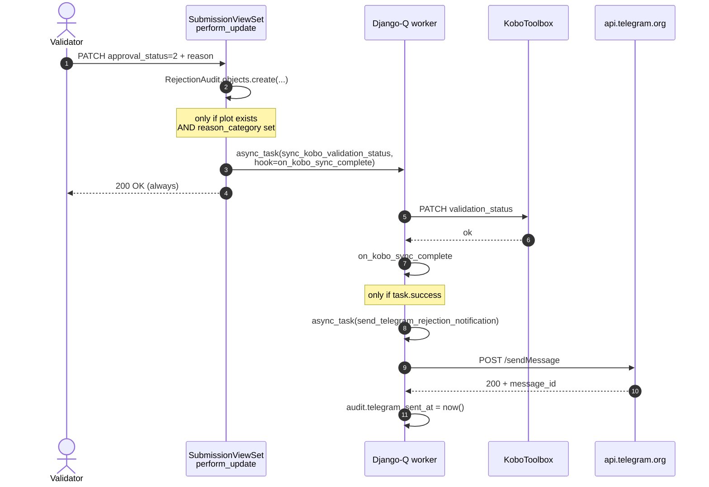
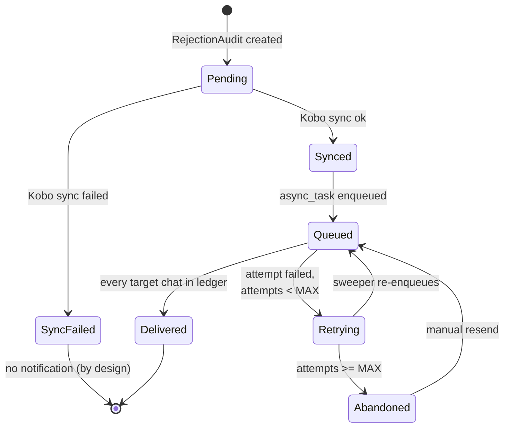
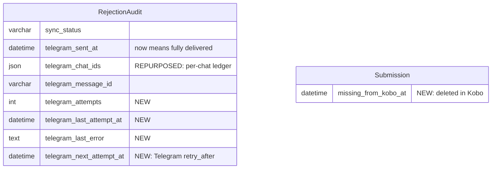

# v28: Telegram Notification Reliability & Delivery Visibility

**Status:** IMPLEMENTED

Supersedes and absorbs the standalone diagnosis that previously lived in
`claudedocs/research_telegram_notification_reliability_20260906.md`.

## Context

`v7_telegram_notifications_plan.md` delivered the rejection-notification
feature. In production it dropped messages intermittently, and operators had no
way to see that a message was lost, let alone resend it.

Two symptoms were reported:

1. Rejection messages intermittently not delivered to Telegram.
2. The Settings page showing a raw chat ID instead of the group name.

They share **one root cause**: every call to the Telegram API was a single,
un-retried `requests` call, and *transport-level* failures (DNS, TCP reset, 10s
timeout) were caught nowhere.

- The Settings page calls `getUpdates`. On a transport failure the view returned
  502, the frontend swallowed it into `setGroups([])`, and the UI silently fell
  back to a raw-ID `<Input>` — that is symptom 2.
- The worker calls `sendMessage`. On the same failure the exception was **not** a
  `TelegramSendError`, so `_send_with_fallback`'s `except` did not catch it, the
  Django-Q task died, and with `max_attempts: 1` it was never retried — symptom 1.

When connectivity to `api.telegram.org` degrades, both fire together.

> **`Plot ID: N/A` is not a defect.** Plot UIDs are minted on first *approval*
> (`create_main_plot_for_submission`), so a submission rejected without ever
> being approved legitimately has none.

## Diagnosis

### The notification chain



Every `Note over` was a point where the chain terminated while the validator
still saw `200 OK`.

### Which exceptions escaped

`TelegramSendError` was raised **only** for an HTTP response that arrived and
was non-2xx. Everything else escaped as its native type:

| Failure | Exception raised | Caught by `_send_with_fallback`? |
|---|---|---|
| Telegram returns 400 (bad Markdown) | `TelegramSendError` | ✅ yes → plain-text retry |
| Telegram returns 429 (rate limit) | `TelegramSendError` | ⚠️ yes, but the "retry" was instant and identical → also 429 |
| DNS failure / TCP reset | `requests.ConnectionError` | ❌ no |
| >10s no response | `requests.Timeout` | ❌ no |
| Unexpected JSON shape | `KeyError` | ❌ no |

`Q_CLUSTER` pins `max_attempts: 1` with `ack_failures: True`, so a failed task
is acknowledged and never redelivered. The notification was lost permanently,
`telegram_sent_at` stayed `NULL`, and nothing distinguished that from a
notification never attempted.

### Second, independent cause of the empty group list

`get_groups()` was built on the wrong endpoint. `getUpdates` returns only
pending updates from the last 24 hours, and a bot's own outgoing messages
generate none — so the list emptied itself after a quiet day. Verified live
against `@AfriBamDCUBot`:

```
getUpdates          → ok=true, n=1        (transient, ages out in <24h)
getChat -4858621327 → ok=true, title="Akvo Testing", type="group"
```

`getUpdates` is also mutually exclusive with webhooks (409) and with any other
poller on the same token.

### Silent-drop paths

| # | Condition | Was it observable? |
|---|---|---|
| A | Submission has no `Plot` → no `RejectionAudit` → no notification | Nothing logged |
| B | `reason_category` omitted from the PATCH | Nothing logged |
| C | Kobo sync failed → notification deliberately suppressed | Logged (warning). By design |
| D | No Kobo status map / no Kobo credentials → returns before enqueueing | Logged (warning) |

A and B were true silent drops, fixed in Phase 5. C and D were already logged.

## Architecture: before and after

```mermaid
flowchart TD
    subgraph Before["Before — single shot, no recovery"]
        A1[on_kobo_sync_complete] --> B1[async_task<br/>send_telegram_rejection_notification]
        B1 --> C1{sendMessage}
        C1 -->|2xx| D1[audit.telegram_sent_at = now]
        C1 -->|non-2xx| E1[TelegramSendError<br/>→ instant plain-text retry]
        C1 -->|ConnectionError<br/>Timeout| F1[uncaught → task dies]
        F1 --> G1[lost forever<br/>max_attempts=1]
    end

    subgraph After["After — ledger + sweeper"]
        A2[on_kobo_sync_complete] --> B2[async_task<br/>send_telegram_rejection_notification]
        B2 --> C2{send per chat}
        C2 -->|delivered| D2[append chat to ledger,<br/>save immediately]
        C2 -->|TelegramSendError<br/>all causes| E2[record attempt, error<br/>and any retry_after]
        E2 --> S[Schedule: every 5 min<br/>retry_pending_telegram_notifications]
        S --> T{attempts < MAX<br/>cooldown passed<br/>retry_after elapsed}
        T -->|yes| B2
        T -->|no| X[give up, visible in the dashboard]
        D2 --> Y[UI: delivered]
    end
```



**The sweeper is the retry mechanism.** There is no in-task retry loop and no
sleeping worker: a failure is recorded and the scheduled sweep re-enqueues it.
One code path, and it survives worker crashes and container restarts — which an
in-process retry does not.

## Delivery state machine



`Delivered` is derived, not stored: `telegram_sent_at IS NOT NULL`, which is set
only once every configured chat id is present in `telegram_chat_ids`. That makes
partial delivery (supervisor ok, enumerator failed) a first-class state instead
of the previous all-or-nothing write.

## Data model

Migration `0015_telegram_delivery_ledger_and_stale_submissions` (single
migration, squashed).



| Field | Purpose |
|---|---|
| `telegram_attempts` | Bounds the sweep so a permanently bad chat id is abandoned |
| `telegram_last_attempt_at` | Drives the cooldown between attempts |
| `telegram_last_error` | Last failure, surfaced for diagnosis |
| `telegram_next_attempt_at` | Set from Telegram's own `parameters.retry_after` on a 429 |
| `missing_from_kobo_at` | Set by sync when Kobo no longer returns the submission |

`telegram_chat_ids` already existed. What changed is **when** it is written: it
was assembled in memory and saved once after the loop; it is now appended and
saved after each successful chat, which is what makes it the idempotency ledger.

## The `enabled` kill switch

Switching **Enable notifications** off makes every part of the mechanism inert.
Two properties make that non-trivial:

- `enabled` lives in `SystemSetting` (falling back to `TELEGRAM_ENABLED`), so it
  is **runtime state, not deploy state** — it can flip between a task being
  queued and that task running.
- A missing `bot_token` is functionally identical to disabled. The effective
  condition everywhere is `enabled AND bot_token`.

The switch is therefore read **at execution time, in every entry point** — never
cached, and never used to decide whether a schedule or task gets registered.

| Entry point | Behaviour when off |
|---|---|
| `on_kobo_sync_complete` | Does not enqueue the send task |
| `send_telegram_rejection_notification` | Returns before any API call |
| `retry_pending_telegram_notifications` | Returns before querying |
| `resend_notification` endpoint | `409`, and `can_resend` is `false` |
| `telegram_status` | Returns `"disabled"`; the UI renders nothing |
| `telegram_settings` / `telegram_groups` | **Deliberately ungated** — a bot must be configurable before it is enabled |

> **Schedule registration is never gated on `enabled`.** The `Schedule` row is
> created by `post_migrate`, long before anyone touches the toggle. Conditional
> registration would mean enabling Telegram later leaves no sweeper and no
> retries, silently.

## Phase 1+7: Transport-error normalisation and HTML parse mode

Shipped as one change — they cannot be split.

`utils/telegram_client.py` routes every call through `_request`, which
normalises **all** failures into `TelegramSendError`: transport faults, non-2xx
responses, and an `ok:false` body on HTTP 200 (which Telegram does return).
`parameters.retry_after` and `parameters.migrate_to_chat_id` are captured onto
the exception.

`_send_with_fallback` was **deleted**. It re-sent the identical text with
`parse_mode=None` on any `TelegramSendError`, which is safe only while transport
faults escape as `requests.Timeout`. Once `_request` normalises a timeout, that
function would catch it — and a timeout can fire *after* Telegram has already
accepted the message, turning an uncaught crash into a silent **duplicate post**.
Two further reasons it went rather than being fixed:

- Its `except` was unqualified despite a docstring scoped to parse errors, so it
  also retried **429** (an instant identical resend lengthens Telegram's
  progressive flood-wait) and **403** (bot kicked — a guaranteed second refusal).
- With the sweep in place, the correct response to any send failure is to record
  it and retry with a cooldown. An immediate blind resend is strictly worse on
  every failure mode it can encounter.

`parse_mode` is now `HTML`, with `django.utils.html.escape`. HTML needs exactly
three characters escaped (`<`, `>`, `&`) and `escape` covers all three — unlike
legacy Markdown, whose four-character set was incomplete and silently lost any
message containing `]` or `(`. That incompleteness was the fallback's whole
reason to exist.

Also added: `get_chat(chat_id)`, authoritative and permanent where `getUpdates`
is neither.

| File | Change |
|---|---|
| `backend/utils/telegram_client.py` | `_request` normalisation; `get_chat`; `retry_after` / `migrate_to_chat_id` on the exception; HTML default; dead marker-icon patch removed |
| `backend/api/v1/v1_odk/tasks.py` | Delete `_send_with_fallback` and `_escape_markdown`; HTML message template |

## Phase 2: Delivery ledger & idempotent send

`send_telegram_rejection_notification` now:

- **Never re-sends to a chat already in the ledger.** This is the guard that
  makes the sweep and the manual resend safe.
- **Saves after each successful chat**, not once at the end. A crash between two
  sends must not lose the record of the first, or the retry double-posts.
- **Never raises.** A failed attempt is recorded state, not an exception —
  raising would only be swallowed by `max_attempts: 1`.
- Sets `telegram_sent_at` **only** when every target chat is in the ledger.

Settings `TELEGRAM_MAX_ATTEMPTS` (5) and `TELEGRAM_RETRY_COOLDOWN_MINUTES` (5)
are read from env, defaults in `settings.py`, and plumbed through
`docker-compose.yml` for both `backend` and `worker`.

## Phase 3: Scheduled sweeper

`retry_pending_telegram_notifications` re-enqueues audits that never fully
delivered. Eligibility requires **all** of:

- `sync_status = synced` — preserves the v7 rule that a rejection which never
  reached Kobo must not notify the enumerator
- `telegram_sent_at IS NULL`
- `telegram_attempts < TELEGRAM_MAX_ATTEMPTS`
- cooldown elapsed since `telegram_last_attempt_at`
- `telegram_next_attempt_at` elapsed — **Telegram's own backoff wins when it is
  longer than ours.** Retrying inside a flood-wait extends it, because Telegram
  lengthens the wait every time it is ignored.

It also logs audits stuck at `sync_status=pending`. django-q's `call_hook`
swallows every exception the hook raises, so a failed `on_kobo_sync_complete`
leaves an audit pending forever. Those must **not** be notified — nothing
recorded whether Kobo accepted the update — but they must not stay invisible.

### Schedule registration

Registered from a `post_migrate` receiver, connected in `V1OdkConfig.ready()`.

> **No database access in `ready()` itself.** It runs for every management
> command, `migrate` included, so touching `django_q_schedule` from there
> crashes on a fresh database before the table exists.

`sender=self` is correct and deliberate: Django emits `post_migrate` with
`sender=app_config`, the AppConfig **instance** (`django/core/management/sql.py`),
and `self` in `ready()` is that instance. Connecting with `sender=V1OdkConfig`
(the class) would silently never match — the schedule would never be created and
retries would never happen. `tests_telegram_schedule_registration` pins this by
emitting the real signal, not just calling the handler.

## Phase 4: Manual resend

`POST /api/v1/odk/rejection-audits/{id}/resend_notification/`

| Case | Response |
|---|---|
| ok | `200` — resets `telegram_attempts` to `0`, enqueues the send task |
| `sync_status != synced` | `409` — never reached Kobo |
| already fully delivered | `409` |
| Telegram disabled or no bot token | `409` |

**Authorization is `IsAuthenticated`**, matching approve/reject on the same
viewset. Accounts are provisioned from KoboToolbox and created with
`is_superuser=False`, so a superuser gate would make this unusable for every real
operator rather than making it safer. What bounds the action is the object-level
state check, not the role.

Resetting `telegram_attempts` also re-arms the sweep, so one click restores
automatic recovery instead of being a one-shot.

> **Rejected approach: a dedicated Django admin section.** An earlier draft added
> an `api/v1/v1_notifications` app with a proxy model, `ModelAdmin`,
> `SimpleListFilter` and an admin action purely to get its own menu. Dropped: it
> was the largest block of new code for the smallest audience, it crowded an
> admin already carrying 15 models, and once delivery status lives in the
> dashboard the resend control belongs beside it. **This plan writes no admin
> code.** `/admin/django_q/` already provides task-level debugging with a
> **Resubmit selected tasks** action, at zero cost.

## Phase 5: Observability for the silent drops

Both branches in `perform_update` that ended the chain while returning `200 OK`
now log a warning naming the submission uuid: no `reason_category`, and no
linked `Plot`.

## Phase 6: Settings page — reliable group names

`telegram_groups` keeps `getUpdates` for **discovery** but resolves the
configured ids with `getChat` and merges them in, so a configured group renders
with its name even after 24h of silence. A `getChat` failure for one id is logged
and skipped rather than failing the whole request; a 502 is returned only when
discovery *and* every lookup fail.

The view only ever hands the renderer a plain `{id, title, type}` dict. Anything
else is a client bug, and letting it reach the JSON encoder turns that bug into
an unbounded allocation rather than a clear error — see the test note below.

The frontend no longer swallows the failure: `groupsError` renders the detail, so
an operator can tell "cannot reach Telegram" from "no groups found". The raw
chat-ID `<Input>` fallback stays as the manual escape hatch.

## Phase 8: Supergroup migration

A basic group upgraded to a supergroup gets a brand-new `-100…` id, and every
send to the old id fails permanently with `parameters.migrate_to_chat_id`. On
catching that, the task persists the new id via
`migrate_telegram_group_id()` and retries that chat once within the same attempt.

## Phase 9: Stale submissions (deleted in KoboToolbox)

Found while diagnosing a rejection that failed every time: Kobo answered
`400 "One or more submission ids are invalid"` for a submission the local
database still had. A submission deleted in Kobo leaves a local row that can
never sync again, so every rejection on it silently fails to reach Kobo and
notifies nobody.

**Detection** — `FormMetadataViewSet.sync` compares local rows against what Kobo
returned and stamps `missing_from_kobo_at`. Two guards matter:

- **Skipped entirely when the fetch is empty.** A failed or partial fetch must
  never condemn every row, because the flag blocks approve/reject.
- **Self-healing.** A submission that reappears is un-flagged automatically.

**Refusal** — `SubmissionViewSet.update` returns `409 missing_from_kobo`. The UI
disables the actions, but a stale row must be refused server-side too: letting it
through writes a local decision that can never reach Kobo.

**Deletion** — `SubmissionViewSet.destroy` is limited to stale rows and deletes
the plot alongside the submission. `Plot.submission` is `SET_NULL`, so leaving
the plot behind orphans a row with no data, no possible action, and — as
discovered in production — one that **500s the entire unfiltered plot list**
when `_resolve_plot_fields` reads `submission.raw_data`. That serializer is now
defensive as well, since existing orphans must not break the list.

Authorization matches Phase 4: `IsAuthenticated`, bounded by the object-level
staleness check.

## Phase 10: Frontend delivery feedback

`handleReject` gets `200 OK` **before** the Kobo sync or the Telegram send has
started — measured latency on real audits was ~3s typically, 28s worst. Blocking
the dialog is therefore wrong, and with the sweep a legitimate "pending" can last
`MAX_ATTEMPTS × COOLDOWN` (25 min).

**Two-stage disclosure.** Stage 1 confirms what is certain immediately. Stage 2
polls `rejection_audits[0].telegram_status` every 3s, up to 8 tries, and reports
the verdict. The poll cancels on resolution, on the cap, or when the selected
plot changes.

`telegram_status` is derived **server-side**, because the only endpoint carrying
the bot config also returns the bot token, and exposing that to every validator
to render a badge is not acceptable.

| Value | Meaning | UI |
|---|---|---|
| `disabled` | Telegram off — no notification was ever promised | Render nothing |
| `pending` | In flight, or waiting for a sweep retry | Muted "Notifying…" |
| `sent` | Every target chat delivered | Green + timestamp |
| `failed` | Telegram attempts exhausted | Amber + Resend |
| `sync_failed` | The rejection never reached Kobo | Amber, points at the sync log |

`sync_failed` is deliberately distinct from `failed`. They have completely
different remedies, and collapsing them told validators to chase the wrong
problem — the badge originally claimed an expired Kobo session, which a later
`400 "submission ids are invalid"` disproved. The copy now names only the
consequence and points at the log, because the cause varies.

`failed` is amber, not red: the rejection itself succeeded, only the
notification did not.

A `TelegramStatusBadge` in the Rejection History card carries the durable answer
once the 3s toast is gone.

## Files

| File | Change |
|---|---|
| `backend/utils/telegram_client.py` | `_request` normalisation, `get_chat`, richer error, HTML default |
| `backend/api/v1/v1_odk/models.py` | 4 `telegram_*` fields, `missing_from_kobo_at` |
| `backend/api/v1/v1_odk/migrations/0015_*` | Single squashed migration |
| `backend/api/v1/v1_odk/tasks.py` | Ledger send, sweeper, HTML template, migration handling, `retry_after` |
| `backend/api/v1/v1_odk/apps.py` | `post_migrate` → `register_telegram_sweep` |
| `backend/api/v1/v1_odk/views.py` | Resend endpoint, stale detection/refusal/deletion, silent-drop logging |
| `backend/api/v1/v1_odk/serializers.py` | `telegram_status`, `can_resend`, `can_delete`, orphan-safe `_resolve_plot_fields` |
| `backend/api/v1/v1_odk/urls.py` | Resend route |
| `backend/api/v1/v1_init/views.py` | `getChat` merge, dict-only responses |
| `backend/api/v1/v1_init/helpers.py` | `migrate_telegram_group_id()` |
| `backend/african_bamboo_dashboard/settings.py`, `.env.example`, `docker-compose.yml` | Retry bounds |
| `frontend/src/components/map/telegram-status-badge.js` | New |
| `frontend/src/components/map/plot-detail-panel.js` | Badge, stale gating, delete |
| `frontend/src/app/dashboard/map/page.js` | Two-stage reject, delete + confirm dialog |
| `frontend/src/components/settings/telegram-tab.js` | Surface group-fetch error |
| `frontend/src/components/forms-table.js` | Report stale submissions after sync |

## Tests

| File | Coverage |
|---|---|
| `utils/tests/tests_telegram_client.py` | Transport faults → `TelegramSendError`; `retry_after`; `migrate_to_chat_id`; `ok:false` body; `get_chat` |
| `tests_telegram_retry.py` | Ledger idempotency, partial delivery, never-raises, sweep bounds, cooldown, `retry_after`, kill switch, stale-pending warning |
| `tests_telegram_resend_endpoint.py` | 200/409 matrix, ordinary-user access, `can_resend` |
| `tests_telegram_schedule_registration.py` | `ready()` issues zero queries; the **real** `post_migrate` signal fires the handler |
| `tests_telegram_migration.py` | Supergroup id persisted and retried |
| `tests_stale_submissions.py` | Flagging, self-healing, empty-fetch guard, 409 on update, delete removes plot, no orphans left |

Two regression guards are worth calling out because they encode bugs that
actually happened:

- **`test_timeout_after_delivery_sends_once`** — a post-delivery timeout must
  produce exactly one API call. Two means `_send_with_fallback` came back.
- **Class-level Telegram settings in `tests_telegram_groups_endpoint`** — with
  the group ids unpinned, the real `.env` values leaked in, the view called
  `get_chat`, and an unconfigured `MagicMock` reached DRF's JSON encoder.
  `hasattr()` is always true on a MagicMock, so the encoder recursed into
  auto-created attributes until the process was **OOM-killed**. That presented as
  "the test suite hangs".

## Verification

```bash
docker compose exec backend ./test.sh                      # full suite
docker compose exec backend ./test.sh api.v1.v1_odk        # one module
docker compose exec backend env TEST_PARALLEL=1 ./test.sh  # memory-constrained
```

`test.sh` was hardened alongside this work: `--noinput` (a killed run leaves test
databases behind, and the next run otherwise blocks on an interactive prompt —
in CI that hangs until timeout), `--parallel` following host cores capped at 4
with a `TEST_PARALLEL` override (GitHub's runner has 2 cores; forking 4 burns
memory for no speed), an exit-137 trap naming the OOM killer, and pip install
skipped when `requirements.txt` is unchanged.

### Manual checklist

**Fresh-database boot**

0. `docker compose down -v && docker compose up`. Backend completes `migrate` and
   reaches `runserver`; `telegram_retry_sweep` exists in `django_q_schedule`. A
   `ProgrammingError` naming that table means registration crept back into
   `ready()`.

**Failure injection**

1. `docker compose exec worker sh -c "echo '127.0.0.1 api.telegram.org' >> /etc/hosts"`
2. Reject a plot. The task **completes** — no traceback — with
   `telegram_attempts=1`, `telegram_last_error` populated, `telegram_sent_at` NULL.
3. Settings → Telegram shows an explicit error, not a silent fallback.
4. Revert `/etc/hosts`, wait one sweep. The message arrives.

**Idempotency**

5. Point `enumerator_group_id` at an invalid chat, reject. The supervisor group
   gets exactly one message; the ledger holds one id.
6. Resend. The supervisor group receives **no second copy**.
7. Fix the enumerator id, resend. Only the enumerator group receives it.

**Kill switch**

8. Turn notifications off, reject a plot: no outbound request, no task, no badge,
   plain `Plot rejected` toast.
9. Turn it back on; the sweep picks up the undelivered audit — proving the
   schedule was registered while the switch was off.

**Stale submissions**

10. Sync a form whose submission was deleted in Kobo. The result reports the
    stale count; approve/reject are disabled with the reason shown; delete
    removes the submission **and** its plot; the unfiltered plot list still
    returns 200.

**Formatting**

11. Reject with a reason containing `_ * [ ] ( ) < > &`. Delivered on the first
    attempt, formatting intact, no fallback.
