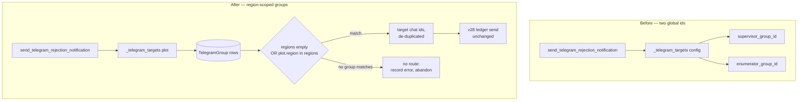
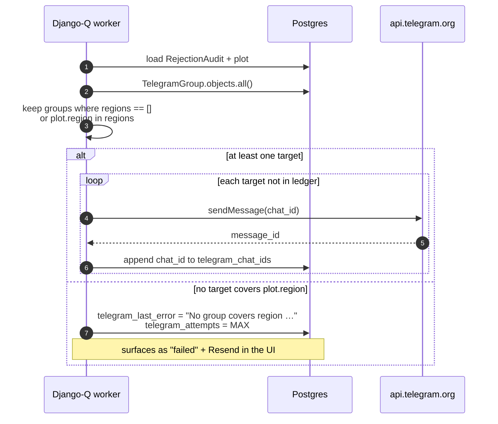
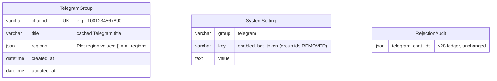
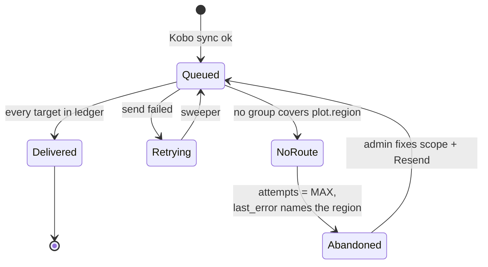

# v29: Region-Scoped Telegram Groups

> **Purpose**: Design for routing plot-rejection alerts to Telegram groups by
> site (Oromia / Sidama). Builds on `v7_telegram_notifications_plan.md` (the
> feature) and `v28_telegram_notification_reliability_plan.md` (ledger, sweeper,
> resend). Nothing in v28's delivery mechanism changes — only **which chats** a
> given rejection is sent to.

---

## Feature: Region-Scoped Telegram Groups

**Task ID**: TBD
**Author**: Iwan Firmawan
**Date**: 2026-10-05
**Status**: Draft

---

## 1. Context & Problem Statement

The client runs field teams at two sites, **Oromia** and **Sidama**, and wants a
rejection alert to reach only the enumerators of the site the plot belongs to.

```
Currently:
- Settings → Telegram holds exactly two global chat ids:
  supervisor_group_id and enumerator_group_id (SystemSetting, env fallback).
- Every rejection goes to both groups (de-duplicated), regardless of where
  the plot is. A Sidama rejection pings the Oromia enumerators, and vice versa.
- Adding a third group, or a group per site, is impossible without code.

Goal:
- An admin can register any number of Telegram groups, each scoped to one or
  more regions, or to all regions.
- Groups are role-agnostic: no "supervisor" / "enumerator" slots and no default
  group. Who sits in a group is the client's business; the dashboard only knows
  a chat and the regions it wants.
- A rejection is delivered to every group whose scope covers the plot's region.
- Existing deployments behave exactly as today until someone edits a scope.
```

The routing key already exists: `Plot.region` is populated from the form's
`region_field` at sync time and holds the raw Kobo option code (e.g. `ET04`),
which `build_option_lookup` resolves to the label `Oromia`. The plot filter
dropdowns (`GET /api/v1/odk/plots/filter_options/`) already serve these values
as `{value, label}` pairs.

### Before and after



### Example configuration

| Group (Telegram title) | Regions (picker label → stored code) |
|---|---|
| AB Management | *All regions* → `[]` |
| AB Oromia | Oromia (Parcel) `ORO`, Oromia (Clone) `ET04` |
| AB Sidama | Sidama (Parcel) `SID`, Sidama Region (Plantation 2026) `sidama`, Sidama (Clone) `ET16` |

Each form codes the same region differently (see §10 findings), so one site
maps to several stored codes.

A Sidama rejection → `AB Management` + `AB Sidama`. Titles are whatever the
group is called in Telegram; the dashboard attaches no meaning to them.

### Routing sequence



---

## 2. Requirements

### User Acceptance Criteria

- [ ] An admin can add, remove and edit any number of Telegram groups in
      Settings → Telegram.
- [ ] Each group has a region multiselect; leaving it empty means *All regions*.
- [ ] A Sidama plot rejection reaches the Sidama-scoped group(s) and every
      *All regions* group — and **not** the Oromia-scoped group.
- [ ] Settings shows no fixed or default group and no "supervisor" /
      "enumerator" wording — only a list of groups and their regions.
- [ ] After upgrade, the chat(s) configured today appear as ordinary *All
      regions* rows (one-time carry-over, D-9) and keep receiving alerts.
- [ ] Each group row shows its Telegram member count (e.g. "12 members").
- [ ] The settings tab warns when a known region is covered by no group.
- [ ] A rejection whose region is covered by no group shows as **failed** with
      the reason "No Telegram group covers region …", and Resend delivers it
      once a scope is fixed.
- [ ] The settings tab explains that a newly added group only appears after a
      message is posted in it and Re-sync is clicked.

### Technical Acceptance Criteria

- [ ] Targets are computed per audit from `plot.region`; v28 ledger, sweeper,
      `retry_after` and resend logic are unchanged.
- [ ] A chat already in `telegram_chat_ids` is never re-sent, including after a
      scope edit between attempts.
- [ ] No route sets `telegram_attempts = TELEGRAM_MAX_ATTEMPTS` so the sweeper
      does **not** re-enqueue it every 5 minutes (fixes a latent v28 loop, see
      D-4).
- [ ] Supergroup migration (`migrate_telegram_group_id`) updates the matching
      `TelegramGroup` row and preserves its regions.
- [ ] `PUT /settings/telegram/` with `groups` replaces the full set atomically;
      omitting `groups` leaves rows untouched.
- [ ] Group discovery resolves **every** configured row via `getChat`, not just
      two hard-coded keys.
- [ ] Backend passes `black`, `isort`, `flake8` (80 cols).

---

## 3. Data Model Changes

### New Models

```python
# backend/api/v1/v1_init/models.py
class TelegramGroup(models.Model):
    """A Telegram chat that receives rejection alerts
    for the regions it is scoped to."""

    # e.g. "-1001234567890". Unique so two rows can
    # never target the same chat.
    chat_id = models.CharField(max_length=64, unique=True)
    # Cached Telegram title, display only. Refreshed
    # on Re-sync so the table renders while Telegram
    # is unreachable.
    title = models.CharField(max_length=255, blank=True)
    # Exact Plot.region values. [] means all regions.
    regions = models.JSONField(default=list, blank=True)
    created_at = models.DateTimeField(auto_now_add=True)
    updated_at = models.DateTimeField(auto_now=True)
```



### Modified Models

| Model | Change | Reason |
|-------|--------|--------|
| `SystemSetting` (`group="telegram"`) | Rows `supervisor_group_id`, `enumerator_group_id` deleted by data migration | Carried over into `TelegramGroup`; roles cease to exist |
| `RejectionAudit` | None | v28 ledger fields reused as-is; no-route state reuses `telegram_last_error` + `telegram_attempts` |

### Migration Strategy

`backend/api/v1/v1_init/migrations/0002_telegram_group.py` — schema + data in
one migration.

```python
# One-time carry-over (RunPython, forward) — NOT a default:
# - Collect the chat ids in effect today, from
#     SystemSetting(group="telegram", key=supervisor_group_id
#                   / enumerator_group_id) if non-blank,
#     else os.environ["TELEGRAM_SUPERVISOR_GROUP_ID" /
#                     "TELEGRAM_ENUMERATOR_GROUP_ID"].
#   os.environ, not settings: the settings attributes are
#   removed in the same change (D-5).
# - Create TelegramGroup(chat_id=value, regions=[]) for each
#   non-blank value, de-duplicated by chat_id. No role, no
#   label — title is filled by the next Re-sync.
# - Delete the two SystemSetting rows.
# - Fresh install with no ids anywhere -> zero rows.
#
# Rollback (RunPython, reverse):
# - Write the first one or two rows (by pk) back to the
#   two SystemSetting keys, then the schema reverse drops
#   the table. Region scopes are lost on rollback —
#   acceptable for a feature rollback.
```

Result: every existing deployment wakes up with the same targets as before,
as ordinary *All regions* rows the admin can re-scope or delete. On the local database both env ids are the same
chat (`-4858621327`), so the carry-over produces **one** row, not two — the de-dup
is a real path, not a corner case.

---

## 4. API Contract

### Endpoints

| Method | URL | Purpose | Auth |
|--------|-----|---------|------|
| GET | `/api/v1/settings/telegram/` | Read `enabled`, `bot_token`, `groups` | Required (`IsAuthenticated`) |
| PUT | `/api/v1/settings/telegram/` | Update settings; `groups` replaces the full set | Required (`IsAuthenticated`) |
| GET | `/api/v1/settings/telegram/groups/` | Discovery: `getUpdates` + `getChat` for every configured row; refreshes `title` | Required (`IsAuthenticated`) |
| GET | `/api/v1/odk/plots/filter_options/?form_id=…` | **Existing, unchanged** — source of region `{value, label}` for the multiselect | Required |

No new endpoint for region options: the frontend calls `filter_options` per
form via the existing `useFilterOptions` hook and merges by `value`.

### Request/Response Examples

```json
// PUT /api/v1/settings/telegram/
{
  "enabled": true,
  "groups": [
    {"chat_id": "-100111", "regions": []},
    {"chat_id": "-100222", "regions": ["ORO", "ET04"]},
    {"chat_id": "-100333", "regions": ["SID", "sidama", "ET16"]}
  ]
}

// Response 200
{
  "enabled": true,
  "bot_token": "123456:ABC…",
  "groups": [
    {"chat_id": "-100111", "title": "AB Management", "regions": []},
    {"chat_id": "-100222", "title": "AB Oromia", "regions": ["ORO", "ET04"]},
    {"chat_id": "-100333", "title": "AB Sidama", "regions": ["SID", "sidama", "ET16"]}
  ]
}

// Response 400 — duplicate chat_id in payload
{
  "groups": ["Duplicate chat_id: -100222"]
}
```

```json
// GET /api/v1/settings/telegram/groups/  — Response 200
[
  {"id": "-100111", "title": "AB Management", "type": "supergroup", "member_count": 6},
  {"id": "-100444", "title": "New Field Group", "type": "group", "member_count": 14}
]
// member_count is null when getChatMemberCount fails for that chat;
// one failure never fails the list (same rule as getChat in v28).
```

Validation rules:

- `chat_id` required, non-blank, unique within the payload.
- `regions` a list of non-blank strings; may be empty.
- `supervisor_group_id` / `enumerator_group_id` are no longer accepted —
  there are no role keys anywhere in the contract.

---

## 5. Decision Log

### D-1: Storage for group configuration

**Options Considered**:
1. Hard-coded `oromia_group_id` / `sidama_group_id` keys in `SystemSetting`.
2. A JSON list inside one `SystemSetting` value.
3. A small `TelegramGroup` model.

**Decision**: Option 3.

**Rationale**: Option 1 hard-codes region codes in Python and needs a release
for a third site. Option 2 needs no schema change, but gives no uniqueness on
`chat_id`, makes every reader parse text, and turns the supergroup migration
into a read-modify-write of a blob. One small model is less code overall and
the DB enforces uniqueness.

**Impact**: One migration in `v1_init`; `get_telegram_config()` drops the two
group keys.

### D-2: Scope by region, not by role

**Options Considered**:
1. Keep fixed "supervisor" / "enumerator" roles and multiselect *groups* per
   role.
2. Free, role-agnostic list of groups, each with a multiselect of *regions*.

**Decision**: Option 2.

**Rationale**: Option 1 only adds more places to broadcast — every group still
gets every alert, which does not meet the goal. Scoping each group to regions
is what actually confines a Sidama alert to Sidama. Roles are not modelled at
all: an oversight group is simply an *All regions* row, a per-site oversight
group is another scoped row, and the dashboard never needs to know which is
which.

**Impact**: The two fixed selects in `telegram-tab.js` become a table.

### D-3: Region option source

**Options Considered**:
1. New endpoint listing regions across all forms.
2. Reuse `filter_options` per form on the frontend.
3. Read the region question's `FormOption` rows.

**Decision**: Option 2.

**Rationale**: Zero backend code, and the values offered are exactly the
`Plot.region` values routing compares against, so they cannot drift. Option 3
would also be noisy: the Clone form's region question carries all 16 Ethiopian
regions, of which only 2 have plots.

**Impact**: The picker lists each form's regions labelled with the form name,
e.g. *Sidama — Parcel Boundary Mapping (SID)*, because the same label recurs
with a different code per form (D-8). Ceiling — `filter_options` lists regions
that already have plots; a brand-new site becomes selectable after its first
synced submission. Upgrade path if ever needed: Option 3.

### D-4: Behaviour when no group covers a plot's region

**Options Considered**:
1. Do nothing (today's code path).
2. Send to a designated fallback group.
3. Record as abandoned with a clear error; recover via Resend.

**Decision**: Option 3.

**Rationale**: Option 1 has a latent v28 bug: when there are no targets the task
returns **before** incrementing `telegram_attempts`, so the sweeper re-enqueues
the audit every 5 minutes forever. Region scoping would make that common.
Option 2 needs a new setting, and an *All regions* row already is that fallback.
Option 3 reuses existing fields: `telegram_last_error = "No Telegram group
covers region '<label>'"`, `telegram_attempts = TELEGRAM_MAX_ATTEMPTS`. The
existing `telegram_status` reports `failed`, and v28's Resend (which resets
attempts) re-routes against the fixed config. No new status, no new field.

**Impact**: `send_telegram_rejection_notification` gains one branch.



### D-5: Env vars for group ids

**Options Considered**:
1. Keep `TELEGRAM_SUPERVISOR_GROUP_ID` / `TELEGRAM_ENUMERATOR_GROUP_ID` as a
   runtime fallback when the table is empty.
2. Keep them as seed-only config.
3. Remove them; the carry-over migration reads `os.environ` once.

**Decision**: Option 3.

**Rationale**: Option 1 would resurrect groups an admin deliberately removed.
Option 2 keeps role-named config alive for a model that has no roles. Groups
are runtime data managed in Settings, like the bot's `enabled` switch; they do
not belong in deploy config.

**Impact**: Removed from `settings.py`, `TELEGRAM_DEFAULTS`,
`docker-compose.yml`, `.env.example` and `README.md`. Deployments must keep the
vars set until the migration has run once — after that they are inert and can
be deleted from `.env`.

### D-6: Re-routing on retry after a scope edit

**Decision**: Targets are recomputed on every attempt. A scope edited between a
failed attempt and its retry routes the retry to the **new** groups; chats
already in the ledger are never re-sent.

**Rationale**: Matches what an admin who just fixed a scope expects, and needs
no extra state.

### D-7: Group membership is not verified by the dashboard

**Decision**: Out of the dashboard's control; documented as a client-side
operational responsibility (see §8).

**Rationale**: The Telegram Bot API has no method to list a group's members,
never exposes members' phone numbers to a bot, and carries no location. Only
`getChatMemberCount` and `getChatAdministrators` are available.

**Impact**: Phase 5 shows each group's member count as a sanity check.

### D-8: Region codes differ across forms

**Finding** (local database, §10): every form codes the same region
differently — Oromia is `ORO` or `ET04`; Sidama is `SID`, `sidama` or `ET16`,
and one form labels it *Sidama Region*.

**Options Considered**:
1. Store raw codes; the admin ticks every code belonging to a site.
2. Match on normalised **label** so picking "Sidama" covers every form.
3. Store `{form, value}` pairs.

**Decision**: Option 1.

**Rationale**: Option 2 already fails on today's data (*Sidama* vs *Sidama
Region*) and would silently mis-route on the next label variant. Option 3 is
only needed if two forms reuse one code for **different** regions; no such
collision exists — every code in use is distinct across forms. Option 1 keeps
`regions` a plain list of strings and routing a single `in` check.

**Impact**: Scoping a site means ticking 2–3 entries once. Ceiling: a code
reused with a different meaning in another form would mis-route; upgrade path
is Option 3. A new form for an existing site needs its code added to the
site's group — the uncovered-region warning (Phase 4) flags exactly that.

### D-9: No default group

**Options Considered**:
1. Keep two non-deletable default rows.
2. No defaults; start from zero rows.
3. No defaults, plus a one-time carry-over of the chats in use today.

**Decision**: Option 3.

**Rationale**: Option 1 reintroduces fixed slots, i.e. roles by another name.
Option 2 silently stops every alert on deploy until someone opens Settings —
with D-4 each rejection would show as failed. Option 3 keeps the model
agnostic (carried rows are ordinary, editable, deletable) while the upgrade is
invisible to field teams.

**Impact**: A fresh install starts with zero groups. With Telegram enabled and
zero groups, every rejection is a no-route (D-4) and the uncovered-region
warning lists every region, so the gap is visible, not silent.

### D-10: Member count on every listed group

**Decision**: In scope (was optional). `TelegramClient.get_chat_member_count`
plus one call per group in the discovery view.

**Rationale**: About 10 lines of backend and one line of UI, no schema change,
and it is the only membership signal the Bot API offers (D-7). Admin names
(`getChatAdministrators`) stay out — more UI for little extra signal.

**Impact**: Discovery makes one extra Telegram call per listed group; groups are
few, so latency is negligible. A failed count renders as "—" rather than failing
the list.

---

## 6. Type/Constant Mappings

| Frontend (settings tab) | Backend | DB Value |
|-----------------|------------------|----------|
| Region multiselect, nothing selected — *All regions* | `TelegramGroup.regions == []` | `[]` |
| Region option *Oromia — Parcel Boundary Mapping (ORO)* | `plot.region == "ORO"` | `"ORO"` in `regions` |
| Region option *Sidama Region — Plantation Site Mapping 2026 (sidama)* | `plot.region == "sidama"` | `"sidama"` in `regions` |
| Badge `failed` + "No Telegram group covers region …" | `telegram_attempts == TELEGRAM_MAX_ATTEMPTS`, `telegram_last_error` set | existing `RejectionAudit` columns |
| Group row title | `TelegramGroup.title` (refreshed via `getChat`) | text |

Matching is an **exact string compare** on the stored raw value. When
`region_field` lists several fields, `Plot.region` is the `" - "`-joined value
and `filter_options` serves that same joined value, so UI and routing agree.
A plot with an empty `Plot.region` (form has no `region_field`) is matched only
by *All regions* groups.

Codes in use on the local database (form → code → label):

| Form | `region_field` | Code | Label | Plots | Rejections |
|---|---|---|---|---|---|
| African Bamboo B.V. Parcel Boundary Mapping | `region,region_specify` | `ORO` | Oromia | 127 | 0 |
| | | `SID` | Sidama | 1 | 0 |
| Plantation Site Mapping 2026 | `region` | `sidama` | Sidama Region | 62 | 0 |
| Clone of … Parcel Boundary Mapping | `region,region_specify` | `ET04` | Oromia | 11 | 5 |
| | | `ET16` | Sidama | 10 | 3 |
| dbg | *(none)* | — | — | 0 | 0 |

---

## 7. Compatibility & Migration

### Backward Compatibility

- [ ] Existing deployments: the one-time carry-over creates ordinary *All
      regions* rows for the chat(s) in use today; alerts reach the same groups
      as before.
- [ ] Group env vars must remain set until `migrate` has run once on each
      environment; remove them from `.env` afterwards.
- [ ] `RejectionAudit` ledger data preserved; in-flight retries continue.
- [ ] Frontend `telegram-tab.js` is the only API consumer of the two removed
      keys; updated in the same change.
- [ ] Existing tests pinning `supervisor_group_id` / `enumerator_group_id` or
      the `TELEGRAM_*_GROUP_ID` settings switch to creating `TelegramGroup`
      rows (`tests_settings_telegram_endpoint`, `tests_telegram_groups_endpoint`,
      `tests_telegram_notification`, `tests_rejection_notification_chain`,
      `tests_tasks_coverage`, `tests_telegram_retry`,
      `tests_telegram_resend_endpoint`).

### Mobile App Impact

- [ ] Not applicable — no mobile client; Kobo collection is unaffected.

### Seeder/CLI Compatibility

- [ ] No seeders reference the Telegram group keys.
- [ ] No new seeder commands needed.

---

## 8. Security Considerations

- [ ] **Permission model**: unchanged — `IsAuthenticated` on all settings
      endpoints, matching v28.
- [ ] **Input validation**: `chat_id` non-blank and unique; `regions` list of
      strings; full-set replace runs in one `transaction.atomic()`.
- [ ] **No new attack vectors**: no new outbound endpoints; `bot_token` stays
      out of every non-settings response (v28 rule).
- [ ] **Data exposure**: the alert body carries Plot ID, Farm ID, location,
      reason and validator name — no phone numbers or personal data. A
      wrong-site member in a group is noise, not a serious leak.
- [ ] **Group membership** (client responsibility, see D-7). Recommended to the
      client:
  - Each site's group is owned by that site's coordinator.
  - Join-request approval is enabled on the invite link.
  - Invite links are not shared publicly; leavers are removed.

---

## 9. Testing Strategy

| Test Type | Coverage |
|-----------|----------|
| Unit — `v1_init/tests/test_models.py` | `TelegramGroup.chat_id` uniqueness |
| Unit — `v1_init/tests/tests_telegram_group_migration.py` | Carry-over from `SystemSetting`; from `os.environ`; de-dup when both ids equal; zero rows when nothing configured; keys removed; reverse restores keys |
| Unit — `utils/tests/tests_telegram_client.py` | `get_chat_member_count` returns int; failure raises `TelegramSendError` |
| Integration — `v1_init/tests/tests_settings_telegram_endpoint.py` | Replace-set PUT; omitted `groups` untouched; duplicate `chat_id` → 400 |
| Integration — `v1_init/tests/tests_telegram_groups_endpoint.py` | Every row resolved via `getChat`; title refreshed; `member_count` present, `null` on per-chat failure. Keep v28's class-level settings pin (OOM guard) |
| Integration — `v1_odk/tests/tests_telegram_retry.py` | Region match; *All regions* match; zero groups → no-route; no match → abandoned with error and not re-swept; scope edit re-routes on resend without re-sending ledgered chats |
| Integration — `v1_odk/tests/tests_telegram_migration.py` | Supergroup id updates the row; merge when new id already present |
| E2E (manual) | Checklist below |

```bash
docker compose exec backend ./test.sh api.v1.v1_init
docker compose exec backend ./test.sh api.v1.v1_odk
```

### Manual checklist

**Backward compatibility**

1. On a DB with both group ids set, run `migrate`. Settings shows one row per
   distinct chat, all *All regions*, with no role labels. Reject any plot: the
   same chat(s) receive it as before.
1b. On a fresh DB with no group ids, Settings shows an empty list and the
   uncovered-region warning.

**Routing**

2. Configure *AB Management = All*, *AB Oromia = ORO, ET04*, *AB Sidama = SID,
   sidama, ET16*.
3. Reject a Sidama plot → AB Management + AB Sidama only.
4. Reject an Oromia plot → AB Management + AB Oromia only.

**No route**

5. Remove the *All regions* row, reject a plot from a region in no scope. Badge
   shows `failed` with "No Telegram group covers region …"; the sweep does
   **not** re-enqueue it every 5 minutes.
6. Add that region to a group's scope, click Resend → delivered to that group.

**Settings UX**

7. Add the bot to a new group, post a message, Re-sync → the group appears in
   the dropdown. With no scope covering *Sidama*, the uncovered-region warning
   names it.

**Supergroup migration**

8. Upgrade a scoped group to a supergroup, reject a plot in its region → the
   row's `chat_id` is updated, its regions are preserved, the message arrives.

**Member count**

9. Re-sync → each row shows "N members" matching Telegram. Add someone to the
   group, Re-sync → count increases.

### Implementation phases

| Phase | Scope | Files |
|---|---|---|
| 1 | Model + carry-over migration; `get_telegram_config` drops group keys; `migrate_telegram_group_id` on the model (merge if new id exists); remove group env vars | `v1_init/models.py`, `v1_init/migrations/0002_telegram_group.py`, `v1_init/helpers.py`, `settings.py`, `docker-compose.yml`, `.env.example`, `README.md` |
| 2 | `_telegram_targets(plot)`; no-route branch | `v1_odk/tasks.py` |
| 3 | `groups` serializer field; replace-set PUT; discovery over all rows | `v1_init/serializers.py`, `v1_init/views.py` |
| 4 | Groups table (empty state when none) with group `Select` (+ raw-id `Input` fallback), region `MultiSelectDropdown`, Add/Remove, uncovered-region warning, Re-sync hint; no role wording | `frontend/src/components/settings/telegram-tab.js` |
| 5 | `get_chat_member_count`; `member_count` in discovery; "12 members" next to each row (D-10) | `backend/utils/telegram_client.py`, `v1_init/views.py`, `telegram-tab.js` |

Phase 2 routing, for reference:

```python
# ponytail: exact-match on the stored raw value; the
# settings UI offers exactly those values, so they agree.
return [
    g.chat_id
    for g in TelegramGroup.objects.order_by("pk")
    if not g.regions or plot.region in g.regions
]
```

---

## 10. Open Questions

Answered against the local database (`docker compose exec db psql`) on
2026-10-05. The local DB is a development copy; re-run the queries below on
production before sign-off.

- [x] **Is Sidama its own region option in the Kobo form?** **Yes, in every
      form**: `SID` (Parcel Boundary Mapping), `sidama` (Plantation Site Mapping
      2026), `ET16` (Clone). The Clone form also lists `ET07` *SNNP* separately,
      so SNNPR is not used for Sidama. Routing keys on `Plot.region`; no
      `sub_region` fallback needed.
- [x] **Do all forms use the same region codes?** **No.** Oromia is `ORO` or
      `ET04`; Sidama is `SID`, `sidama` or `ET16`. Labels differ too (*Sidama*
      vs *Sidama Region*). No code is reused with a different meaning across
      forms. Design updated: see D-8 and §6.
- [x] **Supervisors: one shared group or one per site?** **Resolved by design
      (D-2, D-9):** the model is role-agnostic with no default group. The
      client registers whatever groups exist and sets each one's regions; an
      oversight group is just an *All regions* row. Locally both env ids are
      the same chat (`-4858621327`, *Akvo Testing*), so the carry-over yields a
      single row — check production, which may differ.
- [x] **Member counts?** **In scope** (D-10, Phase 5) — low effort, no schema
      change.

Other observations from the same queries:

- All 8 local rejections are on the **Clone** form (`ET04` ×5, `ET16` ×3), all
  `synced` and all delivered. No audit is currently stuck in the no-target
  loop described in D-4 — it is latent, not live.
- No plot has an empty `region`, and no stored value carries a
  `region_specify` suffix, although two forms list `region_specify` in
  `region_field`. A free-text "other" region would surface as its own picker
  entry (e.g. `other - Gedeo`) and must be scoped explicitly.
- The `dbg` form has no `region_field` and no plots.

Queries used (read-only):

```sql
-- region mapping per form
SELECT asset_uid, name, region_field, sub_region_field FROM form_metadata;

-- region codes and labels per form
SELECT f.asset_uid, o.name AS code, o.label
FROM form_options o
JOIN form_questions q ON q.id = o.question_id
JOIN form_metadata f ON f.id = q.form_id
WHERE q.name = 'region' ORDER BY 1, 2;

-- plots and rejections per form/region
SELECT f.asset_uid, p.region, a.sync_status, count(*),
       count(a.telegram_sent_at) AS sent
FROM rejection_audits a
JOIN plots p ON p.id = a.plot_id
JOIN form_metadata f ON f.id = p.form_id
GROUP BY 1, 2, 3 ORDER BY 1, 2;

-- current group targets (ids only, never the token);
-- empty means the TELEGRAM_*_GROUP_ID env vars are in effect
SELECT key, value FROM v1_init_systemsetting
WHERE "group" = 'telegram' AND key LIKE '%group_id';
```

### Out of scope

| Item | Why |
|---|---|
| Per-person direct messages | Only way to target individuals with certainty, but needs every recipient to `/start` the bot and an account-to-Kobo-user mapping. Separate plan if the group model proves insufficient |
| Per-form scoping (`{form, value}` pairs) | Not needed: no code is reused across forms with a different meaning (D-8) |
| Different message per group | Same body to every target, as today |

---

## 11. References

- Prior art: `docs/v7_telegram_notifications_plan.md` — original feature
- Prior art: `docs/v28_telegram_notification_reliability_plan.md` — ledger,
  sweeper, resend, supergroup migration
- Code: `backend/api/v1/v1_odk/tasks.py` (`_telegram_targets`,
  `send_telegram_rejection_notification`, `retry_pending_telegram_notifications`)
- Code: `backend/api/v1/v1_init/helpers.py` (`get_telegram_config`,
  `migrate_telegram_group_id`)
- Code: `backend/api/v1/v1_odk/plot_views.py` (`filter_options`)
- Code: `frontend/src/components/multi-select-dropdown.js`,
  `frontend/src/hooks/useFilterOptions.js`
- External: [Telegram Bot API](https://core.telegram.org/bots/api) —
  `getUpdates`, `getChat`, `getChatMemberCount`, `getChatAdministrators`

---

## Approval

| Role | Name | Date | Status |
|------|------|------|--------|
| Developer | Iwan Firmawan | 2026-10-05 | Draft |
| Tech Lead | | | |
| Product | | | |
