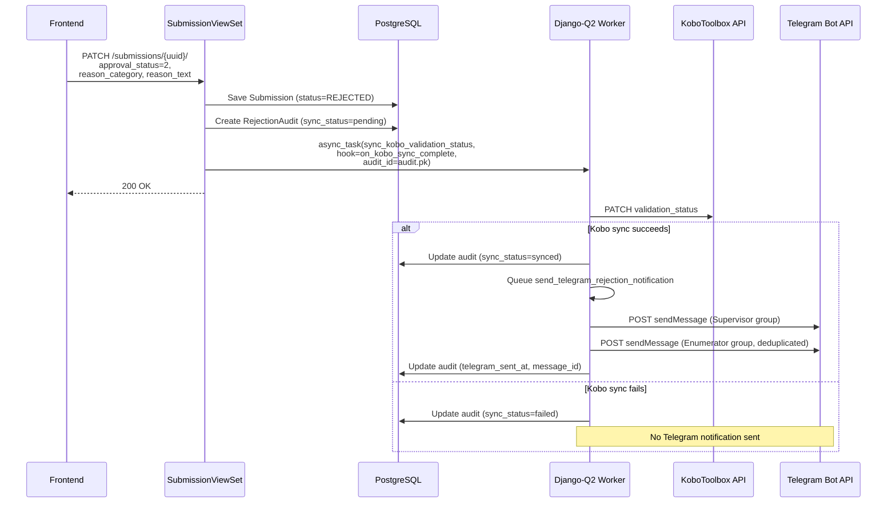
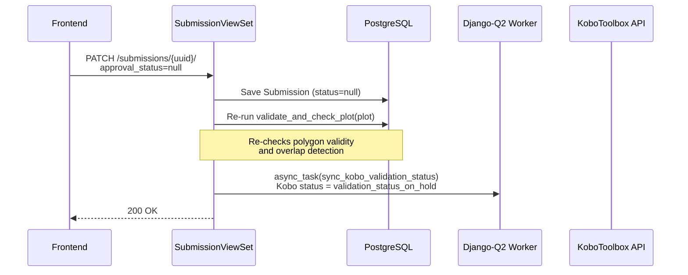
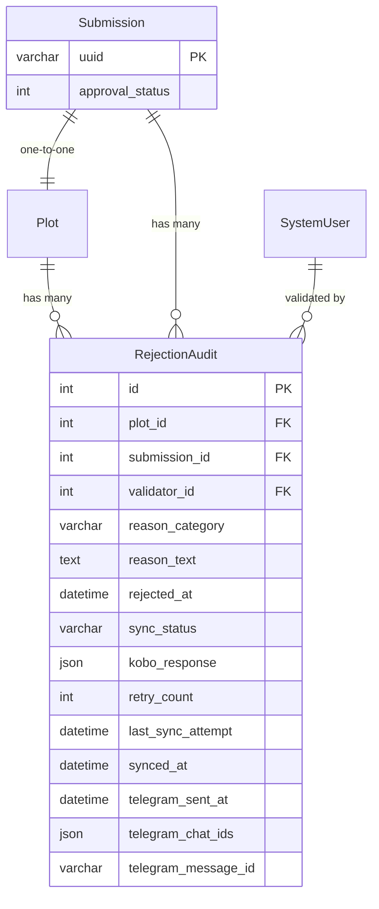
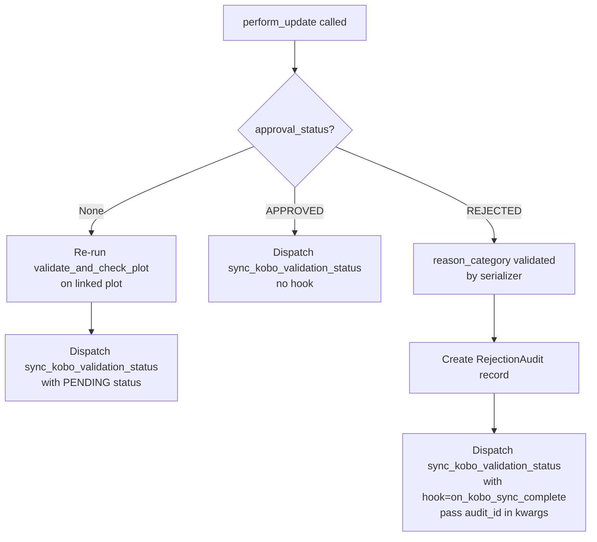
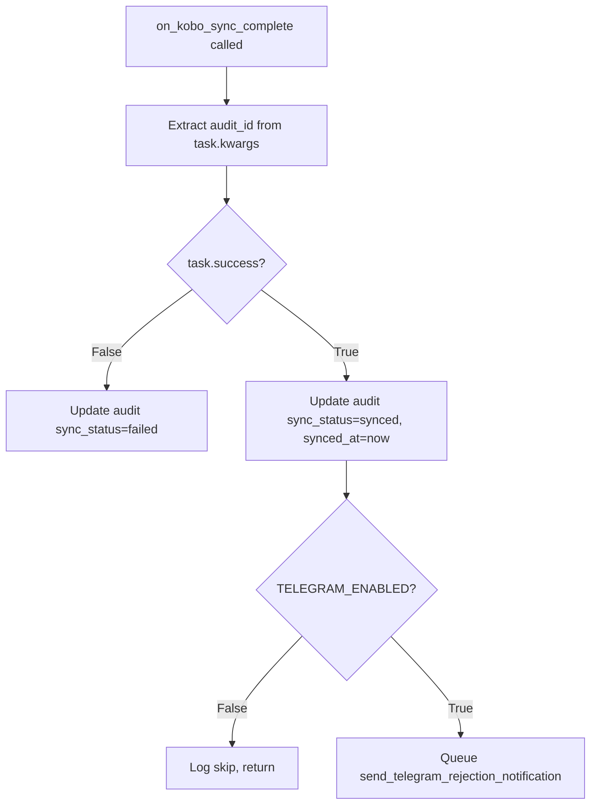
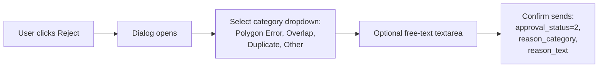

# v7: Telegram Notification Integration

**Status:** IMPLEMENTED

## Context

When a plot submission is rejected in the African Bamboo Dashboard, field supervisors and enumerators need to be notified promptly so they can review and recollect data. Currently, rejections sync back to KoboToolbox via an async Django-Q2 task (`sync_kobo_validation_status`), but there is no notification mechanism to alert field teams.

This feature adds:
1. A `RejectionAudit` model to track rejection details, Kobo sync status, and Telegram delivery
2. Telegram bot notifications that fire **only after a successful Kobo validation sync**
3. Structured rejection reasons (category dropdown + free text)
4. Removal of `reviewer_notes` from Submission — replaced by a read-only property that reads from `RejectionAudit`
5. Removal of the notes textarea from the approval dialog
6. Inline rejection audit trail in the `PlotDetailPanel` (category badge, reason text, validator, date)
7. "Revert to Pending" button that re-runs polygon validation and overlap detection
8. Duplicate Telegram message deduplication when both group IDs point to the same group

Requirements sourced from `docs/chat-export-1772612478071.json`.

## Architecture: Notification Flow



## Revert to Pending Flow



## Data Model



### Key change: Remove `reviewer_notes` from Submission

The `reviewer_notes` field on `Submission` was replaced by the `RejectionAudit` model:
- **DB migration**: `0006_remove_submission_reviewer_notes_rejectionaudit` removes the column and creates the new model
- **Serializer**: A read-only `reviewer_notes` SerializerMethodField returns the latest `RejectionAudit.reason_text` (backwards-compatible)
- **Approval flow**: No longer accepts or stores notes — approve is a simple status change

## Phase 1: RejectionAudit Model & Constants

### Model: `RejectionAudit`

| Field | Type | Description |
|---|---|---|
| `plot` | FK(Plot, on_delete=CASCADE) | The rejected plot |
| `submission` | FK(Submission, on_delete=CASCADE, related_name="rejection_audits") | The rejected submission |
| `validator` | FK(settings.AUTH_USER_MODEL, on_delete=SET_NULL, null) | Who performed the rejection |
| `reason_category` | CharField(50), choices | Mandatory: polygon_error, overlap, duplicate, other |
| `reason_text` | TextField, null, blank | Optional free-text explanation |
| `rejected_at` | DateTimeField(auto_now_add=True) | When rejection occurred |
| `sync_status` | CharField(20), default="pending" | `pending` / `synced` / `failed` |
| `kobo_response` | JSONField, null, blank | Stored Kobo API response |
| `retry_count` | IntegerField, default=0 | Kobo sync retry attempts |
| `last_sync_attempt` | DateTimeField, null, blank | Last sync attempt timestamp |
| `synced_at` | DateTimeField, null, blank | When Kobo sync succeeded |
| `telegram_sent_at` | DateTimeField, null, blank | When Telegram msg was sent |
| `telegram_chat_ids` | JSONField, null, blank | Which groups received the msg |
| `telegram_message_id` | CharField(100), null, blank | Telegram message ID |

### Constants

Added to `backend/api/v1/v1_odk/constants.py`:

```python
class SyncStatus:
    PENDING = "pending"
    SYNCED = "synced"
    FAILED = "failed"

class RejectionCategory:
    POLYGON_ERROR = "polygon_error"
    OVERLAP = "overlap"
    DUPLICATE = "duplicate"
    OTHER = "other"

    CHOICES = [
        (POLYGON_ERROR, "Polygon Error"),
        (OVERLAP, "Overlap"),
        (DUPLICATE, "Duplicate Submission"),
        (OTHER, "Other"),
    ]
```

### Files

| File | Change |
|---|---|
| `backend/api/v1/v1_odk/constants.py` | Add `SyncStatus`, `RejectionCategory` |
| `backend/api/v1/v1_odk/models.py` | Add `RejectionAudit` model, remove `reviewer_notes` from `Submission` |
| Migration `0006_remove_submission_reviewer_notes_rejectionaudit` | Auto-generated |

## Phase 2: Update Rejection & Approval Endpoints

### Serializer changes

**`RejectionAuditSerializer`** (defined before `SubmissionDetailSerializer`):
- Fields: `id`, `reason_category`, `reason_category_display`, `reason_text`, `rejected_at`, `sync_status`, `telegram_sent_at`, `validator_name`
- All fields read-only

**`SubmissionDetailSerializer`**:
- Added `rejection_audits` nested serializer (read-only) to expose audit trail
- Added `reviewer_notes` as read-only SerializerMethodField returning latest audit's `reason_text`

**`SubmissionUpdateSerializer`**:
- Removed `reviewer_notes` from writable fields
- Added `reason_category` (ChoiceField, required when `approval_status == REJECTED`, write-only)
- Added `reason_text` (CharField, optional, write-only)
- Added `approval_status` as `IntegerField(required=False, allow_null=True)` to support revert to pending
- Added read-only `reviewer_notes` SerializerMethodField
- Validation: `reason_category` required when rejecting
- `update()` pops reason_category/reason_text before saving, clears plot flags on approve/reject

### View changes: `SubmissionViewSet.perform_update()`



### Files

| File | Change |
|---|---|
| `backend/api/v1/v1_odk/serializers.py` | Add `RejectionAuditSerializer`; update `SubmissionUpdateSerializer`, `SubmissionDetailSerializer` |
| `backend/api/v1/v1_odk/views.py` | Update `perform_update()` — create audit, dispatch with hook, re-check polygon on revert |

## Phase 3: Telegram Client Utility

Lightweight `TelegramClient` using `requests` (already in `requirements.txt`). No new dependencies.

### `backend/utils/telegram_client.py`

```python
class TelegramSendError(Exception):
    """Raised when Telegram API returns non-OK."""

class TelegramClient:
    BASE_URL = "https://api.telegram.org/bot{token}"

    def __init__(self, bot_token):
        self.bot_token = bot_token
        self.base_url = self.BASE_URL.format(token=bot_token)

    def send_message(self, chat_id, text, parse_mode="Markdown"):
        resp = requests.post(
            f"{self.base_url}/sendMessage",
            json={"chat_id": chat_id, "text": text, "parse_mode": parse_mode},
            timeout=10,
        )
        if not resp.ok:
            raise TelegramSendError(
                f"Telegram API error {resp.status_code}: {resp.text}"
            )
        return resp.json()["result"]["message_id"]
```

### Files

| File | Change |
|---|---|
| `backend/utils/telegram_client.py` | New: `TelegramClient`, `TelegramSendError` |

## Phase 4: Settings & Feature Flags

### Environment variables

| Variable | Type | Default | Description |
|---|---|---|---|
| `TELEGRAM_ENABLED` | bool | `False` | Master toggle — all Telegram logic skipped if False |
| `TELEGRAM_BOT_TOKEN` | string | `""` | Bot API token from @BotFather |
| `TELEGRAM_SUPERVISOR_GROUP_ID` | string | `""` | Supervisor group chat ID (negative number) |
| `TELEGRAM_ENUMERATOR_GROUP_ID` | string | `""` | Enumerator group chat ID (negative number) |

### Files

| File | Change |
|---|---|
| `backend/african_bamboo_dashboard/settings.py` | Add `TELEGRAM_*` settings |
| `docker-compose.yml` | Add `TELEGRAM_*` env vars to `backend` + `worker` services |
| `.env.example` | Add `TELEGRAM_*` env vars section |

## Phase 5: Async Tasks & Hook Chaining

### Implementation notes

- **Django-Q2 kwargs**: Django-Q2 passes ALL `async_task()` kwargs (including `audit_id`) to the task function, so `sync_kobo_validation_status` must accept `**kwargs` to avoid `TypeError`.
- **Hook receives Task object**: `on_kobo_sync_complete(task)` extracts `audit_id` from `task.kwargs`.

### Hook: `on_kobo_sync_complete(task)`



### Task: `send_telegram_rejection_notification(audit_id)`

1. Load `RejectionAudit` with related `plot`, `submission`, `validator`
2. Check `TELEGRAM_ENABLED` — skip if False
3. Build Markdown message:
   ```
   *Plot Rejected*

   *Enumerator:* {submitted_by}
   *Farmer:* {plot_name}
   *Location:* {region} - {sub_region}
   *Reason:* {reason_category_display}: {reason_text}
   *Validated by:* {validator_name}
   *Time:* {rejected_at}

   _Please review and recollect if needed._
   ```
4. Deduplicate group IDs: if `TELEGRAM_SUPERVISOR_GROUP_ID == TELEGRAM_ENUMERATOR_GROUP_ID`, send only once (uses `seen = set()`)
5. Send to both groups (deduplicated)
6. Update audit: `telegram_sent_at`, `telegram_chat_ids`, `telegram_message_id`
7. On `TelegramSendError`: log error, do NOT re-raise (Telegram failure must not block the rejection workflow)

### Files

| File | Change |
|---|---|
| `backend/api/v1/v1_odk/tasks.py` | Add `**kwargs` to `sync_kobo_validation_status`; add `on_kobo_sync_complete` hook; add `send_telegram_rejection_notification` task with dedup |

## Phase 6: Frontend Changes

### 6a. Rejection Dialog — Add Category Dropdown

Updated the rejection `ConfirmDialog` to include a category select before the free-text textarea.



**Changes to `confirm-dialog.js`**:
- Added optional `select` prop (renders Radix UI Select component above textarea)
- Added local `useState` for `notes` and `selectValue` (removed dependency on `useMapState`)
- `onConfirm` receives `{ notes, selectValue }` object
- State clears on dialog close

**Changes to `map/page.js`**:
- `handleReject` receives `{ selectValue, notes }`, sends `{ approval_status: 2, reason_category: selectValue, reason_text: notes }`
- `handleApprove` sends only `{ approval_status: 1 }` — no notes

### 6b. Remove Notes from Approval Dialog

- Removed `textarea` prop from the approval `ConfirmDialog` in `map/page.js`

### 6c. PlotDetailPanel — Audit Trail & Revert to Pending

- Removed the "Notes" textarea section
- Removed `notes` / `setNotes` state from `useMapState`
- Added inline "Rejection History" audit trail showing:
  - Reason category badge per entry
  - Date
  - Reason text
  - Validator name
- Added `onRevertToPending` prop
- Added "Revert to Pending" button (below "Reset Approval") for approved/rejected plots

**Note**: A dedicated audit trail page (`/dashboard/submissions/[uuid]/audits`) was not created. Instead, the audit trail is displayed inline in `PlotDetailPanel` using the `rejection_audits` data from the submission detail API.

### 6d. Revert to Pending Handler

**Changes to `map/page.js`**:
- Added `handleRevertToPending` callback: sends `{ approval_status: null }` to revert the plot to pending
- Backend maps `null` to `ApprovalStatusTypes.PENDING` (0) for Kobo sync as `validation_status_on_hold`
- Backend re-runs `validate_and_check_plot()` on the linked plot to re-check polygon validity and overlap detection

### Frontend files

| File | Change |
|---|---|
| `frontend/src/app/dashboard/map/page.js` | Update handleReject/handleApprove payloads; add handleRevertToPending |
| `frontend/src/components/map/confirm-dialog.js` | Add `select` prop, local state for notes/selectValue |
| `frontend/src/components/map/plot-detail-panel.js` | Remove Notes textarea; add inline rejection audit trail; add Revert to Pending button |
| `frontend/src/hooks/useMapState.js` | Remove `notes`/`setNotes` state |

## Phase 7: Unit Tests

All tests mock external calls (Kobo API, Telegram API) and use Django's `@override_settings` for feature flag testing. Tests follow the project convention: one file per endpoint/concern, inheriting from `OdkTestHelperMixin`.

### Test file: `tests_rejection_audit_endpoint.py` (11 tests)

| # | Test | Description |
|---|---|---|
| 1 | `test_reject_with_category_creates_audit` | PATCH with `approval_status=2` + `reason_category` creates `RejectionAudit` |
| 2 | `test_reject_without_category_returns_400` | PATCH with `approval_status=2` but no `reason_category` returns 400 |
| 3 | `test_reject_with_reason_text` | PATCH with `reason_category=overlap` + `reason_text` stores both fields |
| 4 | `test_reject_invalid_category_returns_400` | PATCH with invalid `reason_category` returns 400 |
| 5 | `test_approve_does_not_create_audit` | PATCH with `approval_status=1` does not create `RejectionAudit` |
| 6 | `test_approve_without_notes_succeeds` | PATCH with `approval_status=1` succeeds |
| 7 | `test_reject_dispatches_with_hook` | Verify `async_task` called with `hook` pointing to `on_kobo_sync_complete` and `audit_id` |
| 8 | `test_audit_stores_validator` | Audit record references the authenticated user as validator |
| 9 | `test_audit_initial_sync_status_pending` | New audit has `sync_status="pending"` |
| 10 | `test_submission_detail_includes_audits` | GET submission detail includes `rejection_audits` list |
| 11 | `test_reviewer_notes_returns_latest` | Read-only `reviewer_notes` returns latest audit's `reason_text` |

### Test file: `tests_telegram_notification.py` (11 tests)

| # | Test | Description |
|---|---|---|
| 1 | `test_hook_success_queues_telegram_task` | `on_kobo_sync_complete` with `task.success=True` queues Telegram task |
| 2 | `test_hook_failure_skips_telegram` | `on_kobo_sync_complete` with `task.success=False` does not queue Telegram, marks audit failed |
| 3 | `test_hook_updates_sync_status_synced` | Successful hook sets `sync_status="synced"` and `synced_at` |
| 4 | `test_hook_updates_sync_status_failed` | Failed hook sets `sync_status="failed"` |
| 5 | `test_notification_sends_to_both_groups` | `send_telegram_rejection_notification` calls send_message twice (supervisor + enumerator) |
| 6 | `test_notification_message_contains_fields` | Message contains enumerator, farmer, location, reason category, reason text, validator, time |
| 7 | `test_notification_updates_audit_fields` | After send, audit has `telegram_sent_at`, `telegram_chat_ids`, `telegram_message_id` |
| 8 | `test_notification_skipped_when_disabled` | With `TELEGRAM_ENABLED=False`, no API calls made |
| 9 | `test_notification_failure_does_not_raise` | `TelegramSendError` is caught and logged, not re-raised |
| 10 | `test_notification_partial_failure` | If supervisor send succeeds but enumerator fails, audit still updated for supervisor |
| 11 | `test_duplicate_group_sends_once` | When both group IDs are identical, only one message is sent |

### Test file: `tests_telegram_client.py` (6 tests)

| # | Test | Description |
|---|---|---|
| 1 | `test_send_message_success` | Mock 200 response, verify returns message_id |
| 2 | `test_send_message_api_error` | Mock 400 response, verify raises `TelegramSendError` |
| 3 | `test_send_message_network_error` | Mock `requests.ConnectionError`, verify raises |
| 4 | `test_send_message_timeout` | Mock `requests.Timeout`, verify raises |
| 5 | `test_send_message_payload` | Verify correct JSON payload sent (chat_id, text, parse_mode) |
| 6 | `test_send_message_url_format` | Verify URL built correctly from bot token |

### Test file: `test_models.py` (4 new tests added)

| # | Test | Description |
|---|---|---|
| 1 | `test_rejection_audit_creation` | Create `RejectionAudit` with all required fields |
| 2 | `test_rejection_audit_str` | Verify `__str__` output |
| 3 | `test_rejection_audit_cascade_delete` | Deleting plot cascades to audit |
| 4 | `test_submission_without_reviewer_notes` | Verify `reviewer_notes` field removed from Submission model |

### Test file: `tests_revert_pending_endpoint.py` (6 tests)

| # | Test | Description |
|---|---|---|
| 1 | `test_revert_redetects_overlap` | Two overlapping plots approved then reverted — overlap re-flagged on both |
| 2 | `test_revert_clean_polygon_not_flagged` | Valid non-overlapping plot reverted — stays clean |
| 3 | `test_revert_invalid_polygon_flags_plot` | Plot with too-small polygon reverted — re-flagged |
| 4 | `test_revert_no_polygon_flags_plot` | Plot with no polygon_wkt reverted — flagged |
| 5 | `test_revert_without_plot_no_error` | Submission without linked plot reverted — no crash |
| 6 | `test_revert_dispatches_kobo_sync` | Revert dispatches Kobo sync with PENDING (0) status |

### Test files

| File | Change |
|---|---|
| `backend/api/v1/v1_odk/tests/tests_rejection_audit_endpoint.py` | New: 11 tests |
| `backend/api/v1/v1_odk/tests/tests_telegram_notification.py` | New: 11 tests |
| `backend/api/v1/v1_odk/tests/tests_revert_pending_endpoint.py` | New: 6 tests |
| `backend/utils/tests/__init__.py` | New: package init |
| `backend/utils/tests/tests_telegram_client.py` | New: 6 tests |
| `backend/api/v1/v1_odk/tests/test_models.py` | Update: add 4 RejectionAudit model tests |
| `backend/api/v1/v1_odk/tests/tests_submissions_endpoint.py` | Update: fix reviewer_notes references |

**Total: 38 new/updated unit tests.**

## Files Summary

| File | Phase | Change |
|---|---|---|
| `backend/api/v1/v1_odk/constants.py` | 1 | Add `SyncStatus`, `RejectionCategory` |
| `backend/api/v1/v1_odk/models.py` | 1 | Add `RejectionAudit`, remove `reviewer_notes` from `Submission` |
| Migration `0006_*` | 1 | Auto-generated |
| `backend/api/v1/v1_odk/serializers.py` | 2 | Add `RejectionAuditSerializer`; update `SubmissionUpdateSerializer`, `SubmissionDetailSerializer` |
| `backend/api/v1/v1_odk/views.py` | 2 | Update `perform_update()` — create audit, dispatch with hook, re-check polygon on revert |
| `backend/utils/telegram_client.py` | 3 | New: `TelegramClient`, `TelegramSendError` |
| `backend/african_bamboo_dashboard/settings.py` | 4 | Add `TELEGRAM_*` settings |
| `docker-compose.yml` | 4 | Add `TELEGRAM_*` env vars to `backend` + `worker` |
| `.env.example` | 4 | Add `TELEGRAM_*` env vars |
| `backend/api/v1/v1_odk/tasks.py` | 5 | Add `**kwargs` to sync task; add `on_kobo_sync_complete` hook; add `send_telegram_rejection_notification` with dedup |
| `frontend/src/app/dashboard/map/page.js` | 6 | Update rejection/approval payloads; add handleRevertToPending |
| `frontend/src/components/map/confirm-dialog.js` | 6 | Add `select` prop, local state for notes/selectValue |
| `frontend/src/components/map/plot-detail-panel.js` | 6 | Remove Notes textarea; add inline rejection audit trail; add Revert to Pending button |
| `frontend/src/hooks/useMapState.js` | 6 | Remove `notes`/`setNotes` state |
| `README.md` | docs | Update API examples; add Telegram setup section |
| `backend/api/v1/v1_odk/tests/tests_rejection_audit_endpoint.py` | 7 | New: 11 tests |
| `backend/api/v1/v1_odk/tests/tests_telegram_notification.py` | 7 | New: 11 tests |
| `backend/api/v1/v1_odk/tests/tests_revert_pending_endpoint.py` | 7 | New: 6 tests |
| `backend/utils/tests/tests_telegram_client.py` | 7 | New: 6 tests |
| `backend/api/v1/v1_odk/tests/test_models.py` | 7 | Update: 4 new model tests |
| `backend/api/v1/v1_odk/tests/tests_submissions_endpoint.py` | 7 | Update: fix reviewer_notes references |

## Verification

### Automated tests

```bash
# Run all new tests
docker compose exec backend python manage.py test api.v1.v1_odk.tests.tests_rejection_audit_endpoint -v 2
docker compose exec backend python manage.py test api.v1.v1_odk.tests.tests_telegram_notification -v 2
docker compose exec backend python manage.py test api.v1.v1_odk.tests.tests_revert_pending_endpoint -v 2
docker compose exec backend python manage.py test utils.tests.tests_telegram_client -v 2

# Run updated model + submission tests
docker compose exec backend python manage.py test api.v1.v1_odk.tests.test_models -v 2
docker compose exec backend python manage.py test api.v1.v1_odk.tests.tests_submissions_endpoint -v 2

# Run full test suite to verify no regressions
docker compose exec backend python manage.py test -v 2

# Lint
docker compose exec backend bash -c "black . && isort . && flake8"
```

### Manual testing checklist

1. Set `TELEGRAM_ENABLED=False` — reject a plot with category + text, verify no Telegram message sent, `RejectionAudit` created with `sync_status=pending`
2. Verify `reviewer_notes` field no longer exists on `Submission` model (check migration)
3. Set `TELEGRAM_ENABLED=True` with valid bot token and group IDs in docker-compose
4. Restart worker service: `docker compose restart worker`
5. Reject a plot — verify category dropdown (Polygon Error, Overlap, Duplicate, Other) + free-text textarea in rejection dialog
6. Select "Polygon Error" category, enter reason text, confirm
7. Verify `RejectionAudit` record created with correct `reason_category` and `reason_text`
8. Verify Kobo sync task dispatched with hook (check Django-Q admin)
9. Wait for worker to process — verify Kobo validation status updated
10. Verify Telegram messages received in both groups with correct formatting
11. Verify `telegram_sent_at` and `telegram_message_id` populated in audit
12. Approve a plot — verify no notes textarea, no audit created, simple status change
13. View plot detail for a rejected submission — verify "Rejection History" section shows audit entries inline
14. Reject without selecting a category — verify 400 error
15. Simulate Kobo sync failure — verify no Telegram sent, `sync_status=failed`
16. Simulate Telegram API failure — verify rejection not reverted, error logged
17. Set both group IDs to the same value — verify only one Telegram message sent (dedup)
18. Revert an approved plot to pending — verify polygon checks and overlap detection re-run
19. Revert an approved overlapping plot to pending — verify both plots get re-flagged
